# 邵伟华周易预测学(下)

> - 来源：[`src-e6fc8612e955`](../../wiki/sources/src-e6fc8612e955.md)
> - 包内原件：`corpus/originals/邵伟华周易预测学(下)  ..pdf`
> - 忠实提取文本：`corpus/extracted/src-e6fc8612e955.txt`
> - 覆盖范围：23 页（有文字层 23 页）
> - 质量状态：`needs_review`
> - 提取器：tools/lib/pdf.ts readPdf（自实现 PDF 对象/内容流/ToUnicode 解析）（node v22.20.0）
> - 本文件由机器清洗生成：只做编码、换行、段落与标题层级处理；**未经人工校对的文字不代表已确认**。
> - 段落锚点格式：`<!-- ¶NNNN -->`，供 Wiki 定位引用。

## 第 1 页（PDF 实际页码）

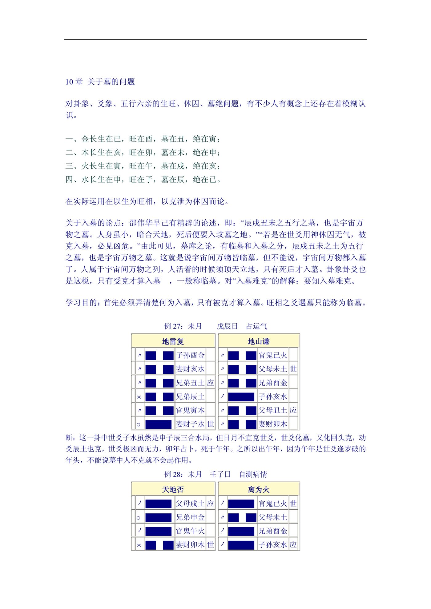

> 卦盘结构化转写（人工目视原页图核对）：[第 1 页转写](../figures/src-e6fc8612e955/page-001.md)

> ⚠ 本页含方块占位字符（██ 等）：原书卦图/爻位无法由文字层还原，**本页卦例不作为默认规则**；请对照上方原页图人工辨认。

<!-- ¶0001 cf0702f023fe -->
10

<!-- ¶0002 da6cc603150d -->
关于墓的问题

<!-- ¶0003 0f760a8f1e7a -->
对卦象、爻象、五行六亲的生旺、休囚、墓绝问题，有不少人有概念上还存在着模糊认

<!-- ¶0004 3ad931725617 -->
识。

<!-- ¶0005 133e0ffefdfc -->
一、金长生在已，旺在酉，墓在丑，绝在寅；

<!-- ¶0006 7be1f595656e -->
二、木长生在亥，旺在卯，墓在未，绝在申；

<!-- ¶0007 7521c94d484b -->
三、火长生在寅，旺在午，墓在戍，绝在亥；

<!-- ¶0008 012bdca4da62 -->
四、水长生在申，旺在子，墓在辰，绝在已。

<!-- ¶0009 74ec91042533 -->
在实际运用在以生为旺相，以克泄为休囚而论。

<!-- ¶0010 17ee2b6ecec9 -->
关于入墓的论点：邵伟华早己有精辟的论述，即：

<!-- ¶0011 29dc8895dd96 -->
辰戍丑未之五行之墓，也是宇宙万

<!-- ¶0012 bee333f5f2e3 -->
物之墓。人身虽小，暗合天地，死后便要入坟墓之地。

<!-- ¶0013 430525931371 -->
”“

<!-- ¶0014 eec23ed415b5 -->
若是在世爻用神休囚无气，被

<!-- ¶0015 2b5de4d6eb9e -->
克入墓，必见凶危。

<!-- ¶0016 d186f2fe0487 -->
由此可

<!-- ¶0017 2149552fa075 -->
见，墓库之论，有临墓和入墓之分，辰戍丑未之土为五行

<!-- ¶0018 b49ad1a154a9 -->
之墓，也是宇宙万物之墓。这就是说宇宙间万物皆临墓，但不能说，宇宙间万物都入墓

<!-- ¶0019 34f81dd285a1 -->
了。人属于宇宙间万物之列，人活着的时候须顶天立地，只有死后才入墓。卦象卦爻也

<!-- ¶0020 dff1069b90ac -->
是这税，只有受克才算入墓

<!-- ¶0021 2a79396027c7 -->
，一般称临墓。对

<!-- ¶0022 ed7eea2826e5 -->
入墓难克

<!-- ¶0023 a009dc333157 -->
的解释：要知入墓难克。

<!-- ¶0024 e308c1c44b0e -->
学习目的：首先必须弄清楚何为入墓，只有被克才算入墓。旺相之爻遇墓只能称为临墓。

<!-- ¶0025 b9a5efb04da4 -->
27

<!-- ¶0026 6a148d64689e -->
：未月

<!-- ¶0027 7b1939e0a885 -->
戊辰日

<!-- ¶0028 878536d96493 -->
占运气

<!-- ¶0029 432f5aca5edc -->
地雷复

<!-- ¶0030 4d98caf1666e -->
██

<!-- ¶0031 577586fb87f0 -->
██

<!-- ¶0032 8cf200415397 -->
子孙酉金

<!-- ¶0033 b8f01a9ca178 -->
██

<!-- ¶0034 71b6f4f2a4b2 -->
██

<!-- ¶0035 c782fcf31941 -->
妻财亥水

<!-- ¶0036 e6a816d675a4 -->
██

<!-- ¶0037 9793f00960b4 -->
██

<!-- ¶0038 68bcd630d031 -->
兄弟丑土

<!-- ¶0039 5f846f98ebf9 -->
██

<!-- ¶0040 ea7a92393f73 -->
██

<!-- ¶0041 b318a1a29901 -->
兄弟辰土

<!-- ¶0042 fb36145a3699 -->
██

<!-- ¶0043 53a08f4b7d7e -->
██

<!-- ¶0044 714172e86d35 -->
官鬼寅木

<!-- ¶0045 15360e5cdec4 -->
█████

<!-- ¶0046 f75401dbd125 -->
妻财子水

<!-- ¶0047 6854ef0d1310 -->
地山谦

<!-- ¶0048 a0e26bc135cb -->
██

<!-- ¶0049 49def4273de7 -->
██

<!-- ¶0050 b2e6792d9c99 -->
官鬼已火

<!-- ¶0051 cfc5d71d6a56 -->
██

<!-- ¶0052 ba7f57616c92 -->
██

<!-- ¶0053 91f9d1a14f5b -->
父母未土

<!-- ¶0054 8fcda81936e3 -->
██

<!-- ¶0055 da01b14b8934 -->
██

<!-- ¶0056 d9adebac4ade -->
兄弟酉金

<!-- ¶0057 5befcd9cc781 -->
█████

<!-- ¶0058 a680c48b30ff -->
子孙亥水

<!-- ¶0059 9014bddb3ab7 -->
██

<!-- ¶0060 bc20b67d0311 -->
██

<!-- ¶0061 443e383b41e0 -->
父母丑土

<!-- ¶0062 fc37302a8921 -->
██

<!-- ¶0063 02aef6bcd5d3 -->
██

<!-- ¶0064 b53c89f717ad -->
妻财卯木

<!-- ¶0065 19db9f4e8fce -->
断：这一卦中世爻子水虽然是申子辰三合水局，但日月不宜克世爻，世爻化墓，又化回头克，动

<!-- ¶0066 89d79201d921 -->
爻辰土也克，世爻极凶而无力，卯年占卜，死于午年。之所以出午年，因为午年是世爻逢岁破的

<!-- ¶0067 26aaed1b0597 -->
年头，不能说

<!-- ¶0068 7d98c669a1f1 -->
墓中人不克就不会起作用。

<!-- ¶0069 f26e15cbdc4f -->
：未月

<!-- ¶0070 132604c817d7 -->
壬子日

<!-- ¶0071 6d7159109a3f -->
自测病情

<!-- ¶0072 649d138c224a -->
天地否

<!-- ¶0073 32e4d745a08d -->
█████

<!-- ¶0074 1efafad3f52b -->
父母戍土

<!-- ¶0075 1f5dcf96bad8 -->
█████

<!-- ¶0076 c15132d6e697 -->
兄弟申金

<!-- ¶0077 8e5fd71a9490 -->
█████

<!-- ¶0078 c257b58f066d -->
官鬼午火

<!-- ¶0079 e312d77a3777 -->
██

<!-- ¶0080 bcaa254fdc66 -->
██

<!-- ¶0081 bd0a8f454051 -->
妻财卯木

<!-- ¶0082 32322f9783cb -->
离为火

<!-- ¶0083 ccd6c3073f9f -->
█████

<!-- ¶0084 cfe0f8eb34c1 -->
官鬼已火

<!-- ¶0085 4ce5a1824836 -->
██

<!-- ¶0086 8e4a42f6633f -->
██

<!-- ¶0087 fc4c1e9b29df -->
父母未土

<!-- ¶0088 8790f62375c3 -->
█████

<!-- ¶0089 e4ec9657f7e2 -->
兄弟酉金

<!-- ¶0090 1ca46f4986db -->
█████

<!-- ¶0091 117883e0af4c -->
子孙亥水

## 第 2 页（PDF 实际页码）

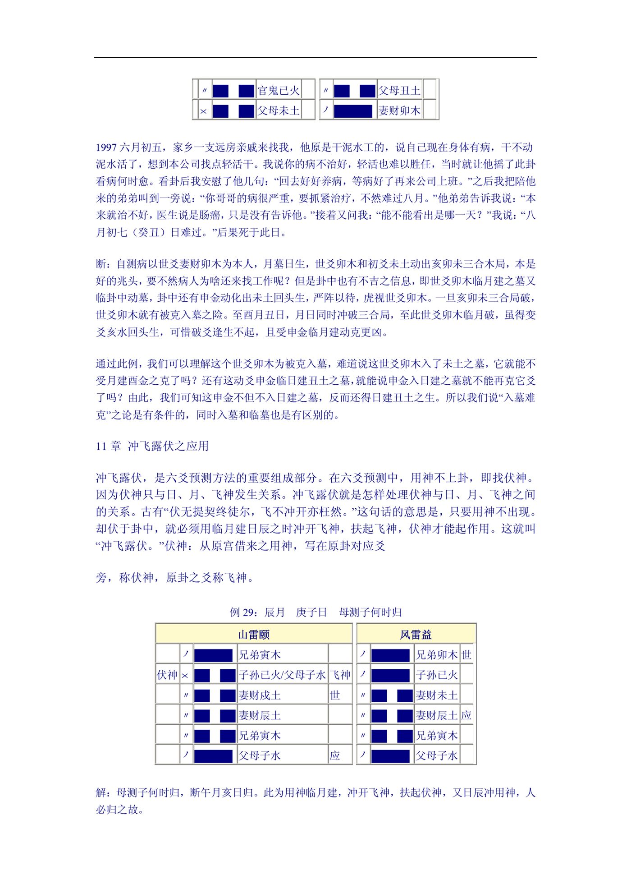

> 卦盘结构化转写（人工目视原页图核对）：[第 2 页转写](../figures/src-e6fc8612e955/page-002.md)

> ⚠ 本页含方块占位字符（██ 等）：原书卦图/爻位无法由文字层还原，**本页卦例不作为默认规则**；请对照上方原页图人工辨认。

<!-- ¶0092 fc788b2f8a4e -->
██

<!-- ¶0093 bc061c189919 -->
██

<!-- ¶0094 a9d1e105b811 -->
官鬼已火

<!-- ¶0095 dcd3b4823604 -->
██

<!-- ¶0096 35752bb25a3a -->
██

<!-- ¶0097 81484d14b115 -->
父母未土

<!-- ¶0098 143772f73d37 -->
██

<!-- ¶0099 3f3717b6c3c1 -->
██

<!-- ¶0100 4478091a7807 -->
父母丑土

<!-- ¶0101 24965e727021 -->
█████

<!-- ¶0102 d23ea676d0af -->
妻财卯木

<!-- ¶0103 316d4979d76e -->
199

<!-- ¶0104 34301e989692 -->
六月初五，家乡一支远房亲戚来找我，他原是干泥水工的，说自己现在身体有病，干不动

<!-- ¶0105 c4ba475f6788 -->
泥水活了，想到本公司找点轻活干。我说你的病不治好，轻活也难以胜任，当时就让他摇了此卦

<!-- ¶0106 3ef324440ae7 -->
看病何时愈。看卦后我安慰了他几句：

<!-- ¶0107 811d2797d55d -->
回去好好养病，等病好了再来公司上班。

<!-- ¶0108 9fa0a41f3d3f -->
之后我把陪他

<!-- ¶0109 d650a1bbb1cc -->
来的弟弟叫到一旁说：

<!-- ¶0110 64a2bf075568 -->
你哥哥的病很严重，要抓紧治疗，不然难过八月。

<!-- ¶0111 6776f2adddc1 -->
他弟弟告诉我说：

<!-- ¶0112 ac739d20265b -->
来就治不好，医生说是肠癌，只是没有告诉他。

<!-- ¶0113 9b03e2623e13 -->
接着又问我：

<!-- ¶0114 999c7c1c8a50 -->
能不能看出是哪一天？

<!-- ¶0115 0e221e412421 -->
我说：

<!-- ¶0116 d1914da013e2 -->
月初七（癸丑）日难过。

<!-- ¶0117 c731e644b554 -->
后果死于此日。

<!-- ¶0118 8d4ddc1d833d -->
断：自测病以世爻妻财卯木为本人，月墓日生，

<!-- ¶0119 fd68f9ac00fb -->
世爻卯木和初爻未土动出亥卯未三合木局，本是

<!-- ¶0120 851620a5d84f -->
好的兆头，要不然病人为啥还来找工作呢？但是卦中也有不吉之信息，即世爻卯木临月建之墓又

<!-- ¶0121 920dfd514d7d -->
临卦中动墓，卦中还有申金动化出未土回头生，严阵以待，虎视世爻卯木。一旦亥卯未三合局破，

<!-- ¶0122 87cdb6614fe6 -->
世爻卯木就有被克入墓之险。至酉月丑日，月日同时冲破三合局，至此世爻卯木临月破，虽得变

<!-- ¶0123 1d706088e3a9 -->
爻亥水回头生，可惜破爻逢生不起，且受申金临月建动克更凶。

<!-- ¶0124 beb9c7537729 -->
通过此例，我们可以理解这个世爻卯木为被克入墓，难道说这世爻卯木入了未土之墓，它就能不

<!-- ¶0125 1f2043d8aaa6 -->
受月建酉金之克了吗？还有这动爻申金临日建丑土之墓，就能说申金入日建之墓就

<!-- ¶0126 c538618f5e0d -->
不能再克它爻

<!-- ¶0127 04bfedd0d805 -->
了吗？由此，我们可知这申金不但不入日建之墓，反而还得日建丑土之生。所以我们说

<!-- ¶0128 0fc8c7156cdc -->
入墓难

<!-- ¶0129 0ea4fac7cfb8 -->
之论是有条件的，同时入墓和临墓也是有区别的。

<!-- ¶0130 faa113045d32 -->
11

<!-- ¶0131 97473fa3c91c -->
冲飞露伏之应用

<!-- ¶0132 a7e8ac9b3326 -->
冲飞露伏，是六爻预测方法的重要组成部分。在六爻预测中，用神不上卦，即找伏神。

<!-- ¶0133 300374459a46 -->
因为伏神只与日、月、飞神发生关系。冲飞露伏就是怎样处理伏神与日、月、飞神之间

<!-- ¶0134 03caa8182c0e -->
的关系。古有

<!-- ¶0135 0d8ce28af6f4 -->
伏无提契终徒尔，飞不冲开亦枉然。

<!-- ¶0136 cf4f267c8aa3 -->
这句话的意思是，只要用神不出现。

<!-- ¶0137 30e7eabace49 -->
却伏于卦中，就必须用临月建日辰之时冲开飞神，扶起飞神，伏神才能起作用。这就叫

<!-- ¶0138 6288e859207c -->
冲飞露伏。

<!-- ¶0139 3d16004e3d09 -->
伏神：从原宫借来之用

<!-- ¶0140 21fb6769f673 -->
神，写在原卦对应爻

<!-- ¶0141 277fcdbaefee -->
旁，称伏神，原卦之爻称飞神。

<!-- ¶0142 05ae02cb8800 -->
29

<!-- ¶0143 8c048e77cd61 -->
：辰月

<!-- ¶0144 f59714088d0e -->
庚子日

<!-- ¶0145 1495a2814392 -->
母测子何时归

<!-- ¶0146 b187e3732499 -->
山雷颐

<!-- ¶0147 56cc331465d7 -->
█████

<!-- ¶0148 780c4de54f97 -->
兄弟寅木

<!-- ¶0149 4fadb7725ab5 -->
伏神

<!-- ¶0150 9450e2475aa0 -->
██

<!-- ¶0151 7811703cfc00 -->
██

<!-- ¶0152 3afe30112144 -->
子孙已火

<!-- ¶0153 106765b003c8 -->
父母子水

<!-- ¶0154 56900e83b392 -->
飞神

<!-- ¶0155 b362e0d6b19e -->
██

<!-- ¶0156 0e8882220d56 -->
██

<!-- ¶0157 6379e0ba80f0 -->
妻财戍土

<!-- ¶0158 4a02ed35e2f6 -->
██

<!-- ¶0159 f49243e8d959 -->
██

<!-- ¶0160 2c2054495ac1 -->
妻财辰土

<!-- ¶0161 8382d168c433 -->
██

<!-- ¶0162 bea91a54f1f9 -->
██

<!-- ¶0163 ebbdd2d2811c -->
兄弟寅木

<!-- ¶0164 4876018475aa -->
█████

<!-- ¶0165 4a4b34b9d6f1 -->
父母子水

<!-- ¶0166 c46524307daf -->
风雷益

<!-- ¶0167 9276cd31cc19 -->
█████

<!-- ¶0168 cd91c5a0def6 -->
兄弟卯木

<!-- ¶0169 6660f6e3e7c6 -->
█████

<!-- ¶0170 3702f4eb3c0a -->
子孙已火

<!-- ¶0171 40a3f6f08078 -->
██

<!-- ¶0172 b2020be39ebd -->
██

<!-- ¶0173 4a6a8568a8e5 -->
妻财未土

<!-- ¶0174 d382c875054b -->
██

<!-- ¶0175 5137de13a7cf -->
██

<!-- ¶0176 0673347a7106 -->
妻财辰土

<!-- ¶0177 fb176a8369c1 -->
██

<!-- ¶0178 abfc6fbc7bc1 -->
██

<!-- ¶0179 53c29c8b952c -->
兄弟寅木

<!-- ¶0180 a19c06ae9912 -->
█████

<!-- ¶0181 d3290e13d967 -->
父母子水

<!-- ¶0182 6c9c1ebb40c3 -->
解：母测子何时归，断午月亥日归。此为用神临月建，冲开飞神，扶起伏神，又日辰冲用神，人

<!-- ¶0183 6680df67161e -->
必归之故。

## 第 3 页（PDF 实际页码）

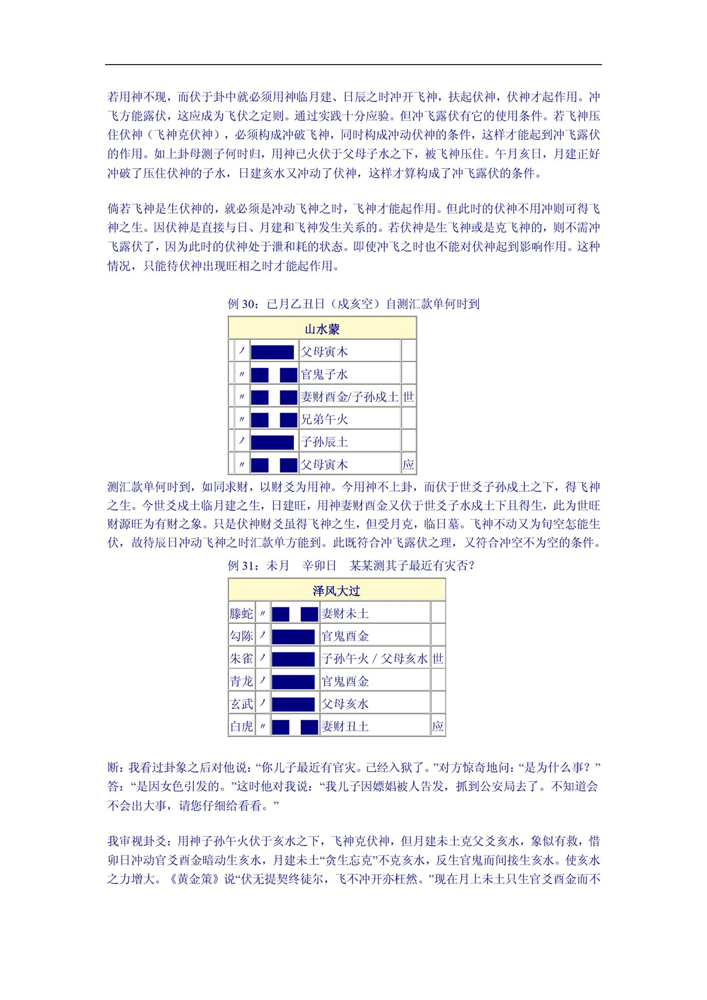

> 卦盘结构化转写（人工目视原页图核对）：[第 3 页转写](../figures/src-e6fc8612e955/page-003.md)

> ⚠ 本页含方块占位字符（██ 等）：原书卦图/爻位无法由文字层还原，**本页卦例不作为默认规则**；请对照上方原页图人工辨认。

<!-- ¶0184 61ee78828848 -->
若用神不现，而伏于卦中就必须用神临月建、日辰之时冲开飞神，扶起伏神，伏神才起作用。冲

<!-- ¶0185 050001d185ac -->
飞方能露伏，这应成为飞伏之定则。通过实践十分应验。但冲飞露伏有它的使用条件。若飞神压

<!-- ¶0186 d340a75375f8 -->
住伏神（飞神克伏神），必须构成冲破飞神，同时构成冲动伏神的条件，这样才能起到冲飞露伏

<!-- ¶0187 ddf0f330e800 -->
的作用。如上卦母测子何时归，用神已火伏于父母子水之下，被飞神压住。午月亥日，月建正好

<!-- ¶0188 b34dd37cb3dc -->
冲破了压住伏神的子水，日建亥水又冲动了

<!-- ¶0189 6b5fca6c78d9 -->
伏神，这样才算构成了冲飞露伏的条件。

<!-- ¶0190 a6e75573dbde -->
倘若飞神是生伏神的，就必须是冲动飞神之时，飞神才能起作用。但此时的伏神不用冲则可得飞

<!-- ¶0191 56f7bc889ff6 -->
神之生。因伏神是直接与日、月建和飞神发生关系的。若伏神是生飞神或是克飞神的，则不需冲

<!-- ¶0192 da2c321290ca -->
飞露伏了，因为此时的伏神处于泄和耗的状态。即使冲飞之时也不能对伏神起到影响作用。这种

<!-- ¶0193 28f0820599b6 -->
情况，只能待伏神出现旺相之时才能起作用。

<!-- ¶0194 1b5974aeb3b6 -->
：已月乙丑日（戍亥空）自测汇款单何时到

<!-- ¶0195 ae9fa0afdf38 -->
山水蒙

<!-- ¶0196 28ddb91d1ba3 -->
█████

<!-- ¶0197 9750273579a1 -->
父母寅木

<!-- ¶0198 5a2a197ff37a -->
██

<!-- ¶0199 f2e9f68fb5a0 -->
██

<!-- ¶0200 07f3b8bfe1c6 -->
官鬼子水

<!-- ¶0201 f513c657505f -->
██

<!-- ¶0202 5fc498c8ee34 -->
██

<!-- ¶0203 ec9324d9b3de -->
妻财酉金

<!-- ¶0204 288cbea0b26b -->
子孙戍土

<!-- ¶0205 92aa022fe19e -->
██

<!-- ¶0206 1521b4319e6f -->
██

<!-- ¶0207 314bf5706d29 -->
兄弟午火

<!-- ¶0208 3d390fd2036c -->
█████

<!-- ¶0209 9bb8b0625168 -->
子孙辰土

<!-- ¶0210 84e44608ada8 -->
██

<!-- ¶0211 dcbf32e4a52c -->
██

<!-- ¶0212 d472685fcd41 -->
父母寅木

<!-- ¶0213 89dc1f81ef10 -->
测汇款单何时到，如同求财，以财爻为用神。今用神不上卦，而伏于世爻子孙戍土之下，得飞神

<!-- ¶0214 ba5bfb44315b -->
之生。今世爻戍土临月建之生，日建旺，用神妻财酉金又伏于世爻子水戍土下且得生，此为世旺

<!-- ¶0215 5340076bda14 -->
财源旺为有财之象。只是伏神财爻虽得飞神之生，但受月克，临日墓。飞神不动又为旬空怎能生

<!-- ¶0216 4a4e38084156 -->
伏，故待辰日冲动飞神之时汇款单方能到。此既符合冲飞露伏之理，又符合冲空不为空的条件。

<!-- ¶0217 bb742954f974 -->
：未月

<!-- ¶0218 77833a9747fe -->
辛卯日

<!-- ¶0219 84bfe57f2250 -->
某某测其子最近有灾否？

<!-- ¶0220 a096fde7fd40 -->
泽风大过

<!-- ¶0221 8ecd897d08cb -->
滕蛇

<!-- ¶0222 e3c87d0e71b6 -->
██

<!-- ¶0223 5d3782c1be09 -->
██

<!-- ¶0224 1875d5ac0db6 -->
妻财未土

<!-- ¶0225 d5d990fe2479 -->
勾陈

<!-- ¶0226 db08b1ac7127 -->
█████

<!-- ¶0227 8f2b73507b0f -->
官鬼酉金

<!-- ¶0228 3cf02b159aa9 -->
朱雀

<!-- ¶0229 b8f2e0312911 -->
█████

<!-- ¶0230 c7df0e5dc3af -->
子孙午火／父母亥水

<!-- ¶0231 060daa8daf5d -->
青龙

<!-- ¶0232 780ab8bc1557 -->
█████

<!-- ¶0233 22ca4b880db1 -->
官鬼酉金

<!-- ¶0234 52e28a623bb0 -->
玄武

<!-- ¶0235 4734698701e9 -->
█████

<!-- ¶0236 68154fd0f0e3 -->
父母亥水

<!-- ¶0237 e034cd27fb81 -->
白虎

<!-- ¶0238 be68c8be63f7 -->
██

<!-- ¶0239 7e6256c3cf3c -->
██

<!-- ¶0240 eb95c328dd8b -->
妻财丑土

<!-- ¶0241 d05feb1e6407 -->
断：我看过卦象之后对他说：

<!-- ¶0242 dcfd50ffba5c -->
你儿子最近有官灾。己经入狱了。

<!-- ¶0243 23785a675793 -->
对方惊奇地问：

<!-- ¶0244 0add15e1aab3 -->
是为什么事？

<!-- ¶0245 7a535013162e -->
答：

<!-- ¶0246 3a47cdbe8240 -->
是因女色引发的。

<!-- ¶0247 5ede0b0b891a -->
这时他对我说：

<!-- ¶0248 fb7a5d5102ce -->
我儿子因嫖娼被人告发，抓到公安局去了。不知道会

<!-- ¶0249 c119d005bec8 -->
不会出大事，请您仔细给看看。

<!-- ¶0250 a7501aac6a4a -->
我审视卦爻：用神子孙午火伏于亥水之下，飞神克伏神，但月建未

<!-- ¶0251 073dcebc3e85 -->
土克父爻亥水，象似有救，惜

<!-- ¶0252 e7f9f45f3a2d -->
卯日冲动官爻酉金暗动生亥水，月建未土

<!-- ¶0253 2f17f940bda0 -->
贪生忘克

<!-- ¶0254 0c705d1203c2 -->
不克亥水，反生官鬼而间接生亥水。使亥水

<!-- ¶0255 9997f9d2392a -->
之力增大。《黄金策》说

<!-- ¶0256 99a9e32c7810 -->
伏无提契终徒尔，飞不冲开亦枉然。

<!-- ¶0257 63ddc0249522 -->
现在月上未土只生官爻酉金而不

## 第 4 页（PDF 实际页码）

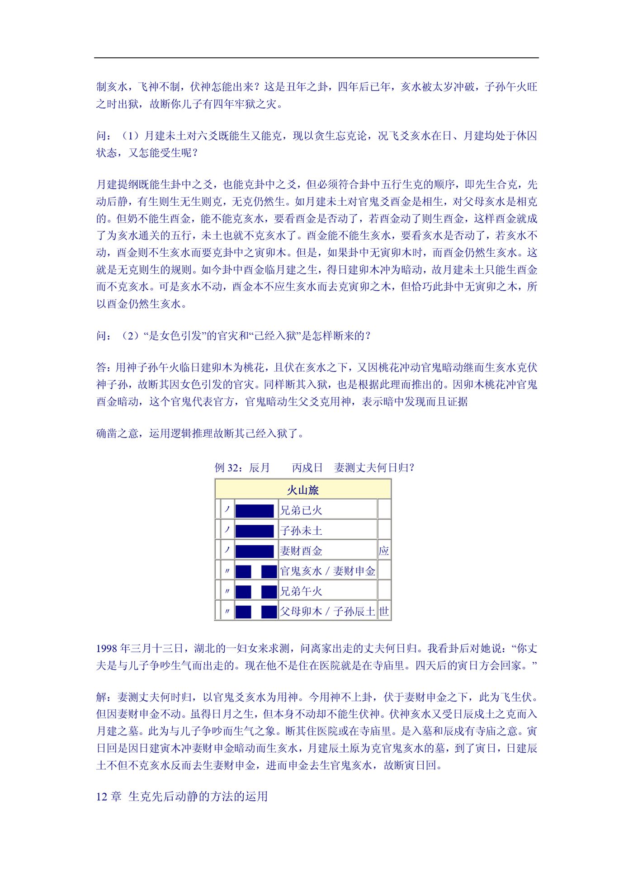

> ⚠ 本页含方块占位字符（██ 等）：原书卦图/爻位无法由文字层还原，**本页卦例不作为默认规则**；请对照上方原页图人工辨认。

<!-- ¶0258 bb0e1d879fc7 -->
制亥水，飞神不制，伏神怎能出来？这是丑年之卦，四年后已年，亥水被太岁冲破，子孙午火旺

<!-- ¶0259 e78ee3a4fceb -->
之时出狱，故断你儿子有四年牢狱之灾。

<!-- ¶0260 7eec6a92f0ec -->
问：（

<!-- ¶0261 53fe1afda67a -->
）月建未土对六爻既能生又能克，现以贪生忘克论，况飞爻亥水在日、月建均处于休囚

<!-- ¶0262 bb6450e9c7df -->
状态，又怎能受生呢？

<!-- ¶0263 2f403f2f9edb -->
月建提纲既能生卦中之爻，也能克卦中之爻，但必须符合卦中五行生克的顺序，即先生合克，

<!-- ¶0264 98bf65fd754a -->
动后静，有生则生无生则克，无克仍然生。如月建未土对官鬼爻酉金是相生，对父母亥水是相克

<!-- ¶0265 9b7923bdc958 -->
的。但奶不能生酉金，能不能克亥水，要看酉金是否动了，若酉金动了则生酉金，这样酉金就成

<!-- ¶0266 ce0945bd10f8 -->
了为亥水通关的五行，未土也就不克亥水了。酉金能不能生亥水，要看亥水是否动了，若亥水不

<!-- ¶0267 47abf37b6318 -->
动，酉金则不生亥水而要克卦中之寅卯木。但是，如果卦中无寅卯木时，而酉金仍然生亥水。这

<!-- ¶0268 ee18620ce0f3 -->
就是无克则生的规则。如今卦中酉金临月建之生，得日建卯木冲为暗动，故月建未土只能生酉金

<!-- ¶0269 6b60c560cfe7 -->
而不克亥水。可是亥水不动，酉金本不应生亥水而去克寅卯之木，但恰巧此卦中无寅卯之木，所

<!-- ¶0270 2c398371f1a9 -->
以酉金

<!-- ¶0271 6df7d0394959 -->
仍然生亥水。

<!-- ¶0272 339d86760d36 -->
问：（

<!-- ¶0273 ffd5eacaee98 -->
是女色引发

<!-- ¶0274 6325ce2a2d96 -->
的官灾和

<!-- ¶0275 3eb53f400f4e -->
己经入狱

<!-- ¶0276 1b477d0dcb79 -->
是怎样断来的？

<!-- ¶0277 e9aab876be7e -->
答：用神子孙午火临日建卯木为桃花，且伏在亥水之下，又因桃花冲动官鬼暗动继而生亥水克伏

<!-- ¶0278 4f8823b81dc9 -->
神子孙，故断其因女色引发的官灾。同样断其入狱，也是根据此理而推出的。因卯木桃花冲官鬼

<!-- ¶0279 ecafca520bc6 -->
酉金暗动，这个官鬼代表官方，官鬼暗动生父爻克用神，表示暗中发现而且证据

<!-- ¶0280 af76050313df -->
确凿之意，运用逻辑推理故断其己经入狱了。

<!-- ¶0281 fa9d898a8c22 -->
：辰月

<!-- ¶0282 3a68d875794e -->
丙戍日

<!-- ¶0283 9fd449e08821 -->
妻测丈夫何日归？

<!-- ¶0284 57b31d92809f -->
火山旅

<!-- ¶0285 c9f651abde2d -->
█████

<!-- ¶0286 aacb6e26d615 -->
兄弟已火

<!-- ¶0287 ca24df3cff80 -->
█████

<!-- ¶0288 17e907cb85d6 -->
子孙未土

<!-- ¶0289 ff57e59e9899 -->
█████

<!-- ¶0290 7abb67ed1114 -->
妻财

<!-- ¶0291 7b0ffcb641b5 -->
酉金

<!-- ¶0292 eebf05c87273 -->
██

<!-- ¶0293 58fbd433a8ab -->
██

<!-- ¶0294 fb122b7246c6 -->
官鬼亥水／妻财申金

<!-- ¶0295 364713296f3f -->
██

<!-- ¶0296 9301fbd510aa -->
██

<!-- ¶0297 39884ee2347b -->
兄弟午火

<!-- ¶0298 2f8a43690eed -->
██

<!-- ¶0299 f35ec352efbd -->
██

<!-- ¶0300 1d8546eb1bc7 -->
父母卯木／子孙辰土

<!-- ¶0301 6b585385f775 -->
1998

<!-- ¶0302 5616abc251a0 -->
年三月十三日，湖北的一妇女来求测，问离家出走的丈夫何日归。我看卦后对她说：

<!-- ¶0303 64d1f104bf6b -->
你丈

<!-- ¶0304 6df9a7908c94 -->
夫是与儿子争吵生气而出走的。现在他不是住在医院就是在寺庙里。四天后的寅日方会回家。

<!-- ¶0305 6aef8517525a -->
解：妻测丈夫何时归，以官鬼爻亥水为用神。今用神不上卦，伏于妻财申金之下，此为飞生伏。

<!-- ¶0306 a886892d1659 -->
但因妻财申金不动。虽得日月之生，但本身不动却不能生伏神。伏神亥水又受日辰戍土之克而入

<!-- ¶0307 4ebae0318bdf -->
月建之墓。此为与儿子争

<!-- ¶0308 2022d454d4db -->
吵而生气之象。断其住医院或在寺庙里。是入墓和辰戍有寺庙之意。寅

<!-- ¶0309 b2fcd7837195 -->
日回是因日建寅木冲妻财申金暗动而生亥水，月建辰土原为克官鬼亥水的墓，到了寅日，日建辰

<!-- ¶0310 21fd059c6acc -->
土不但不克亥水反而去生妻财申金，进而申金去生官鬼亥水，故断寅日回。

<!-- ¶0311 0954a25e8995 -->
12

<!-- ¶0312 c8d359956be7 -->
生克先后动静的方法的运用

## 第 5 页（PDF 实际页码）

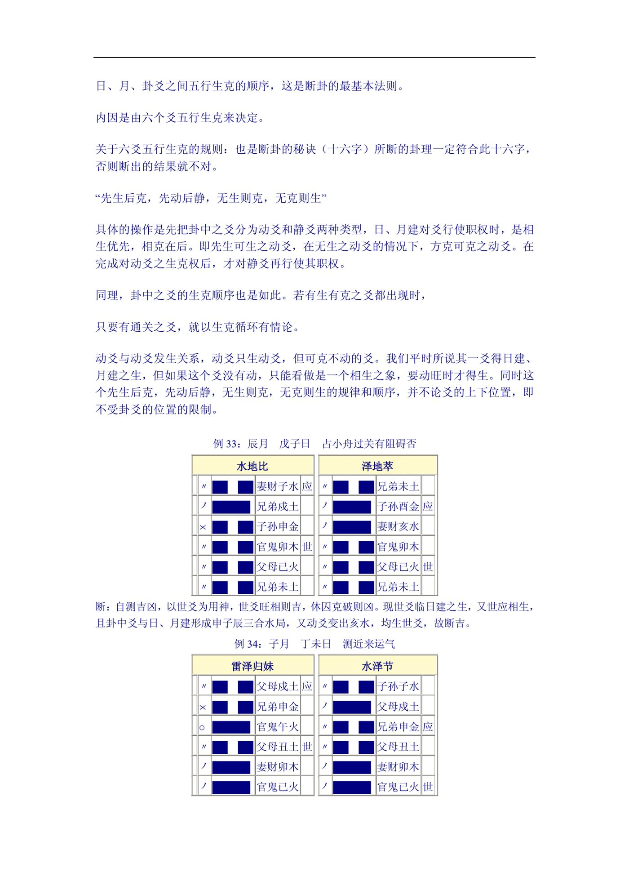

> ⚠ 本页含方块占位字符（██ 等）：原书卦图/爻位无法由文字层还原，**本页卦例不作为默认规则**；请对照上方原页图人工辨认。

<!-- ¶0313 d8ddf2756b16 -->
日、月、卦爻之间五行生克的顺序，这是断卦的最基本法则。

<!-- ¶0314 847679e6af10 -->
内因是由六个爻五行生克来决定。

<!-- ¶0315 a19fb0b256d1 -->
关于六爻五行生克的规则：也是断卦的秘诀（十六字）所断的卦理一定符合此十六字，

<!-- ¶0316 ea287c4102e3 -->
否则断出的结果就不对。

<!-- ¶0317 8cb47b471b63 -->
先生后克，先动后静，无生则克，无克则生

<!-- ¶0318 7ca46ae03633 -->
具体的操作是先把卦中之爻

<!-- ¶0319 015af31012a4 -->
分为动爻和静爻两种类型，日、月建对爻行使职权时，是相

<!-- ¶0320 bf7e90c4063d -->
生优先，相克在后。即先生可生之动爻，在无生之动爻的情况下，方克可克之动爻。在

<!-- ¶0321 143904ae5f8d -->
完成对动爻之生克权后，才对静爻再行使其职权。

<!-- ¶0322 8bf3314e4a4a -->
同理，卦中之爻的生克顺序也是如此。若有生有克之爻都出现时，

<!-- ¶0323 f2a398136df5 -->
只要有通关之爻，就以生克循环有情论。

<!-- ¶0324 f95a9e64fe7d -->
动爻与动爻发生关系，动爻只生动爻，但可克不动的爻。我们平时所说其一爻得日建、

<!-- ¶0325 88e8c3d85250 -->
月建之生，但如果这个爻没有动，只能看做是一个相生之象，要动旺时才得生。同时这

<!-- ¶0326 e914a9eebefc -->
个先生后克，先动后静，无生则克，无克则生的规律和顺序，并不论爻的上下位置，即

<!-- ¶0327 db341a0672d8 -->
不受卦

<!-- ¶0328 604fe777829b -->
爻的位置的限制。

<!-- ¶0329 097feafc0bd0 -->
33

<!-- ¶0330 458e97ec0fd2 -->
：辰月

<!-- ¶0331 c08852fcdcc6 -->
戊子日

<!-- ¶0332 d095e2cf6aa9 -->
占小舟过关有阻碍否

<!-- ¶0333 5c37baa9c0c5 -->
水地比

<!-- ¶0334 94d93d9576d9 -->
██

<!-- ¶0335 c5f5bac6e0bc -->
██

<!-- ¶0336 169e3a883d27 -->
妻财子水

<!-- ¶0337 a4777a84ecdd -->
█████

<!-- ¶0338 171043a04067 -->
兄弟戍土

<!-- ¶0339 6478e702c43f -->
██

<!-- ¶0340 58f34792b635 -->
██

<!-- ¶0341 f38c2c995228 -->
子孙申金

<!-- ¶0342 24f430bf84dc -->
██

<!-- ¶0343 c5bef2a906e5 -->
██

<!-- ¶0344 91c4eb9b2aa5 -->
官鬼卯木

<!-- ¶0345 bd46636ea744 -->
██

<!-- ¶0346 4aab591e8115 -->
██

<!-- ¶0347 f3b59d29141f -->
父母已火

<!-- ¶0348 6147bf96d0a5 -->
██

<!-- ¶0349 b04bd1b1414e -->
██

<!-- ¶0350 2bf14dc568b5 -->
兄弟未土

<!-- ¶0351 0aa3ec0c11b0 -->
泽地萃

<!-- ¶0352 3cfad6926634 -->
██

<!-- ¶0353 8b047ee7eb49 -->
██

<!-- ¶0354 bd252d35cbe4 -->
兄弟未土

<!-- ¶0355 adb229b30ebb -->
█████

<!-- ¶0356 cc35273d4d49 -->
子孙酉金

<!-- ¶0357 ebff5bbfaa21 -->
█████

<!-- ¶0358 4ace50d3291b -->
妻财亥水

<!-- ¶0359 afb7444cc610 -->
██

<!-- ¶0360 fbf8c43a3c40 -->
██

<!-- ¶0361 2d87cc0a3218 -->
官鬼卯木

<!-- ¶0362 d5749ec61301 -->
██

<!-- ¶0363 993ec7056a35 -->
██

<!-- ¶0364 4797f590d106 -->
父母已火

<!-- ¶0365 9c2f3b0e8636 -->
██

<!-- ¶0366 bf2eca3af9e8 -->
██

<!-- ¶0367 daea312dfc00 -->
兄弟未土

<!-- ¶0368 44c9f350253b -->
：自测吉凶，以世爻为用神，世爻旺相则吉，休囚克破则凶。现世爻临日建之生，又世应相生，

<!-- ¶0369 b666e0e0d680 -->
且卦中爻与日、月建形成申子辰三合水局，又动爻变出亥水，均生世爻，故断吉。

<!-- ¶0370 8737770578a5 -->
：子月

<!-- ¶0371 7f77ea17d5e5 -->
丁未日

<!-- ¶0372 8d1c5a258ccb -->
测近来运气

<!-- ¶0373 ec4951bf30fb -->
雷泽归妹

<!-- ¶0374 0908d12b11ea -->
██

<!-- ¶0375 4b8cbf23d24d -->
██

<!-- ¶0376 7c2e67cf6dff -->
父母戍土

<!-- ¶0377 add74d50211a -->
██

<!-- ¶0378 b3f458e2b4df -->
██

<!-- ¶0379 fb7e9df0e76f -->
兄弟申金

<!-- ¶0380 2c9125797f53 -->
█████

<!-- ¶0381 d2594261a1e7 -->
官鬼午火

<!-- ¶0382 e1be04b88b8f -->
██

<!-- ¶0383 d64aee7dd68d -->
██

<!-- ¶0384 6cc0be70108b -->
父母丑土

<!-- ¶0385 7c079f7c45e4 -->
█████

<!-- ¶0386 1d0f1c7da2af -->
妻财卯木

<!-- ¶0387 dff572d2b491 -->
█████

<!-- ¶0388 6c3444e5f56e -->
官鬼已火

<!-- ¶0389 48fbd472cfca -->
水泽节

<!-- ¶0390 6b92114a7390 -->
██

<!-- ¶0391 cdcaa2d89a52 -->
██

<!-- ¶0392 055fe5669d6b -->
子孙子水

<!-- ¶0393 8e127ff97d48 -->
█████

<!-- ¶0394 29115f684482 -->
父母戍土

<!-- ¶0395 a5d1044a3308 -->
██

<!-- ¶0396 fff55fe9ccfd -->
██

<!-- ¶0397 23bf516ec01d -->
兄弟申金

<!-- ¶0398 19071e014417 -->
██

<!-- ¶0399 a9d907be9043 -->
██

<!-- ¶0400 7f17af5d1cc6 -->
父母丑土

<!-- ¶0401 8a6b29e3c3cb -->
█████

<!-- ¶0402 2b39df21c78e -->
妻财卯木

<!-- ¶0403 f8e7b32a5d12 -->
█████

<!-- ¶0404 a4829077e57f -->
官鬼已火

## 第 6 页（PDF 实际页码）

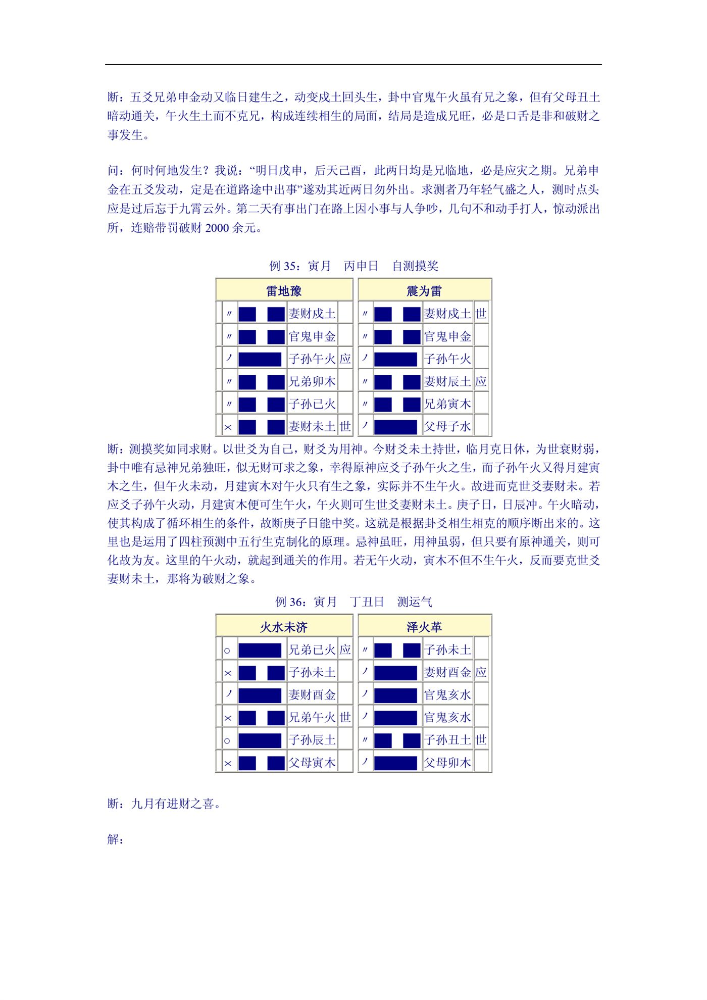

> ⚠ 本页含方块占位字符（██ 等）：原书卦图/爻位无法由文字层还原，**本页卦例不作为默认规则**；请对照上方原页图人工辨认。

<!-- ¶0405 5bf9354b3d48 -->
断：五爻兄弟申金动又临日建生之，动变戍土回头生，卦中官鬼午火虽有兄之象，但有父母丑土

<!-- ¶0406 729ca3a9c175 -->
暗动通关，午火生土而不克兄，构成连续相生的局面，结局是造成兄旺，必是口舌是非和破财之

<!-- ¶0407 fa9cd82f73e7 -->
事发生。

<!-- ¶0408 77f8eed58491 -->
问：何时何地发生？我说：

<!-- ¶0409 91a4dfc92116 -->
明日戊申，后天己酉，此两日均是兄临地，必是应灾之期。兄弟申

<!-- ¶0410 73c2ae2d3d81 -->
金在五爻发动，定是在道路途中出事

<!-- ¶0411 a72d6172329f -->
遂劝其近两日勿外出。求测者乃年轻气盛之人，测时点头

<!-- ¶0412 be0ea377994e -->
应是过后忘于九霄云外。第二天有事出

<!-- ¶0413 024fb1293fff -->
门在路上因小事与人争吵，几句不和动手打人，惊动派出

<!-- ¶0414 39483c451b2a -->
所，连赔带罚破财

<!-- ¶0415 caf1513371f5 -->
224000

<!-- ¶0416 d9bd40d616c0 -->
余元。

<!-- ¶0417 78d3e9f9c3df -->
：寅月

<!-- ¶0418 af9fce9cf6bf -->
丙申日

<!-- ¶0419 45ef19f93da2 -->
自测摸奖

<!-- ¶0420 f27358393202 -->
雷地豫

<!-- ¶0421 986cc68deddf -->
██

<!-- ¶0422 634d9de7e40b -->
██

<!-- ¶0423 ab2eeddd25a2 -->
妻财戍土

<!-- ¶0424 c6c2c2b5fe8a -->
██

<!-- ¶0425 bb71a4c6b242 -->
██

<!-- ¶0426 04dff5484b58 -->
官鬼申金

<!-- ¶0427 922d5a537861 -->
█████

<!-- ¶0428 fc550568bd6b -->
子孙午火

<!-- ¶0429 891c3917beda -->
██

<!-- ¶0430 bc100820c756 -->
██

<!-- ¶0431 bea4e0cf678c -->
兄弟卯木

<!-- ¶0432 afe070cc6a58 -->
██

<!-- ¶0433 6f0f7222a517 -->
██

<!-- ¶0434 e04d35e95c7c -->
子孙已火

<!-- ¶0435 f785536772d0 -->
██

<!-- ¶0436 47d32921f82b -->
██

<!-- ¶0437 30fc9aaff5ea -->
妻财未土

<!-- ¶0438 96bb2510133d -->
震为雷

<!-- ¶0439 4e74cf74becf -->
██

<!-- ¶0440 436642123d6a -->
██

<!-- ¶0441 3ea6d4672396 -->
妻财戍土

<!-- ¶0442 79c4897ac297 -->
██

<!-- ¶0443 c23a8e9adbdd -->
██

<!-- ¶0444 bf1c615cbbf5 -->
官鬼申金

<!-- ¶0445 45668cb40dee -->
█████

<!-- ¶0446 b6719194f8de -->
子孙午火

<!-- ¶0447 5038b0286ebd -->
██

<!-- ¶0448 3b7d4a3649f5 -->
██

<!-- ¶0449 461998900fdd -->
妻财辰土

<!-- ¶0450 617690510cb4 -->
██

<!-- ¶0451 6a11804bd46f -->
██

<!-- ¶0452 c4f2fd9428ea -->
兄弟寅

<!-- ¶0453 b73ee5fb66fb -->
█████

<!-- ¶0454 cbbc42654930 -->
父母子水

<!-- ¶0455 401b0a052b77 -->
断：测摸奖如同求财。以世爻为自己，财爻为用神。今财爻未土持世，临月克日休，为世衰财弱，

<!-- ¶0456 9f50e6963be3 -->
卦中唯有忌神兄弟独旺，似无财可求之象，幸得原神应爻子孙午火之生，而子孙午火又得月建寅

<!-- ¶0457 476dd6fec94a -->
木之生，但午火未动，月建寅木对午火只有生之象，实际并不生午火。故进而克世爻妻财未。若

<!-- ¶0458 5eb32e1b6fe4 -->
应爻子孙午火动，月建寅木便可生午火，午火则可生世爻妻财未土。庚子日，日辰冲。午火暗动，

<!-- ¶0459 63876bbb1b2e -->
使其构成了循环相生的条件，故断庚子日能中奖。这就是根据卦爻相生相克的顺序断出来的。这

<!-- ¶0460 fdc888cf8fb2 -->
里也是运用了四柱预测中五行生克制化的原

<!-- ¶0461 6ef6fac790f1 -->
理。忌神虽旺，用神虽弱，但只要有原神通关，则可

<!-- ¶0462 ddd0f7ba5193 -->
化故为友。这里的午火动，就起到通关的作用。若无午火动，寅木不但不生午火，反而要克世爻

<!-- ¶0463 d57864c4e075 -->
妻财未土，那将为破财之象。

<!-- ¶0464 f5f0ebd9f04b -->
：寅月

<!-- ¶0465 8a3aeb866944 -->
丁丑日

<!-- ¶0466 2b7b97f6c0c0 -->
测运气

<!-- ¶0467 cf6f3200ba2c -->
火水未济

<!-- ¶0468 aed10b4558de -->
█████

<!-- ¶0469 654a135d826d -->
兄弟已火

<!-- ¶0470 dd1f15095e2e -->
██

<!-- ¶0471 b7237dfb0a70 -->
██

<!-- ¶0472 8e4b22f31be6 -->
子孙未土

<!-- ¶0473 51baf3215728 -->
█████

<!-- ¶0474 2bb1beaa10e9 -->
妻财酉金

<!-- ¶0475 52c0276f2f5d -->
██

<!-- ¶0476 ff789d2f1cc7 -->
██

<!-- ¶0477 d8553e1fce06 -->
兄弟午火

<!-- ¶0478 cc4b03657ae2 -->
█████

<!-- ¶0479 7d26b375f14d -->
子孙辰土

<!-- ¶0480 97c24d16cd31 -->
██

<!-- ¶0481 9c8416d77e98 -->
██

<!-- ¶0482 6843a3f5ff40 -->
父母寅木

<!-- ¶0483 e3f4e8de1897 -->
泽火革

<!-- ¶0484 5237856b9020 -->
██

<!-- ¶0485 2a111bfbd0b2 -->
██

<!-- ¶0486 bceb210f749e -->
子孙未土

<!-- ¶0487 ad506ddfc10a -->
█████

<!-- ¶0488 4fab2f33bce0 -->
妻财酉金

<!-- ¶0489 6813858447ac -->
█████

<!-- ¶0490 51cab78df7f1 -->
官鬼亥水

<!-- ¶0491 ec309df421ee -->
█████

<!-- ¶0492 baee50291187 -->
官鬼亥水

<!-- ¶0493 04719061d4ee -->
██

<!-- ¶0494 17e4ea514e62 -->
██

<!-- ¶0495 573df54b07d8 -->
子孙丑土

<!-- ¶0496 c1cb57525c53 -->
█████

<!-- ¶0497 f91c5a23adac -->
父母卯木

<!-- ¶0498 d4c43f4d452b -->
断：九月有进财之喜。

<!-- ¶0499 e89953cb35a0 -->
解：

## 第 7 页（PDF 实际页码）

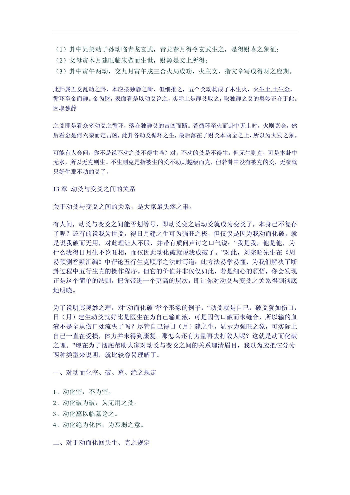

<!-- ¶0500 e0b2bab54bef -->
）卦中兄弟动子孙动临青龙玄武，青龙春月得令玄武生之，是得财喜之象征；

<!-- ¶0501 4dbe82cd8b32 -->
）父母寅木月建旺临朱雀而生世，财源是文上所得；

<!-- ¶0502 1af0b9cbc103 -->
）卦中寅午两动，交九月寅午戍三合火局成功，火主文，指文章写成得财之应期。

<!-- ¶0503 0b35281645b2 -->
此卦属五爻乱动之卦，本应按独静之断，但细推之，五个爻动构成了木生火，火生土

<!-- ¶0504 63454337358c -->
土生金，

<!-- ¶0505 d45bb6979ee0 -->
循环至金而静。金为财，表面看是以动爻论之，实际上是静爻取之，

<!-- ¶0506 7978fc91623f -->
取独静之爻的奥妙正在于此。

<!-- ¶0507 b977e321d140 -->
因取独静

<!-- ¶0508 d4c17e1d54fd -->
之爻即是看众多动爻之循环，落在独静爻的吉凶而断。若循环至火而卦中无土时，火则克金，然

<!-- ¶0509 626e104eb709 -->
后看金是何六亲而定吉凶，此卦各动爻循环之生，最后落在了财爻本酉金之上，所以为大发之象。

<!-- ¶0510 2df34b7bb9ac -->
可能有人会问，你不是说不动之爻不得生吗？对，不动的爻是不得生，但无生则克，可是本卦中

<!-- ¶0511 bff1e9ae5def -->
无水，所以无克则生。不生则克是指被生的爻不动则越级而克，但若卦中没有被克的爻，无奈就

<!-- ¶0512 3ca04cf1dd09 -->
只好生那不动的爻了。

<!-- ¶0513 502f8cb58449 -->
13

<!-- ¶0514 a15396462e7f -->
动爻与变爻之间的关系

<!-- ¶0515 0268e5786096 -->
关于动爻与变爻之间的关系，是大家最头疼之事。

<!-- ¶0516 740a450817bc -->
有人问，动爻与变爻之间能否划等号

<!-- ¶0517 f5e320715b11 -->
，即动爻变之后动爻就成为变爻了，本身己不复存

<!-- ¶0518 254292ef1720 -->
了呢？还有的说我为世爻，得日月建之生可为强旺之极，但仅仅是因为我动而化破，就

<!-- ¶0519 335b64030307 -->
是说我破而无用，对此理让人不服，并带有质问声讨之口气说：

<!-- ¶0520 262dff195c9a -->
我是我，他是他，为

<!-- ¶0521 301c0be4d584 -->
什么我得日月生不论旺相，而仅因此动化破就说我成破了。

<!-- ¶0522 a4c7e36089d3 -->
对此，刘宪昭先生在《周

<!-- ¶0523 b104f6220871 -->
易预测答疑汇编》中评论五行生克顺序之法时写道：此方法易学易懂，为我们解决了断

<!-- ¶0524 26aff1a9ec1f -->
卦过程中五行生克的操作程序。但它的价值并非仅仅如此，若是细心的领悟，你会发现

<!-- ¶0525 1aff45097f64 -->
正是这个简单的法则，把你带进一个更高的层次，即让你对动爻与变爻之关系得到彻底

<!-- ¶0526 f119b8bb9b60 -->
地明晓。

<!-- ¶0527 fed9f40854c8 -->
为了说明其奥妙之理，对

<!-- ¶0528 144a5dc8dd35 -->
动而化破

<!-- ¶0529 907988fc89da -->
举个形象的例子，

<!-- ¶0530 4198eaaee86b -->
动爻就是自己，破爻犹如伤口，

<!-- ¶0531 8407beee1890 -->
日（月）建生动爻就好比是医生在为自己输血液，可是因伤口破而未缝合，所以输的血

<!-- ¶0532 dfa746e72284 -->
液不是全从伤口处流失了吗？尽管自己得日（月）建之生，显示为强旺之象，可实际上

<!-- ¶0533 714488dd4dce -->
自己一直在受损，体力并未得到康复。那怎么还有力量再去打敌人呢？这就是动而化破

<!-- ¶0534 83d6148da4ec -->
之理。

<!-- ¶0535 92de4e587d04 -->
现在为了彻底帮助大家对动爻与变爻之间的关系理清眉目，我以为应把它分为

<!-- ¶0536 be25f516294a -->
两种类型来说明，就比较容易理解了。

<!-- ¶0537 3e312d2cf1dc -->
一、对动而化空、破、墓、绝之规定

<!-- ¶0538 4529f0058b5b -->
、动化空，不为空。

<!-- ¶0539 22d538b5d4e2 -->
、动化破为破，为无用之爻。

<!-- ¶0540 ff2605894956 -->
、动化墓以临墓论之。

<!-- ¶0541 3f6e82f9f0d4 -->
、动化绝为化休，为衰弱之意。

<!-- ¶0542 23742c16de08 -->
二、对于动而化回头生、克之规定

## 第 8 页（PDF 实际页码）

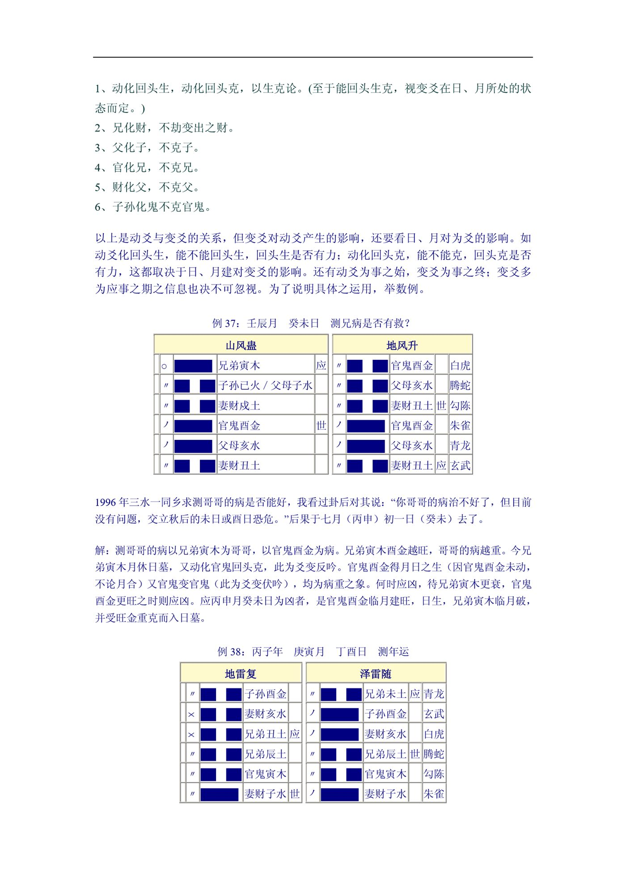

> ⚠ 本页含方块占位字符（██ 等）：原书卦图/爻位无法由文字层还原，**本页卦例不作为默认规则**；请对照上方原页图人工辨认。

<!-- ¶0543 5511ed1ec9d1 -->
、动化回头生，动化回头克，以生克论。

<!-- ¶0544 97f7c95ddac4 -->
至于能回头生克，视变爻在日、月所处的状

<!-- ¶0545 5fb57d3eb138 -->
态而定。

<!-- ¶0546 1b92211db752 -->
、兄化财，不劫变出之财。

<!-- ¶0547 97707ae68395 -->
、父化子，不克子。

<!-- ¶0548 d0bba636ffcc -->
、官化兄，不克兄。

<!-- ¶0549 b9ea3708eb9e -->
、财化父，不克父。

<!-- ¶0550 9d2f0eaf7273 -->
、子孙化鬼不克官鬼。

<!-- ¶0551 46f80d84af33 -->
以上是动爻与变爻的关系，但变爻对动爻产生的影响，还要看日、月对为爻的影响。如

<!-- ¶0552 4812a848482c -->
动爻化回头生，能不能回头生，回头生是否有力；动化回头克，能不能克，回头克是否

<!-- ¶0553 fe2e5735ce05 -->
有力，这都取决于日、月建对变爻的影响。还有动爻为事之

<!-- ¶0554 498def06f2fd -->
始，变爻为事之终；变爻多

<!-- ¶0555 1c52051632df -->
为应事之期之信息也决不可忽视。为了说明具体之运用，举数例。

<!-- ¶0556 981113181c9e -->
37

<!-- ¶0557 6fa9ac0e75b4 -->
：壬辰月

<!-- ¶0558 c2b4f1b26861 -->
癸未日

<!-- ¶0559 9670a68d4f34 -->
测兄病是否有救？

<!-- ¶0560 47c84cd59a97 -->
山风蛊

<!-- ¶0561 0cf9bc3eeca3 -->
█████

<!-- ¶0562 c5e5e8aee4d5 -->
兄弟寅木

<!-- ¶0563 957466e2057c -->
██

<!-- ¶0564 eb1ecaa49a2d -->
██

<!-- ¶0565 255c62b56867 -->
子孙已火／父母子水

<!-- ¶0566 77ba28bd5705 -->
██

<!-- ¶0567 a181a7eb924f -->
██

<!-- ¶0568 b99a69de3b60 -->
妻财戍土

<!-- ¶0569 837297b6e2df -->
█████

<!-- ¶0570 09051e7701ef -->
官鬼酉金

<!-- ¶0571 5987ea3c0b4d -->
█████

<!-- ¶0572 3b9bf94586aa -->
父母亥水

<!-- ¶0573 e24e700fc0e4 -->
██

<!-- ¶0574 cb3b62bd143c -->
██

<!-- ¶0575 8da62b955f36 -->
妻财丑土

<!-- ¶0576 b51aaf82ad3b -->
地风升

<!-- ¶0577 4091ee80fc9c -->
██

<!-- ¶0578 d677c2e84f44 -->
██

<!-- ¶0579 a9b9649714d7 -->
官鬼酉金

<!-- ¶0580 f92a122689c2 -->
白虎

<!-- ¶0581 4e2fbaaea412 -->
██

<!-- ¶0582 abaca7332fac -->
██

<!-- ¶0583 9c2b9fb107b6 -->
父母亥水

<!-- ¶0584 0bf85b7dca26 -->
腾蛇

<!-- ¶0585 17c19b53461b -->
██

<!-- ¶0586 dc0cd4d11f53 -->
██

<!-- ¶0587 f0058826f165 -->
妻财丑土

<!-- ¶0588 527f28c098f1 -->
勾陈

<!-- ¶0589 fc7cd2783045 -->
█████

<!-- ¶0590 82d10d13c48c -->
官鬼

<!-- ¶0591 77a885054392 -->
酉金

<!-- ¶0592 7505f65b76a1 -->
朱雀

<!-- ¶0593 914d94d9e101 -->
█████

<!-- ¶0594 4bc6c22b7817 -->
父母亥水

<!-- ¶0595 de8a819d5dde -->
青龙

<!-- ¶0596 a8ec8226e2cf -->
██

<!-- ¶0597 9a69af07d7a3 -->
██

<!-- ¶0598 efffa9e0be26 -->
妻财丑土

<!-- ¶0599 01ed89e0206a -->
玄武

<!-- ¶0600 c7aa137d1d79 -->
996

<!-- ¶0601 b554ab4198ff -->
年三水一同乡求测哥哥的病是否能好，我看过卦后对其说：

<!-- ¶0602 fc797e8e30cc -->
你哥哥的病治不好了，但目前

<!-- ¶0603 86281929d9de -->
没有问题，交立秋后的未日或酉日恐危。

<!-- ¶0604 0d1ff29505c9 -->
后果于七月（丙申）初一日（癸未）去了。

<!-- ¶0605 ca9faa00c22a -->
解：测哥哥的病以兄弟寅木为哥哥，以官鬼酉金为病。兄弟寅木酉金越旺，哥哥的病越重。今兄

<!-- ¶0606 d12712ff4a4e -->
弟寅木月休日墓，又动化官鬼回头克，此为爻变反吟。官鬼酉金得月日之生（因官鬼酉金未动，

<!-- ¶0607 762d565426f1 -->
不论月合）又官鬼变官鬼（此为爻变伏吟），均为病重之象。何时应凶，待兄弟寅木更衰

<!-- ¶0608 cf413167a702 -->
，官鬼

<!-- ¶0609 d2ead25c3164 -->
酉金更旺之时则应凶。应丙申月癸未日为凶者，是官鬼酉金临月建旺，日生，兄弟寅木临月破，

<!-- ¶0610 0812098620a0 -->
并受旺金重克而入日墓。

<!-- ¶0611 72f40f5d9701 -->
：丙子年

<!-- ¶0612 0e0ec891e3e8 -->
庚寅月

<!-- ¶0613 61d30885c84e -->
丁酉日

<!-- ¶0614 4f287e8a71ad -->
测年运

<!-- ¶0615 2023d8394b0f -->
地雷复

<!-- ¶0616 6d7cb6b34ac5 -->
██

<!-- ¶0617 06b43e46b924 -->
██

<!-- ¶0618 703148df667c -->
子孙酉金

<!-- ¶0619 17591e859165 -->
██

<!-- ¶0620 dd5c2df81205 -->
██

<!-- ¶0621 6ca1a3a550ed -->
妻财亥水

<!-- ¶0622 67133a9eab44 -->
██

<!-- ¶0623 78668ba4337e -->
██

<!-- ¶0624 8a56cd66813a -->
兄弟丑土

<!-- ¶0625 365495e09196 -->
██

<!-- ¶0626 14fe10e18a66 -->
██

<!-- ¶0627 26fd60aaf67e -->
兄弟辰土

<!-- ¶0628 bda4a4f05999 -->
██

<!-- ¶0629 dd763a9c6bbc -->
██

<!-- ¶0630 3a083316886c -->
官鬼寅木

<!-- ¶0631 8b780c335ed3 -->
█████

<!-- ¶0632 fef70e6bbf5a -->
妻财子水

<!-- ¶0633 ed87597cff55 -->
泽雷随

<!-- ¶0634 2880d8b3acbf -->
██

<!-- ¶0635 559ad2d03063 -->
██

<!-- ¶0636 de3e65f05f38 -->
兄弟未土

<!-- ¶0637 8e0597ab022a -->
青龙

<!-- ¶0638 ddb310b32b43 -->
█████

<!-- ¶0639 428c84632e06 -->
子孙酉金

<!-- ¶0640 e788f9c2dc0c -->
玄武

<!-- ¶0641 f1829ddea91d -->
█████

<!-- ¶0642 25f1c04b60cc -->
妻财亥水

<!-- ¶0643 699f8da69ba6 -->
白虎

<!-- ¶0644 d3ad025c43df -->
██

<!-- ¶0645 3a6e43e36d31 -->
██

<!-- ¶0646 ff28aef429ca -->
兄弟辰土

<!-- ¶0647 dbf88d357258 -->
腾蛇

<!-- ¶0648 defddaffb15f -->
██

<!-- ¶0649 334e1116cc85 -->
██

<!-- ¶0650 ac4836624b7d -->
官鬼寅木

<!-- ¶0651 460f67e4f85a -->
勾陈

<!-- ¶0652 d9332ab5941e -->
█████

<!-- ¶0653 3c991a14a50a -->
妻财子水

<!-- ¶0654 d2e6c0d5e9fb -->
朱雀

## 第 9 页（PDF 实际页码）

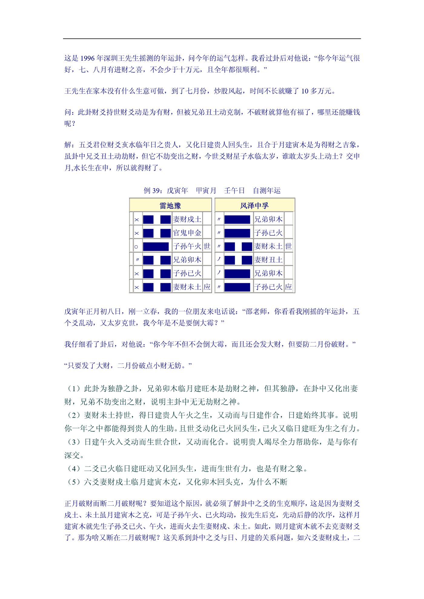

> ⚠ 本页含方块占位字符（██ 等）：原书卦图/爻位无法由文字层还原，**本页卦例不作为默认规则**；请对照上方原页图人工辨认。

<!-- ¶0655 8fe38d676811 -->
这是

<!-- ¶0656 a65c000c06ca -->
1996

<!-- ¶0657 1c8472a165eb -->
年深圳王先生摇测的年运卦，问今年的运气怎样。我看过卦后对他说：

<!-- ¶0658 972e94dc4ed1 -->
你今年运气很

<!-- ¶0659 27c8165eb49f -->
好，七、八月有进财之喜，不会少于十万元，且全年都很顺利。

<!-- ¶0660 d5860c3d50bf -->
王先生在家本没有什么生意可做，到了七月份，炒股风起，时间不长就赚了

<!-- ¶0661 9b5c30d2cc66 -->
10

<!-- ¶0662 9d5a97c27977 -->
多万元。

<!-- ¶0663 3e408687ae99 -->
问：此卦财爻持世财爻动是为有财，但被兄弟丑土动克制，不破财就算他有福了，哪里还能赚钱

<!-- ¶0664 4d104c61fe6d -->
呢？

<!-- ¶0665 d2c0d34c5b19 -->
解：五爻君位财爻亥水临年日之贵人，又化日建贵人回头生，且合于月建寅木是为

<!-- ¶0666 e0390a87c749 -->
得财之吉象，

<!-- ¶0667 72b159b91f7d -->
虽卦中兄爻丑土动劫财，但它不劫变出之财，今世爻财星子水临太岁，谁敢太岁头上动土？交申

<!-- ¶0668 3cfe6412c3e2 -->
水长生在申，所以就得财了。

<!-- ¶0669 53d54bc27c88 -->
：戊寅年

<!-- ¶0670 cce19c6dafdb -->
甲寅月

<!-- ¶0671 7d788f931799 -->
壬午日

<!-- ¶0672 546e8fe668a2 -->
自测年运

<!-- ¶0673 01307bc6a765 -->
雷地豫

<!-- ¶0674 076df8c046ad -->
██

<!-- ¶0675 d7ad3352c237 -->
██

<!-- ¶0676 47c37a510604 -->
妻财戍土

<!-- ¶0677 e37a24e277e5 -->
██

<!-- ¶0678 195d2229ba3c -->
██

<!-- ¶0679 efe7b0629280 -->
官鬼申金

<!-- ¶0680 d3b5881f25e2 -->
█████

<!-- ¶0681 7a785d90483b -->
子孙午火

<!-- ¶0682 57d92f8fcfc6 -->
██

<!-- ¶0683 54f9ef23a2c7 -->
██

<!-- ¶0684 097aa92b3a36 -->
兄弟卯木

<!-- ¶0685 aa0e51bc8c94 -->
██

<!-- ¶0686 719a3d89edde -->
██

<!-- ¶0687 2303ba8fadc8 -->
子孙已火

<!-- ¶0688 9304f374278b -->
██

<!-- ¶0689 ec2bb9c52f33 -->
██

<!-- ¶0690 3b0eef8f21b8 -->
妻财未土

<!-- ¶0691 cf23f039e35c -->
风泽中孚

<!-- ¶0692 d3b2534d91e7 -->
█████

<!-- ¶0693 4990370c4434 -->
兄弟卯木

<!-- ¶0694 e2852f854b75 -->
█████

<!-- ¶0695 4895f9bf0843 -->
子孙已火

<!-- ¶0696 88848a41d63a -->
██

<!-- ¶0697 47c14cb4a748 -->
██

<!-- ¶0698 03d073d3779e -->
妻财未土

<!-- ¶0699 4dfb01d2198f -->
██

<!-- ¶0700 2106ba43d411 -->
██

<!-- ¶0701 a0422ae9fbb3 -->
妻财丑土

<!-- ¶0702 e03e06d831f2 -->
█████

<!-- ¶0703 4c70b8bd0f58 -->
兄弟卯木

<!-- ¶0704 b70df73eb6eb -->
█████

<!-- ¶0705 fd933db3e08f -->
子孙已火

<!-- ¶0706 45ded15514f9 -->
戊寅年正月初八日，刚一立春，我的一位朋友来电话说：

<!-- ¶0707 5ac0d87ea794 -->
邵老师，你看看我刚摇的年运卦，五

<!-- ¶0708 99a14a0323fc -->
个爻乱动，又太岁克世，我今年是不是要倒大霉？

<!-- ¶0709 31559a8d03f5 -->
我仔细看了卦后，对他说：

<!-- ¶0710 7f8635bedcdd -->
你今年不但不会倒大霉，而且还会发大财，但要防二月份破财。

<!-- ¶0711 5d835011e393 -->
只要发了大财，二月份破点小财无妨。

<!-- ¶0712 a018705b2aea -->
）此卦为独静之卦，兄弟卯木临月建旺本是劫财之神，但其独静，在卦中又化出妻

<!-- ¶0713 accc1f282e14 -->
财，兄弟不劫变出之财，说明主卦中无无劫财之神。

<!-- ¶0714 05aeabc06f4b -->
）妻财未土

<!-- ¶0715 dc95d6ae5d79 -->
持世，得日建贵人午火之生，又动而与日建作合，日建始终其事。说明

<!-- ¶0716 f4d821354527 -->
你一年之中都能得到贵人的生助。且世爻动化已火回头生，已火又临日建旺为生之有力。

<!-- ¶0717 c4d668bc8b3b -->
）日建午火入爻动而生世合世，又动而化合。说明贵人竭尽全力帮助你，是与你有

<!-- ¶0718 ab1b42b7afb6 -->
深交。

<!-- ¶0719 7e271fa99c21 -->
）二爻已火临日建旺动又化回头生，进而生世有力，也是有财之象。

<!-- ¶0720 647c7d5b6cce -->
）六爻妻财戍土临月建寅木克，又化卯木回头克，为什么不断

<!-- ¶0721 536ca76d8b58 -->
正月破财而断二月破财呢？要知道这个原因，就必须了解卦中之爻的生克顺序，这是因为妻财爻

<!-- ¶0722 118c67ed932a -->
戍土、未土虽月建寅木之克，可是子孙午火、已火均动，按先生后克，先动后

<!-- ¶0723 07333fc80c27 -->
静的次序，这样月

<!-- ¶0724 fa8eb1da88cb -->
建寅木就先生子孙爻已火、午火，进而火去生妻财戍、未土。如此，则月建寅木就不去克妻财爻

<!-- ¶0725 469ec8c254d8 -->
了。那为啥又断在二月破财呢？这关系到卦中之爻与日、月建的关系问题，如六爻妻财戍土，二

## 第 10 页（PDF 实际页码）

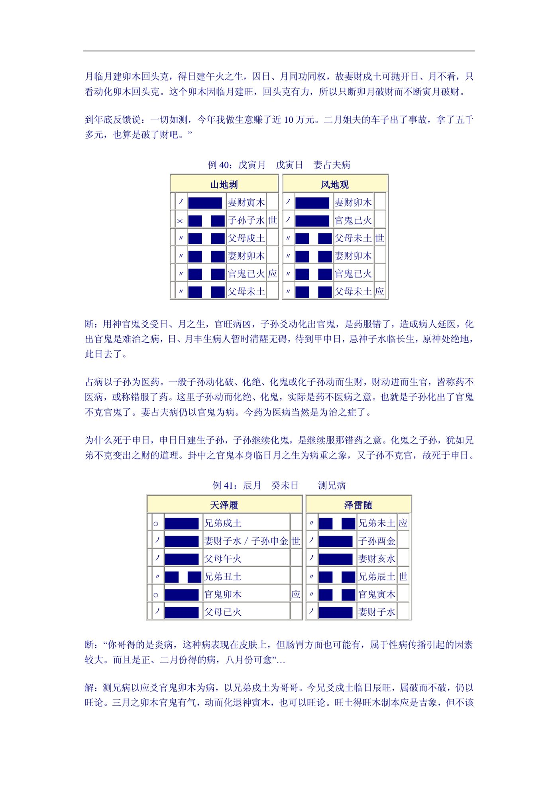

> ⚠ 本页含方块占位字符（██ 等）：原书卦图/爻位无法由文字层还原，**本页卦例不作为默认规则**；请对照上方原页图人工辨认。

<!-- ¶0726 e9cc975708d9 -->
月临月建卯木回头克，得日建午火之生，因日、月同功同权，故妻财戍土可抛开日、月不看，只

<!-- ¶0727 5ac282d0e71f -->
看动化卯木回头克。这个卯木因临月建旺，回头克有力，所以只断卯月破财而不断寅月破财。

<!-- ¶0728 b44ee75e3a23 -->
到年底反馈说：一切如测，今年我做生意赚了近

<!-- ¶0729 f536278ca99b -->
10

<!-- ¶0730 c9b15c787874 -->
万元。二月姐夫的车子出了事故，拿了五千

<!-- ¶0731 212962ac6780 -->
多元，也算是破了财吧。

<!-- ¶0732 fb53cb0ed58b -->
：戊寅月

<!-- ¶0733 789d5273f8a2 -->
戊寅日

<!-- ¶0734 f7da0705f0e8 -->
妻占夫病

<!-- ¶0735 fce4f47d520c -->
山地剥

<!-- ¶0736 e0252702c1f3 -->
█████

<!-- ¶0737 1fd0b3b3dd5c -->
妻财寅木

<!-- ¶0738 5aaff8a7e646 -->
██

<!-- ¶0739 7ca714929fa6 -->
██

<!-- ¶0740 599b229102cb -->
子孙子水

<!-- ¶0741 b066321631d8 -->
██

<!-- ¶0742 eb3910a96cc3 -->
██

<!-- ¶0743 f4a1c660f68f -->
父母戍土

<!-- ¶0744 0673b32361c0 -->
██

<!-- ¶0745 f1fbf07c0abb -->
██

<!-- ¶0746 d34f59623c96 -->
妻财卯木

<!-- ¶0747 9b506d7062eb -->
██

<!-- ¶0748 bf8536aff3a4 -->
██

<!-- ¶0749 dd2bc1bff9d9 -->
官鬼已火

<!-- ¶0750 ed7711cdbe15 -->
██

<!-- ¶0751 7e98754fa040 -->
██

<!-- ¶0752 ab1fb6a387d5 -->
父母未土

<!-- ¶0753 fffbdc6a1ab4 -->
风地观

<!-- ¶0754 c1965801f577 -->
█████

<!-- ¶0755 31b9f0e6cb94 -->
妻财卯木

<!-- ¶0756 c3b5e8ffd429 -->
█████

<!-- ¶0757 9168b9be00a9 -->
官鬼已火

<!-- ¶0758 98620ed73a6f -->
██

<!-- ¶0759 6cea676a666b -->
██

<!-- ¶0760 caedf57724fa -->
父母未土

<!-- ¶0761 e926ff260b00 -->
██

<!-- ¶0762 c959d9cd1f1b -->
██

<!-- ¶0763 a8385145206c -->
妻财卯木

<!-- ¶0764 c3be79f4df9a -->
██

<!-- ¶0765 82c2750e59d8 -->
██

<!-- ¶0766 f6b9752d7e5a -->
官鬼已火

<!-- ¶0767 4067b5563c38 -->
██

<!-- ¶0768 7b68eae70617 -->
██

<!-- ¶0769 95ed8f65e605 -->
父母未土

<!-- ¶0770 fb390aac3776 -->
断：用神官鬼爻受日、月之生，官旺病凶，子孙爻动化出官鬼，是药服错了，造成病人

<!-- ¶0771 404bc67ff7d6 -->
延医，化

<!-- ¶0772 4f599b9b5733 -->
出官鬼是难治之病，日、月丰生病人暂时清醒无碍，待到甲申日，忌神子水临长生，原神处绝地，

<!-- ¶0773 5da5f32ddeab -->
此日去了。

<!-- ¶0774 c85e2b625638 -->
占病以子孙为医药。一般子孙动化破、化绝、化鬼或化子孙动而生财，财动进而生官，皆称药不

<!-- ¶0775 4c7ccbd9cf06 -->
医病，或称错服了药。这里子孙动而化绝、化鬼，实际是药不医病之意。也就是子孙化出了官鬼

<!-- ¶0776 bed08f5ad0ec -->
不克官鬼了。妻占夫病仍以官鬼为病。今药为医病当然是为治之症了。

<!-- ¶0777 0b099af28841 -->
为什么死于申日，申日日建生子孙，子孙继续化鬼，是继续服那错药之意。化鬼之子孙，犹如兄

<!-- ¶0778 15382f97ddf2 -->
弟不克变出之财的道理。卦中之官鬼本身临日月之生为病重之象，又子孙不克官，故死于申日。

<!-- ¶0779 b282122a7886 -->
：辰月

<!-- ¶0780 e018433662e6 -->
癸未日

<!-- ¶0781 95ddb794ab7f -->
测兄病

<!-- ¶0782 27804066391d -->
天泽履

<!-- ¶0783 8367dfd760c2 -->
█████

<!-- ¶0784 e138b3560ee7 -->
兄弟戍土

<!-- ¶0785 a7df95b68c57 -->
█████

<!-- ¶0786 997a42d8dd02 -->
妻财子水／子孙申金

<!-- ¶0787 3c4669dbbb88 -->
█████

<!-- ¶0788 6edbfba4702b -->
父母午火

<!-- ¶0789 0ad5f2a5d0d3 -->
██

<!-- ¶0790 a857a996f07e -->
██

<!-- ¶0791 18d336da9b29 -->
兄弟丑土

<!-- ¶0792 ff9cbd264135 -->
█████

<!-- ¶0793 4486416651e9 -->
官鬼卯木

<!-- ¶0794 1ef91a520e41 -->
█████

<!-- ¶0795 aff8875e91d6 -->
父母已火

<!-- ¶0796 856d6a2c03ed -->
泽雷随

<!-- ¶0797 65118dbfec62 -->
██

<!-- ¶0798 4e28c5a4dead -->
██

<!-- ¶0799 0f65fbfe0736 -->
兄弟未土

<!-- ¶0800 219a18a88308 -->
█████

<!-- ¶0801 380e0a1fffd1 -->
子孙酉金

<!-- ¶0802 5fc28b57f877 -->
█████

<!-- ¶0803 d0ae2af21c4e -->
妻财亥水

<!-- ¶0804 4911de7f2ebc -->
██

<!-- ¶0805 94a82de00826 -->
██

<!-- ¶0806 90126e9cf733 -->
兄弟辰土

<!-- ¶0807 e3c1e53c13c8 -->
██

<!-- ¶0808 c3a22f58cf3c -->
██

<!-- ¶0809 2a2351416c5b -->
官鬼寅木

<!-- ¶0810 f438aa19e2f7 -->
█████

<!-- ¶0811 faa606759fc9 -->
妻财子水

<!-- ¶0812 06e90cef1b7f -->
断：

<!-- ¶0813 ccb9a97fae3a -->
你哥得的是炎病，

<!-- ¶0814 177dd692cdeb -->
这种病表现在皮肤上，但肠胃方面也可能有，属于性病传播引起的因素

<!-- ¶0815 6f35936a87f7 -->
较大。而且是正、二月份得的病，八月份可愈

<!-- ¶0816 183d67d0c77e -->
”…

<!-- ¶0817 d6525a2a632f -->
解：测兄病以应爻官鬼卯木为病，以兄弟戍土为哥哥。今兄爻戍土临日辰旺，属破而不破，仍以

<!-- ¶0818 fb53bfb782b3 -->
旺论。三月之卯木官鬼有气，动而化退神寅木，也可以旺论。旺土得旺木制本应是吉象，但不该

## 第 11 页（PDF 实际页码）

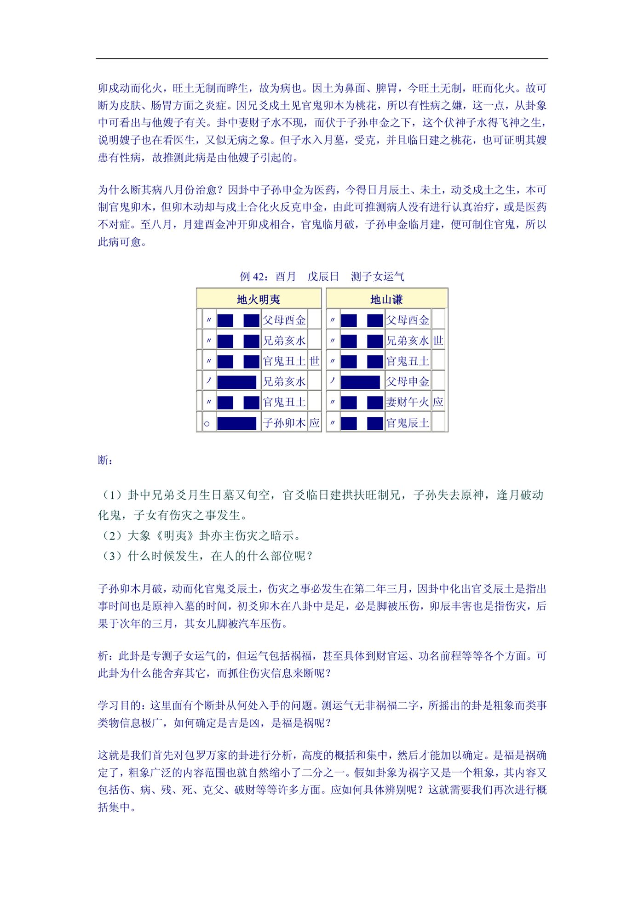

> ⚠ 本页含方块占位字符（██ 等）：原书卦图/爻位无法由文字层还原，**本页卦例不作为默认规则**；请对照上方原页图人工辨认。

<!-- ¶0819 7db87b77bce0 -->
卯戍动而化火，旺土无制而晔生，故为病也。因土为鼻面、脾胃，今旺土无制，旺而化火。故可

<!-- ¶0820 ada89a0b11fc -->
断为皮肤、肠胃方面之炎症。因兄爻戍土见官鬼卯木为桃花，所以有性病之嫌，这一点，从卦象

<!-- ¶0821 d5d278c467e4 -->
中可看出与他嫂子有关。卦中妻财子水不现，而伏于子孙申金之下，这个伏

<!-- ¶0822 0a90a384466c -->
神子水得飞神之生，

<!-- ¶0823 eef0ff04d3a0 -->
说明嫂子也在看医生，又似无病之象。但子水入月墓，受克，并且临日建之桃花，也可证明其嫂

<!-- ¶0824 c9e9ac837e92 -->
患有性病，故推测此病是由他嫂子引起的。

<!-- ¶0825 f726681eceec -->
为什么断其病八月份治愈？因卦中子孙申金为医药，今得日月辰土、未土，动爻戍土之生，本可

<!-- ¶0826 ab4fa4adb176 -->
制官鬼卯木，但卯木动却与戍土合化火反克申金，由此可推测病人没有进行认真治疗，或是医药

<!-- ¶0827 96759ab8246e -->
不对症。至八月，月建酉金冲开卯戍相合，官鬼临月破，子孙申金临月建，便可制住官鬼，所以

<!-- ¶0828 8baaaf5346a7 -->
此病可愈。

<!-- ¶0829 f994149b8782 -->
：酉月

<!-- ¶0830 83fd65773875 -->
戊辰日

<!-- ¶0831 afd50e6cdb4d -->
测子女运气

<!-- ¶0832 979270155a3a -->
地火明夷

<!-- ¶0833 32e2568d85c6 -->
██

<!-- ¶0834 8ff05841018b -->
██

<!-- ¶0835 c77ee0815319 -->
父母酉金

<!-- ¶0836 157e42b3f48f -->
██

<!-- ¶0837 2fce2115019a -->
██

<!-- ¶0838 8e521f8d504a -->
兄弟亥水

<!-- ¶0839 f0b09a3f5b6c -->
██

<!-- ¶0840 7f42030184cd -->
██

<!-- ¶0841 86a9004c9d37 -->
官鬼丑土

<!-- ¶0842 e3289be5b237 -->
█████

<!-- ¶0843 71a7d6ca1e6f -->
兄弟亥水

<!-- ¶0844 4bd15fe8984b -->
██

<!-- ¶0845 8af5dfdca9b1 -->
██

<!-- ¶0846 24d891ff6b84 -->
官鬼丑土

<!-- ¶0847 6277b54f9d39 -->
█████

<!-- ¶0848 326f0a5c34f6 -->
子孙卯木

<!-- ¶0849 4e3198bb9f0b -->
地山谦

<!-- ¶0850 0d0dc16e9df9 -->
██

<!-- ¶0851 9add4275e9bc -->
██

<!-- ¶0852 5ba26d12bb87 -->
父母酉金

<!-- ¶0853 fcec79e704e5 -->
██

<!-- ¶0854 8cd6c730f382 -->
██

<!-- ¶0855 d99b7c49ec87 -->
兄弟亥水

<!-- ¶0856 96b94905f58c -->
██

<!-- ¶0857 1178b51952ce -->
██

<!-- ¶0858 46e235279376 -->
官鬼丑土

<!-- ¶0859 a493ad866af0 -->
█████

<!-- ¶0860 59dff7693fdd -->
父母申金

<!-- ¶0861 a180e0837fa6 -->
██

<!-- ¶0862 3072348294c7 -->
██

<!-- ¶0863 fcb92d6c4fa9 -->
妻财午火

<!-- ¶0864 64e6e2e675f0 -->
██

<!-- ¶0865 24669a10d09f -->
██

<!-- ¶0866 398479835241 -->
官鬼辰土

<!-- ¶0867 964dc189447f -->
断：

<!-- ¶0868 39896719629a -->
）卦中兄弟爻月生日墓又旬空，官爻临日建拱扶旺制兄，子孙失去原神，逢月破动

<!-- ¶0869 e2f5b6a4cb2e -->
化鬼，子女有伤灾之事发生。

<!-- ¶0870 cbf3b84d72f3 -->
）大象《明夷

<!-- ¶0871 9dd93b6e2210 -->
》卦亦主伤灾之暗示。

<!-- ¶0872 e09e4eb8765b -->
）什么时候发生，在人的什么部位呢？

<!-- ¶0873 6a4ca1841eb6 -->
子孙卯木月破，动而化官鬼爻辰土，伤灾之事必发生在第二年三月，因卦中化出官爻辰土是指出

<!-- ¶0874 79cc4e779661 -->
事时间也是原神入墓的时间，初爻卯木在八卦中是足，必是脚被压伤，卯辰丰害也是指伤灾，后

<!-- ¶0875 f201958b2736 -->
果于次年的三月，其女儿脚被汽车压伤。

<!-- ¶0876 e74ffd44f9ae -->
析：此卦是专测子女运气的，但运气包括祸福，甚至具体到财官运、功名前程等等各个方面。可

<!-- ¶0877 08cfadc34ac5 -->
此卦为什么能舍弃其它，而抓住伤灾信息来断呢？

<!-- ¶0878 98107a6f4ccd -->
学习目的：这里面有个断卦从何处入手的问题。测运气无非祸福二字，所摇出的卦是粗象而类事

<!-- ¶0879 b54d42bd4cfa -->
类物信息极广，如何确定是吉是凶，是福是祸呢？

<!-- ¶0880 0c5a35f20794 -->
这就是我们首先对包罗万家的卦进行分析，高度的概括和集中，然后才能加以确定。是福是祸确

<!-- ¶0881 52e657c0aa30 -->
定了，粗象广泛的内容范围也就自然缩小了二分之一。假如卦象为祸字又是一个粗象，其内容又

<!-- ¶0882 6c2eee51c3a9 -->
包括伤、病、残、死、克父、破财等等许多方面。应如何具体辨别呢？这就需要我们再次进行概

<!-- ¶0883 e0d789b4fd33 -->
括集中。

## 第 12 页（PDF 实际页码）

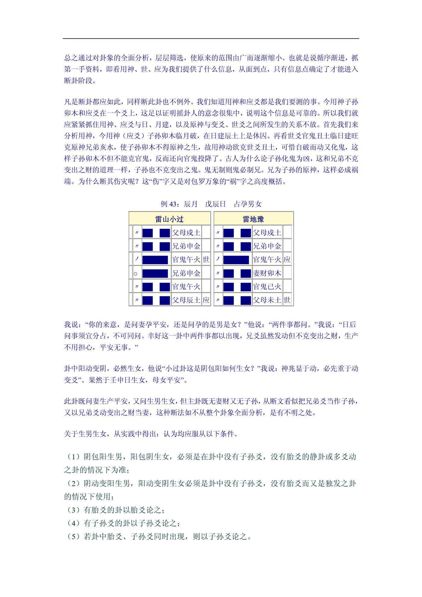

> ⚠ 本页含方块占位字符（██ 等）：原书卦图/爻位无法由文字层还原，**本页卦例不作为默认规则**；请对照上方原页图人工辨认。

<!-- ¶0884 e1bf59ca5407 -->
总之通过对卦象的全面分析，层层筛选，使原来的范围由广而逐渐缩小。也就是说循序渐进，抓

<!-- ¶0885 8c4c302c7a11 -->
第一手资料，即看用神、世、应为我

<!-- ¶0886 404ba7f93381 -->
们提供了什么信息，从面到点，只有信息点确定了才能进入

<!-- ¶0887 252e65f493f2 -->
断卦阶段。

<!-- ¶0888 a2f78bcb4b7e -->
凡是断卦都应如此，同样断此卦也不例外。我们知道用神和应爻都是我们要测的事。今用神子孙

<!-- ¶0889 2bb4f3c82fdd -->
卯木和应爻在一个爻上，这足以证明摇卦人的意念很集中，说明这个信息是可靠的。所以我们就

<!-- ¶0890 59410bf59249 -->
应紧紧抓住用神、应爻与日、月建，以及原神与变爻、世爻之间所发生的关系不放。首先我们来

<!-- ¶0891 a9c5d6480ea4 -->
分析用神，今用神（应爻）子孙卯木临月破，在日建辰土上是休囚。再看世爻官鬼丑土临日建旺

<!-- ¶0892 fb7eec7c6c39 -->
克原神兄弟亥水，使子孙卯木不得原神之生，故用神动欲克世爻丑土，可惜自破而动又化鬼，这

<!-- ¶0893 4c593a702586 -->
样子孙卯木不但不能克官鬼，

<!-- ¶0894 a227d3fc8b80 -->
反而还向官鬼投降了。古人为什么论子孙化鬼为凶，这和兄弟不克

<!-- ¶0895 eca7508e9d0b -->
变出之财的道理一样，子孙也不克变出之鬼。鬼无制则鬼必制兄。兄为子孙的原神，这样必成祸

<!-- ¶0896 0b2c1aca4e8f -->
端。为什么断其伤灾呢？这

<!-- ¶0897 b5a8cc973fba -->
字又是对包罗万象的

<!-- ¶0898 074f785a5aa3 -->
字之高度概括。

<!-- ¶0899 1b387c66e746 -->
：辰月

<!-- ¶0900 3efa09cf5493 -->
戊辰日

<!-- ¶0901 21b0565e6e3f -->
占孕男女

<!-- ¶0902 c23f721f4249 -->
雷山小过

<!-- ¶0903 efc40963898d -->
██

<!-- ¶0904 a9b2566d314c -->
██

<!-- ¶0905 1c9f27867ffc -->
父母戍土

<!-- ¶0906 953b387094d3 -->
██

<!-- ¶0907 f6a689d6f92e -->
██

<!-- ¶0908 23111e801aa0 -->
兄弟申金

<!-- ¶0909 9ffdaaa9fb3a -->
█████

<!-- ¶0910 c51c4d59f82e -->
官鬼午火

<!-- ¶0911 8ce38e8c8eac -->
█████

<!-- ¶0912 8bbb1a7e6a45 -->
兄弟申金

<!-- ¶0913 fd4ebcb983bd -->
██

<!-- ¶0914 bd56ba47ee6e -->
██

<!-- ¶0915 a0e3ffe64649 -->
官鬼午火

<!-- ¶0916 5ca3ca1cfb21 -->
██

<!-- ¶0917 11021d0fd3b2 -->
██

<!-- ¶0918 c0a8a19e4392 -->
父母辰土

<!-- ¶0919 fa22cb0af537 -->
雷地豫

<!-- ¶0920 01dd021c8152 -->
██

<!-- ¶0921 df9befa02534 -->
██

<!-- ¶0922 646319f39a11 -->
父母戍土

<!-- ¶0923 2a9b6ba90224 -->
██

<!-- ¶0924 5b565bf4f5bb -->
██

<!-- ¶0925 3fb84d3a5fef -->
兄弟申金

<!-- ¶0926 4fa60d8d2e10 -->
█████

<!-- ¶0927 672a9eba5af9 -->
官鬼午火

<!-- ¶0928 e8a1b2d62f10 -->
██

<!-- ¶0929 2fb5fa9afe9e -->
██

<!-- ¶0930 58b6dbf6fd62 -->
妻财卯木

<!-- ¶0931 879bae8ed77d -->
██

<!-- ¶0932 8d70b74042f6 -->
██

<!-- ¶0933 3f2f1d250e56 -->
官鬼已火

<!-- ¶0934 92e60cc4a82f -->
██

<!-- ¶0935 f037afea2cd6 -->
██

<!-- ¶0936 7bfc27445e7b -->
父母未土

<!-- ¶0937 a2e452ee81cc -->
我说：

<!-- ¶0938 6fd506864eab -->
你的来意，是问妻孕平安，还是问孕的是男是女？

<!-- ¶0939 9407060b811a -->
他说：

<!-- ¶0940 7f0ce6adb5c6 -->
两件事都问。

<!-- ¶0941 9c42ff2081e6 -->
我说：

<!-- ¶0942 350c25e1b385 -->
日后

<!-- ¶0943 69e1897aee89 -->
问事须宜分占，不可同问。幸好这一卦中两件事都以出现，兄爻虽然发动但不克变出之财，生产

<!-- ¶0944 15d5b542404d -->
不用担心，平安无事。

<!-- ¶0945 b02f0e7b4784 -->
卦中阳动变阴，必然生女，他说

<!-- ¶0946 db2db174851d -->
小过卦这是阴包阳如何生女？

<!-- ¶0947 8fd487bb0c2c -->
我说：神兆显于动，必先重于动

<!-- ¶0948 c619e94975cf -->
变爻

<!-- ¶0949 5bd73ec2f029 -->
。果然于壬申日生女，母女平安

<!-- ¶0950 e4658b912f5d -->
此卦

<!-- ¶0951 fca9ce311add -->
既问妻生产平安，又问生男生女，但主卦既无妻财又无子孙，从断文看似把兄弟爻当作子孙，

<!-- ¶0952 8fc74d6a735a -->
又以兄弟爻动变出之财当妻，这种断法如不从整个卦象全面分析，是有不明之处。

<!-- ¶0953 3354740a0855 -->
关于生男生女，从实践中得出：认为均应服从以下条件。

<!-- ¶0954 17727ad508bf -->
）阴包阳生男，阳包阴生女，必须是在卦中没有子孙爻，没有胎爻的静卦或多爻动

<!-- ¶0955 d5a0d4134323 -->
之卦的情况下为准；

<!-- ¶0956 97d405fa7cb3 -->
）阴动变阳生男，阳动变阴生女必须是卦中没有子孙爻，没有胎爻而又是独发之卦

<!-- ¶0957 f513de584982 -->
的情况下使用；

<!-- ¶0958 3aa5ed52ce67 -->
）有胎爻的卦以胎爻论之；

<!-- ¶0959 5a741e7feef5 -->
）有子孙爻的卦以子孙爻论之；

<!-- ¶0960 7cd25c0ff5bf -->
）若卦中胎爻、子孙爻同时出现，则以子

<!-- ¶0961 2026b697294c -->
孙爻论之。

## 第 13 页（PDF 实际页码）

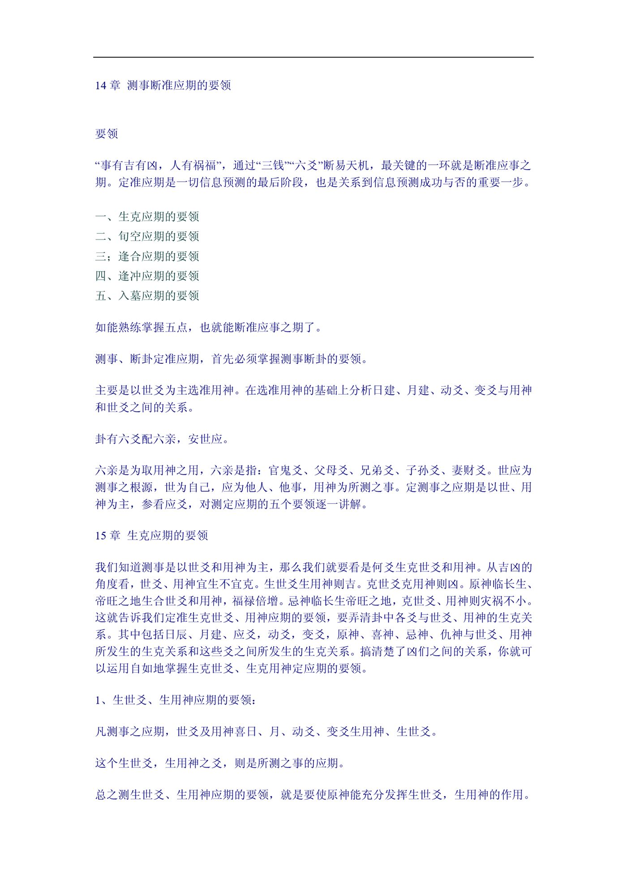

<!-- ¶0962 e11a0923cdc3 -->
14

<!-- ¶0963 981526c20a34 -->
测事断准应期的要领

<!-- ¶0964 977f4d3f96bc -->
要领

<!-- ¶0965 87dca2ee9360 -->
事有吉有凶，人有祸福

<!-- ¶0966 f0c75ac99d44 -->
，通过

<!-- ¶0967 f4080724a3f3 -->
三钱

<!-- ¶0968 c1db77a1fda7 -->
”“

<!-- ¶0969 03dc28f8b2fe -->
六爻

<!-- ¶0970 747fffda25bf -->
断易天机，最关键的一环就是断准应事之

<!-- ¶0971 a9406c83837f -->
期。定准应期是一切信息预测的最后阶段，也是关系到信息预测成功与否的重要一步。

<!-- ¶0972 1cc45867d87c -->
一、生克应期的要领

<!-- ¶0973 25ed2ab9f30d -->
二、旬空应期的要领

<!-- ¶0974 44d70a6dedba -->
三；逢合应期的要领

<!-- ¶0975 b8a29e98d4d1 -->
四、逢冲应期的要领

<!-- ¶0976 b9d7c93cc737 -->
五、入墓应期的要领

<!-- ¶0977 c6bce26d7463 -->
如能熟练掌握五点，也就能断准应事之期了。

<!-- ¶0978 37d9007297ed -->
测事、断卦定准应期，首先必须掌握测事断卦的要领。

<!-- ¶0979 7ba3da1c8add -->
主要是以世爻为主选准用神。在选准用神的基础上分析日建、月建、动爻、变爻与用神

<!-- ¶0980 68d16939f9d2 -->
和世爻之间的关系。

<!-- ¶0981 7850847d8f37 -->
卦有

<!-- ¶0982 cbb2531d5b37 -->
六爻配六亲，安世应。

<!-- ¶0983 d53a3f917980 -->
六亲是为取用神之用，六亲是指：官鬼爻、父母爻、兄弟爻、子孙爻、妻财爻。世应为

<!-- ¶0984 06a44c8dab11 -->
测事之根源，世为自己，应为他人、他事，用神为所测之事。定测事之应期是以世、用

<!-- ¶0985 f6267ef178c3 -->
神为主，参看应爻，对测定应期的五个要领逐一讲解。

<!-- ¶0986 2088ca5ce080 -->
15

<!-- ¶0987 496ac1cf43f7 -->
生克应期的要领

<!-- ¶0988 19e79aaeeed8 -->
我们知道测事是以世爻和用神为主，那么我们就要看是何爻生克世爻和用神。从吉凶的

<!-- ¶0989 277f8f1c7631 -->
角度看，世爻、用神宜生不宜克。生世爻生用神则吉。克世爻克用神则凶。原神临长生、

<!-- ¶0990 24bebd41a374 -->
帝旺之地生合世爻和用神，福禄倍增。忌神临长生帝旺之地，克世爻、用神则灾祸不小。

<!-- ¶0991 9194290ef104 -->
这就告诉我们定准生克世爻、用神

<!-- ¶0992 2129f87561ff -->
应期的要领，要弄清卦中各爻与世爻、用神的生克关

<!-- ¶0993 c2b736689b0e -->
系。其中包括日辰、月建、应爻，动爻，变爻，原神、喜神、忌神、仇神与世爻、用神

<!-- ¶0994 33c6b2e281d9 -->
所发生的生克关系和这些爻之间所发生的生克关系。搞清楚了凶们之间的关系，你就可

<!-- ¶0995 18e434dd77ac -->
以运用自如地掌握生克世爻、生克用神定应期的要领。

<!-- ¶0996 06199186d4b0 -->
、生世爻、生用神应期的要领：

<!-- ¶0997 b74a722af738 -->
凡测事之应期，世爻及用神喜日、月、动爻、变爻生用神、生世爻。

<!-- ¶0998 6ff90dac88ed -->
这个生世爻，生用神之爻，则是所测之事的应期。

<!-- ¶0999 d57322a4f443 -->
总之测生世爻、生用神应期的要领，就是要使原神能充分发挥生世爻，生用神的作用。

## 第 14 页（PDF 实际页码）

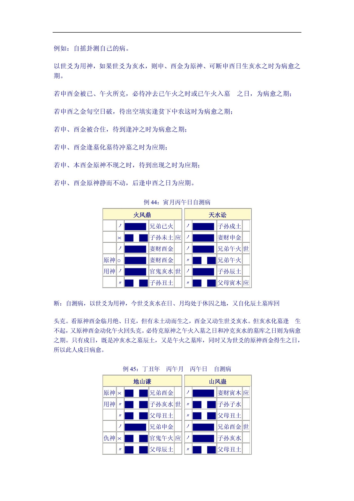

> ⚠ 本页含方块占位字符（██ 等）：原书卦图/爻位无法由文字层还原，**本页卦例不作为默认规则**；请对照上方原页图人工辨认。

<!-- ¶1000 f079d24dca5a -->
例如：自摇卦测自己的病。

<!-- ¶1001 7d11ab0fa43f -->
以世爻为

<!-- ¶1002 25b8de69db38 -->
用神，如果世爻为亥水，则申、酉金为原神、可断申酉日生亥水之时为病愈之

<!-- ¶1003 07943d710822 -->
期。

<!-- ¶1004 e079fb075b5d -->
若申酉金被已、午火所克，必待冲去已午火之时或已午火入墓

<!-- ¶1005 bfbf36cfe6dc -->
之日，为病愈之期；

<!-- ¶1006 cba80999c62f -->
若申酉之金旬空日破，待出空填实逢贫下中农这时为病愈之期；

<!-- ¶1007 363dd0072ca4 -->
若申、酉金被合住，待到逢冲之时为病愈之期；

<!-- ¶1008 9bba2cf573f9 -->
若申、酉金逢墓化墓待冲墓之时为应期；

<!-- ¶1009 ba2f439cb75b -->
若申、本酉金原神不现之时，待到出现之时为应期；

<!-- ¶1010 6c092a965a6e -->
若申、酉金原神静而不动，后逢申酉之日为应期。

<!-- ¶1011 5d339ab6e046 -->
44

<!-- ¶1012 8e85300aabd4 -->
：寅月丙午日自测病

<!-- ¶1013 0fa71a4c621b -->
火风鼎

<!-- ¶1014 d4d73f525e97 -->
█████

<!-- ¶1015 81c4b4749067 -->
兄弟已火

<!-- ¶1016 7a78fdea699c -->
██

<!-- ¶1017 321169a6a929 -->
██

<!-- ¶1018 608ba02814f7 -->
子孙未土

<!-- ¶1019 3d0b6f582b14 -->
█████

<!-- ¶1020 c34647f26c6e -->
妻财酉金

<!-- ¶1021 e19cc929d9f9 -->
原神

<!-- ¶1022 a20a0c07163e -->
█████

<!-- ¶1023 c1bd353553e2 -->
妻财酉金

<!-- ¶1024 d9474bdb8662 -->
用神

<!-- ¶1025 8376a57a1baa -->
█████

<!-- ¶1026 074aa37c6e04 -->
官鬼亥水

<!-- ¶1027 11b1b991e28d -->
██

<!-- ¶1028 8089a5b6bf52 -->
██

<!-- ¶1029 602e367b1eef -->
子孙丑土

<!-- ¶1030 efe5b4349ac8 -->
天水讼

<!-- ¶1031 1b14a1bba27f -->
█████

<!-- ¶1032 a03e8ae9a913 -->
子孙戍土

<!-- ¶1033 fb5efdf81b82 -->
█████

<!-- ¶1034 d26a33c9b376 -->
妻财申金

<!-- ¶1035 5b0852c3d9ae -->
█████

<!-- ¶1036 4b36ffe03d5a -->
兄弟午火

<!-- ¶1037 48a1e742d077 -->
██

<!-- ¶1038 a7c1d8535682 -->
██

<!-- ¶1039 351cdac9e91b -->
兄弟午火

<!-- ¶1040 176e4d5f1697 -->
█████

<!-- ¶1041 f214ef10186e -->
子孙辰土

<!-- ¶1042 44abb0f2a32d -->
██

<!-- ¶1043 196d9588b663 -->
██

<!-- ¶1044 b20c9ffc3231 -->
父母寅木

<!-- ¶1045 bec50a91d60a -->
断：自测病，以世爻为用神，今世爻亥水在日、月均处于休囚之地，又自化辰土墓库回

<!-- ¶1046 cbced265bff9 -->
头克。看原神酉金临月绝、日克，但有未土动而生之，酉金又动生世爻亥水。但

<!-- ¶1047 19e1411043f3 -->
亥水化墓逢

<!-- ¶1048 d8d15a86cb9d -->
不起，又原神酉金动化午火回头克。必待克原神之午火入墓之日和冲克亥水的墓库之日则为病愈

<!-- ¶1049 b4af2d5bec7b -->
之期。只有戍日，既是冲亥水之墓辰土，又是午火之墓库，同时又为世爻的原神酉金得生之日，

<!-- ¶1050 0c5cca7fdf06 -->
所以此人戍日病愈。

<!-- ¶1051 f626c6feb188 -->
：丁丑年

<!-- ¶1052 0d3e7817c347 -->
丙午月

<!-- ¶1053 cb23bbe1acc2 -->
丙午日

<!-- ¶1054 101bc8e183cc -->
自测病

<!-- ¶1055 5a6b0c46d8b7 -->
地山谦

<!-- ¶1056 9328dec7363d -->
原神

<!-- ¶1057 f2310a3f2b4c -->
██

<!-- ¶1058 ff378e6413b3 -->
██

<!-- ¶1059 d557df68c627 -->
兄弟酉金

<!-- ¶1060 ad67e0c84ea1 -->
用神

<!-- ¶1061 4b3ce2d8669c -->
██

<!-- ¶1062 25ff4cefa187 -->
██

<!-- ¶1063 9b15843bb77b -->
子孙亥水

<!-- ¶1064 219cf6bbdcb0 -->
██

<!-- ¶1065 838e068d2c99 -->
██

<!-- ¶1066 f515f36a6680 -->
父母丑土

<!-- ¶1067 679c67427c31 -->
█████

<!-- ¶1068 cf04a1c70f5b -->
兄弟申金

<!-- ¶1069 9ae75b32f715 -->
仇神

<!-- ¶1070 d75477f97797 -->
██

<!-- ¶1071 90ea8bd9b8ea -->
██

<!-- ¶1072 51e73564df7c -->
官鬼午火

<!-- ¶1073 082754a2a0e3 -->
██

<!-- ¶1074 c916a9b1002e -->
██

<!-- ¶1075 e42e8a52f650 -->
父母辰土

<!-- ¶1076 6ceec6f1d436 -->
山风蛊

<!-- ¶1077 e9f2c4da7da6 -->
█████

<!-- ¶1078 1a516b7e50a8 -->
妻财寅木

<!-- ¶1079 4637f2eb3560 -->
██

<!-- ¶1080 94b57db6bfff -->
██

<!-- ¶1081 62f41691a0d8 -->
子孙子水

<!-- ¶1082 9e0c08c2b91a -->
██

<!-- ¶1083 3d00ceab2dad -->
██

<!-- ¶1084 fa8f51d31d59 -->
父母丑土

<!-- ¶1085 1e533fe8c254 -->
█████

<!-- ¶1086 ff10b4810ba2 -->
兄弟酉金

<!-- ¶1087 7a5362075e86 -->
█████

<!-- ¶1088 c250fa4335d4 -->
子孙亥水

<!-- ¶1089 09630b2e7559 -->
██

<!-- ¶1090 3d3d776e2780 -->
██

<!-- ¶1091 47115c0d0158 -->
父母丑土

## 第 15 页（PDF 实际页码）

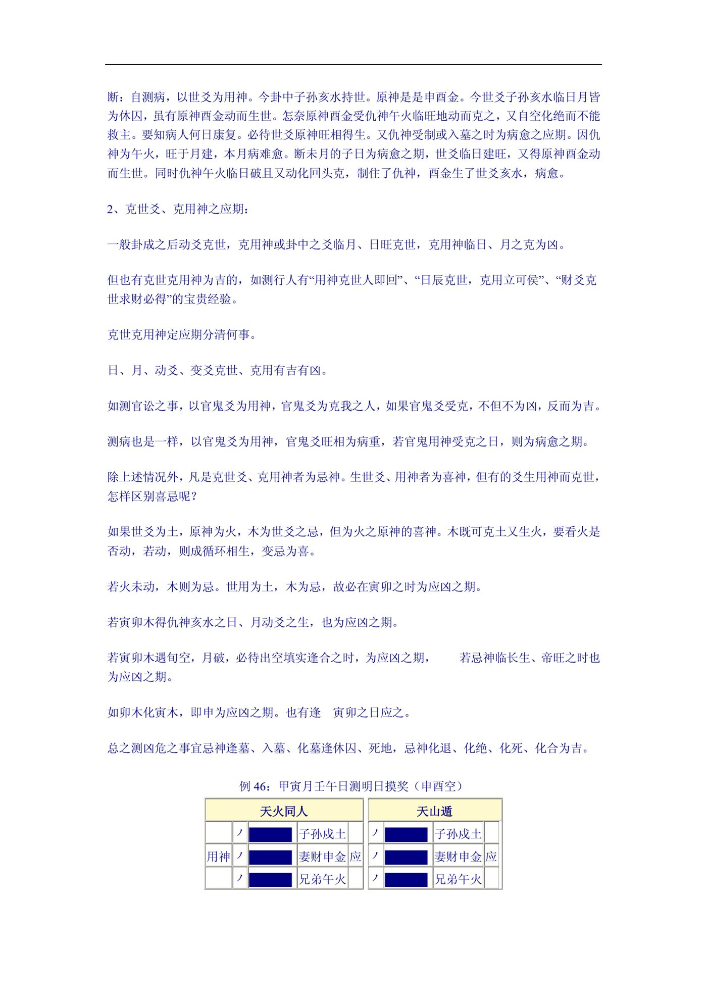

> ⚠ 本页含方块占位字符（██ 等）：原书卦图/爻位无法由文字层还原，**本页卦例不作为默认规则**；请对照上方原页图人工辨认。

<!-- ¶1092 c45f75734673 -->
断：自测病，以世爻为用神。今卦中子孙亥水持世。原神是是申酉金。今世爻子孙亥水临日月皆

<!-- ¶1093 9598b4491d7d -->
为休囚，虽有原神酉金动而生世。怎奈原神酉金受仇神午火临旺地动而克之，又自空化绝而不能

<!-- ¶1094 d37862ee43d0 -->
救主。要知病人何日康复。必待世爻原神旺相得生。又仇神受制或入墓之时为病愈之应期。因仇

<!-- ¶1095 a63ecc9871d8 -->
神为午火，旺于月建，本月病难愈。断未月的子日为病愈之期，世爻临日建旺，又得原

<!-- ¶1096 401023730faa -->
神酉金动

<!-- ¶1097 5c6772fab27b -->
而生世。同时仇神午火临日破且又动化回头克，制住了仇神，酉金生了世爻亥水，病愈。

<!-- ¶1098 f6db2959f995 -->
、克世爻、克用神之应期：

<!-- ¶1099 3f6c91a8fe51 -->
一般卦成之后动爻克世，克用神或卦中之爻临月、日旺克世，克用神临日、月之克为凶。

<!-- ¶1100 11aa1b264990 -->
但也有克世克用神为吉的，如测行人有

<!-- ¶1101 7538e5e25799 -->
用神克世人即回

<!-- ¶1102 7f3b541ad317 -->
日辰克世，克用立可侯

<!-- ¶1103 3ffc267eaa78 -->
财爻克

<!-- ¶1104 c6ff62e46402 -->
世求财必得

<!-- ¶1105 a88034fc860f -->
的宝贵经验。

<!-- ¶1106 2b53ac396033 -->
克世克用神定应期分清何事。

<!-- ¶1107 846c8968b8f7 -->
日、月、动爻、变爻克世、克用有吉有凶。

<!-- ¶1108 7ec71f3f1ae1 -->
如测官讼之事，以官鬼爻为用神，官鬼爻为克我之人，如果官鬼爻受克，不但不为凶，反而为吉。

<!-- ¶1109 9b372062913b -->
测病也是一样，以官鬼爻为用神，官

<!-- ¶1110 9845125070a7 -->
鬼爻旺相为病重，若官鬼用神受克之日，则为病愈之期。

<!-- ¶1111 6e149c012dc4 -->
除上述情况外，凡是克世爻、克用神者为忌神。生世爻、用神者为喜神，但有的爻生用神而克世，

<!-- ¶1112 8f62cbf17101 -->
怎样区别喜忌呢？

<!-- ¶1113 0959a0379155 -->
如果世爻为土，原神为火，木为世爻之忌，但为火之原神的喜神。木既可克土又生火，要看火是

<!-- ¶1114 80f2bcf3692b -->
否动，若动，则成循环相生，变忌为喜。

<!-- ¶1115 42b92a83239a -->
若火未动，木则为忌。世用为土，木为忌，故必在寅卯之时为应凶之期。

<!-- ¶1116 a4037245520b -->
若寅卯木得仇神亥水之日、月动爻之生，也为应凶之期。

<!-- ¶1117 073226867630 -->
若寅卯木遇旬空，月破，必待出空填实逢合之时，为应凶之期，

<!-- ¶1118 dc5c5ca7787a -->
若忌神临长生、帝旺之时也

<!-- ¶1119 bf5ce2699ded -->
为应凶之期。

<!-- ¶1120 739b4f84fac2 -->
如卯木

<!-- ¶1121 8455a736a197 -->
化寅木，即申为应凶之期。也有逢

<!-- ¶1122 34ef95a7afba -->
寅卯之日应之。

<!-- ¶1123 d862c39b2fa5 -->
总之测凶危之事宜忌神逢墓、入墓、化墓逢休囚、死地，忌神化退、化绝、化死、化合为吉。

<!-- ¶1124 881feea0c9ca -->
：甲寅月壬午日测明日摸奖（申酉空）

<!-- ¶1125 5ebcf001b050 -->
天火同人

<!-- ¶1126 7579806f2347 -->
█████

<!-- ¶1127 26774fda4bdd -->
子孙戍土

<!-- ¶1128 900fda2ad07d -->
用神

<!-- ¶1129 4112e1042aed -->
█████

<!-- ¶1130 f118eb81a310 -->
妻财申金

<!-- ¶1131 f9345c9a9b4b -->
█████

<!-- ¶1132 d61863ac15f1 -->
兄弟午火

<!-- ¶1133 78c1bc99a530 -->
天山遁

<!-- ¶1134 35fcf763bcd9 -->
█████

<!-- ¶1135 6f79e3bece30 -->
子孙戍土

<!-- ¶1136 09cf450c9db4 -->
█████

<!-- ¶1137 576ff7f02619 -->
妻财申金

<!-- ¶1138 84f39136214b -->
█████

<!-- ¶1139 933399393252 -->
兄弟午

## 第 16 页（PDF 实际页码）

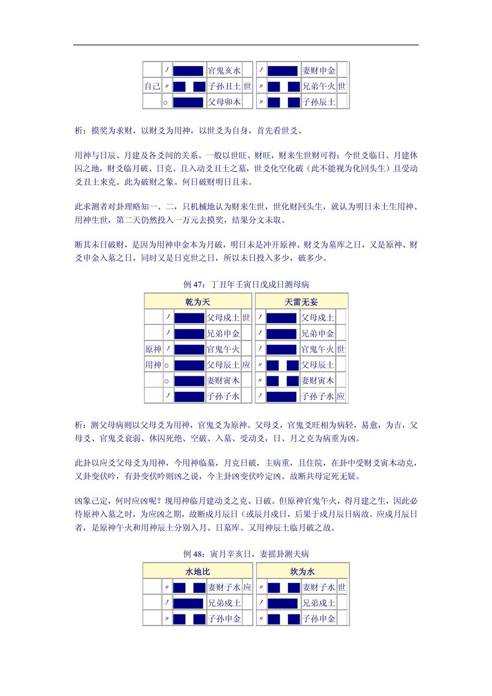

> ⚠ 本页含方块占位字符（██ 等）：原书卦图/爻位无法由文字层还原，**本页卦例不作为默认规则**；请对照上方原页图人工辨认。

<!-- ¶1140 eac5ae14c6f5 -->
█████

<!-- ¶1141 81b720a4ac8d -->
官鬼亥水

<!-- ¶1142 b2e4cfc10d90 -->
自己

<!-- ¶1143 bbf54579d118 -->
██

<!-- ¶1144 045dcd3e14e3 -->
██

<!-- ¶1145 5e4ef37e71fd -->
子孙丑土

<!-- ¶1146 c973082d181a -->
█████

<!-- ¶1147 2ff9a6261f59 -->
父母卯木

<!-- ¶1148 0b5bc1847343 -->
█████

<!-- ¶1149 9c12abebc33d -->
妻财申金

<!-- ¶1150 5b8da62b49b6 -->
██

<!-- ¶1151 bc574bfa62ac -->
██

<!-- ¶1152 4adec8ac28a5 -->
兄弟午火

<!-- ¶1153 9b054e256146 -->
██

<!-- ¶1154 dbf1e09b6a97 -->
██

<!-- ¶1155 fcab44812370 -->
子孙辰土

<!-- ¶1156 eaed1a2bab70 -->
析：摸奖为求财，以财爻为用神，以世爻为自身，首先看世爻、

<!-- ¶1157 af53e9fbad11 -->
用神与日辰、月建及各爻间的关系。一般以世旺、财旺，财来生世财可得；今世爻临日、月建休

<!-- ¶1158 d8637f800ca3 -->
囚之地，财爻临月破、日克。且入动爻丑土之墓，世爻化空化破（此不能视为化回头生）且受动

<!-- ¶1159 89996f2d6541 -->
爻丑土来克。此为破财之象。何日破财明日且未。

<!-- ¶1160 628c50fdccda -->
此求测者对卦理略知一、二，只机械地认为财来生世，世化财回头生，就认为明日未土生用神、

<!-- ¶1161 100035b8a18b -->
用神生世，第二天仍然投入一万元去摸

<!-- ¶1162 0003ac26189c -->
奖，结果分文未取。

<!-- ¶1163 add5c5af9d00 -->
断其未日破财，是因为用神申金本为月破，明日未是冲开原神、财爻为墓库之日，又是原神、财

<!-- ¶1164 bc74f0057723 -->
爻申金入墓之日，同时又是日克世之日，所以未日投入多少，破多少。

<!-- ¶1165 b2ce8b3b7c66 -->
：丁丑年壬寅日戊戍日测母病

<!-- ¶1166 153173104123 -->
乾为天

<!-- ¶1167 764362d941bf -->
█████

<!-- ¶1168 ac2d8f6a0f4d -->
父母戍土

<!-- ¶1169 ae705636f3bc -->
█████

<!-- ¶1170 9a18d2ff8197 -->
兄弟申金

<!-- ¶1171 7b3f66f36b97 -->
原神

<!-- ¶1172 35b5eb70ed89 -->
█████

<!-- ¶1173 5d667e8ae9af -->
官鬼午火

<!-- ¶1174 fb57d9000715 -->
用神

<!-- ¶1175 10c017ffa790 -->
█████

<!-- ¶1176 d33ac53a1613 -->
父母辰土

<!-- ¶1177 791b3c94708e -->
█████

<!-- ¶1178 54303edf1966 -->
妻财寅木

<!-- ¶1179 69be11b7d1b4 -->
█████

<!-- ¶1180 a330a0b12750 -->
子孙子水

<!-- ¶1181 0ae26dc7ceb8 -->
天雷无妄

<!-- ¶1182 5a42aba0504e -->
█████

<!-- ¶1183 2161b7f2d338 -->
父母戍土

<!-- ¶1184 cc312a25cb43 -->
█████

<!-- ¶1185 9f474a7b714e -->
兄弟申金

<!-- ¶1186 b91e00744f8f -->
█████

<!-- ¶1187 085fb9516574 -->
官鬼午火

<!-- ¶1188 750dd9d571a8 -->
██

<!-- ¶1189 d9eae6da1330 -->
██

<!-- ¶1190 78fc175352dc -->
父母辰土

<!-- ¶1191 a7728c5c78c5 -->
██

<!-- ¶1192 f8cbdcd86f5e -->
██

<!-- ¶1193 5b17092edc57 -->
妻财寅木

<!-- ¶1194 3898577dd0e7 -->
█████

<!-- ¶1195 8249e88fd2f0 -->
子孙子水

<!-- ¶1196 3c083cdcaaf3 -->
析：测父母病则以父母爻为用神，官鬼爻为原神。父母爻，官鬼爻旺相为病轻，易愈，为吉，父

<!-- ¶1197 40c1439c7025 -->
母爻、官鬼爻衰弱、休囚死绝、空破、入墓、受动爻，日、月之克为病重为凶。

<!-- ¶1198 5370960bafbe -->
此卦以应爻父母爻为用神，今用神临墓，月克日破，主病重，且住院，在卦中受财爻寅木动克，

<!-- ¶1199 b945ea82feb5 -->
又卦变伏吟，有卦变伏吟则凶之说，今主卦凶变伏吟定凶。故断共母定死无疑。

<!-- ¶1200 050cd3e38b7b -->
凶象己定，何时应凶呢？现用神临月建动爻之克、日破。

<!-- ¶1201 2c3f3930fc52 -->
但原神官鬼午火，得月建之生，因此必

<!-- ¶1202 84116a71b194 -->
待原神入墓之时，为应凶之期，故断戍月辰日（或辰月戍日，后果于戍月辰日病故。应戍月辰日

<!-- ¶1203 7bd042b3ebae -->
者，是原神午火和用神辰土分别入月、日墓库。又用神辰土临月破之故。

<!-- ¶1204 209e3c9c02db -->
：寅月辛亥日，妻摇卦测夫病

<!-- ¶1205 3548ff9e69c5 -->
水地比

<!-- ¶1206 813c797644fd -->
██

<!-- ¶1207 58b304606777 -->
██

<!-- ¶1208 3cf9bb2bff29 -->
妻财子水

<!-- ¶1209 d7db4bad045c -->
█████

<!-- ¶1210 1919a45fd6b7 -->
兄弟戍土

<!-- ¶1211 e3f3365d8256 -->
██

<!-- ¶1212 55135e9dfe87 -->
██

<!-- ¶1213 f06b7e693d92 -->
子孙申金

<!-- ¶1214 a19f0605ddb4 -->
坎为水

<!-- ¶1215 d9a646dc4737 -->
██

<!-- ¶1216 8f77faac855e -->
██

<!-- ¶1217 0de3762d7212 -->
妻财子水

<!-- ¶1218 f6e93c434891 -->
█████

<!-- ¶1219 27e3fc8231a0 -->
弟戍土

<!-- ¶1220 ceb298c5d7c9 -->
██

<!-- ¶1221 80746c57e954 -->
██

<!-- ¶1222 733389052d9d -->
子孙申金

## 第 17 页（PDF 实际页码）

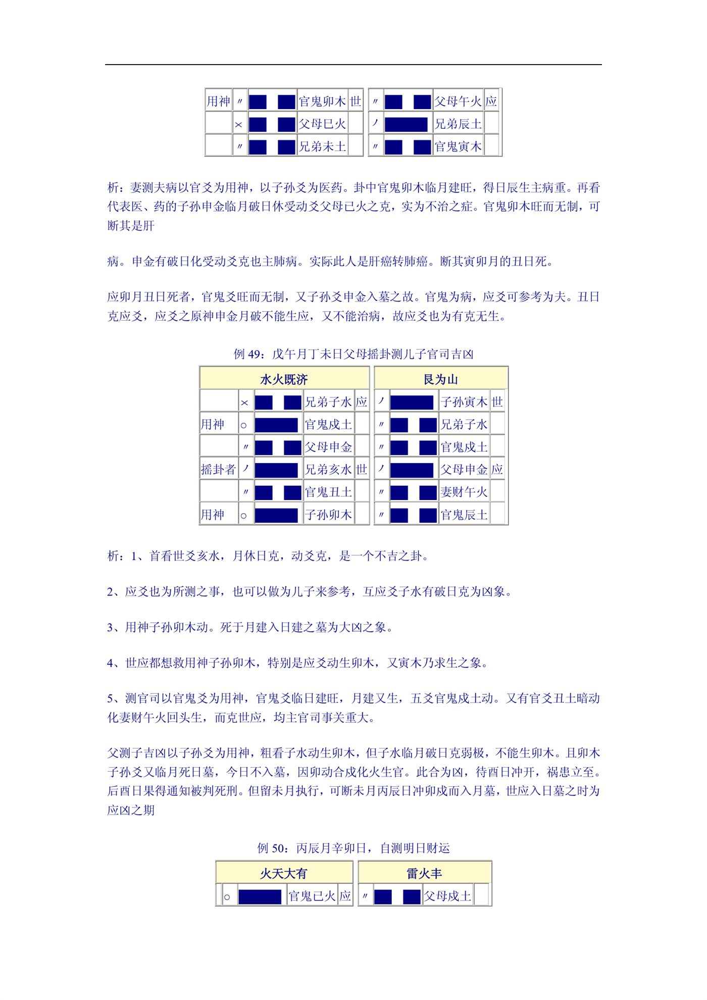

> ⚠ 本页含方块占位字符（██ 等）：原书卦图/爻位无法由文字层还原，**本页卦例不作为默认规则**；请对照上方原页图人工辨认。

<!-- ¶1223 4e6a4ed71222 -->
用神

<!-- ¶1224 986b00a093e8 -->
██

<!-- ¶1225 f60ba131b9fb -->
██

<!-- ¶1226 609f488bbcfa -->
官鬼卯木

<!-- ¶1227 63154f554ef8 -->
██

<!-- ¶1228 f4bbb5a01552 -->
██

<!-- ¶1229 f5dcc9c30a36 -->
父母巳火

<!-- ¶1230 2c59c1eb749c -->
██

<!-- ¶1231 82b1fba9917e -->
██

<!-- ¶1232 92656579e6f3 -->
兄弟未土

<!-- ¶1233 c3be1ae2553b -->
██

<!-- ¶1234 80d6216838e0 -->
██

<!-- ¶1235 748491b9b464 -->
父母午火

<!-- ¶1236 3e393876de5c -->
█████

<!-- ¶1237 30ae841c1654 -->
兄弟辰土

<!-- ¶1238 50cfcd8139e2 -->
██

<!-- ¶1239 be2c2d68f846 -->
██

<!-- ¶1240 19310f4ba405 -->
官鬼寅木

<!-- ¶1241 3dc399a6e331 -->
析：妻测夫病以官爻为用神，以子孙爻为医药。卦中官鬼卯木临月建旺，得日辰生主病重。再看

<!-- ¶1242 ec400ef54c17 -->
代表医、药的子孙申金临月破日休受动爻父母已火之克，实为不治之症。官鬼卯木旺而无制，可

<!-- ¶1243 b612a493b8b1 -->
断其是肝

<!-- ¶1244 d39659d91cf3 -->
病。申金有破日化受动爻克也主肺病。实际此人是肝癌转肺癌。断其寅卯月的丑日死。

<!-- ¶1245 e988fc392606 -->
应卯月丑日死者，官鬼爻旺而无制，又子孙爻申金入墓之故。官鬼为病，应爻可参考为夫。丑日

<!-- ¶1246 2f6979cc4c6a -->
克应爻，应爻

<!-- ¶1247 8c5ab95ffaa7 -->
之原神申金月破不能生应，又不能治病，故应爻也为有克无生。

<!-- ¶1248 dc290b50608e -->
：戊午月丁未日父母摇卦测儿子官司吉凶

<!-- ¶1249 2a6d2d395ad8 -->
水火既济

<!-- ¶1250 130053ec5d9d -->
██

<!-- ¶1251 65481a6a68c1 -->
██

<!-- ¶1252 a1f1e34d8e05 -->
兄弟子水

<!-- ¶1253 fe90dac8bf8b -->
用神

<!-- ¶1254 bf999e907a87 -->
█████

<!-- ¶1255 4cd0f5337b3f -->
官鬼戍土

<!-- ¶1256 2e88cbed4de7 -->
██

<!-- ¶1257 55e7acaf3adf -->
██

<!-- ¶1258 2ef39f184dc2 -->
父母申金

<!-- ¶1259 e4992e3c9d60 -->
摇卦者

<!-- ¶1260 ed9a2c47432c -->
█████

<!-- ¶1261 20d0bb6adc75 -->
兄弟亥水

<!-- ¶1262 3b0f71842d68 -->
██

<!-- ¶1263 5564f7326db0 -->
██

<!-- ¶1264 5819a5d2919d -->
官鬼丑土

<!-- ¶1265 df3945e65da8 -->
用神

<!-- ¶1266 df71bd8e3b03 -->
█████

<!-- ¶1267 5beb105628ad -->
子孙卯木

<!-- ¶1268 ea165b1cc618 -->
艮为山

<!-- ¶1269 4f154c62fb98 -->
█████

<!-- ¶1270 3745f6949227 -->
子孙寅木

<!-- ¶1271 f2e2637b62ae -->
██

<!-- ¶1272 e3d0b18caf70 -->
██

<!-- ¶1273 4a72397a58d5 -->
兄弟子水

<!-- ¶1274 64970c913890 -->
██

<!-- ¶1275 63b0f96fcc36 -->
██

<!-- ¶1276 03e4188693ad -->
官鬼戍土

<!-- ¶1277 f2dce56e6b64 -->
█████

<!-- ¶1278 2e7990b8b604 -->
父母申金

<!-- ¶1279 6b1395d5063b -->
██

<!-- ¶1280 9563799704f4 -->
██

<!-- ¶1281 e65e0b19287a -->
妻财午

<!-- ¶1282 6ab66708f148 -->
██

<!-- ¶1283 7c8de2add5fb -->
██

<!-- ¶1284 7dd8d60e95b2 -->
官鬼辰土

<!-- ¶1285 78c9225162fc -->
析：

<!-- ¶1286 8e368186d933 -->
、首看世爻亥水，月休日克，动爻克，是一个不吉之卦。

<!-- ¶1287 5148335fdd99 -->
、应爻也为所测之事，也可以做为儿子来参考，互应爻子水有破日克为凶象。

<!-- ¶1288 fd2a0fea62c1 -->
、用神子孙卯木动。死于月建入日建之墓为大凶之象。

<!-- ¶1289 9396e53204c7 -->
、世应都想救用神子孙卯木，特别是应爻动生卯木，又寅木乃求生之象。

<!-- ¶1290 ad389464fea0 -->
、测官司以官鬼爻为用神，官鬼爻临日建旺，月建又生，五爻官鬼戍土动。又有官爻丑土暗动

<!-- ¶1291 0ff014b2ad39 -->
化妻财午火回头生，而克世应，均主官司事关重大。

<!-- ¶1292 ab033bfd46a9 -->
父测子吉凶以子孙爻为用神，粗看子水动生卯木，但子水临月破日克弱极，不能

<!-- ¶1293 7304e3afa8dc -->
生卯木。且卯木

<!-- ¶1294 806ced6a05c8 -->
子孙爻又临月死日墓，今日不入墓，因卯动合戍化火生官。此合为凶，待酉日冲开，祸患立至。

<!-- ¶1295 5aa96ea08672 -->
后酉日果得通知被判死刑。但留未月执行，可断未月丙辰日冲卯戍而入月墓，世应入日墓之时为

<!-- ¶1296 6689a230fbeb -->
应凶之期

<!-- ¶1297 ca00ece5b17e -->
：丙辰月辛卯日，自测明日财运

<!-- ¶1298 364a8c7504e2 -->
火天大有

<!-- ¶1299 e7a7ad06ef37 -->
█████

<!-- ¶1300 87fc93a248d8 -->
官鬼已火

<!-- ¶1301 dfeb6f2f1500 -->
雷火丰

<!-- ¶1302 3c16072d9c6b -->
██

<!-- ¶1303 4e4835741b34 -->
██

<!-- ¶1304 08b906215a2a -->
父母戍土

## 第 18 页（PDF 实际页码）

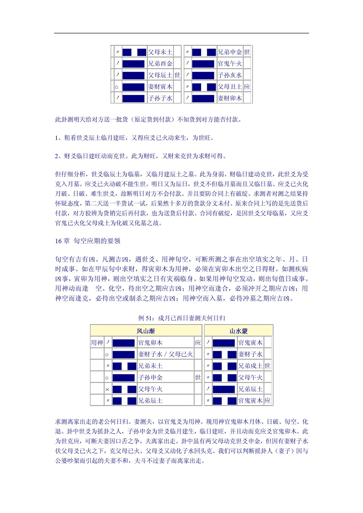

> ⚠ 本页含方块占位字符（██ 等）：原书卦图/爻位无法由文字层还原，**本页卦例不作为默认规则**；请对照上方原页图人工辨认。

<!-- ¶1305 0477054478ad -->
██

<!-- ¶1306 53d07b993c36 -->
██

<!-- ¶1307 73ab4bc9c811 -->
父母未土

<!-- ¶1308 63cb4d809b5e -->
█████

<!-- ¶1309 e94ae235c0ae -->
兄弟酉金

<!-- ¶1310 c304a35ec110 -->
█████

<!-- ¶1311 7b552783685c -->
父母辰土

<!-- ¶1312 d0f07b4b89f4 -->
█████

<!-- ¶1313 08d8b4cd1490 -->
妻财寅木

<!-- ¶1314 8710825f8c5d -->
█████

<!-- ¶1315 e3125ebc8349 -->
子孙子水

<!-- ¶1316 0a1d3d7f4875 -->
██

<!-- ¶1317 c62fbcca3d1d -->
兄弟申金

<!-- ¶1318 6277fe91efac -->
█████

<!-- ¶1319 8bff845d66ea -->
官鬼午火

<!-- ¶1320 95e9b9794dd8 -->
█████

<!-- ¶1321 7464093bbecc -->
子孙亥水

<!-- ¶1322 518e97aef064 -->
██

<!-- ¶1323 876b103a9ffc -->
██

<!-- ¶1324 7327414f90d7 -->
父母丑土

<!-- ¶1325 4e2f72862b74 -->
█████

<!-- ¶1326 07c3ae35e9d5 -->
妻财卯木

<!-- ¶1327 eb9d286ed9b6 -->
此卦测明天给对方送一批货（原定货到付款）不知货到对方能否付款。

<!-- ¶1328 8432e46657f0 -->
、粗看世爻辰土临月建旺，又得应爻已火动来生，为世旺。

<!-- ¶1329 b3d224a1e4fb -->
、财爻临日建旺动而克世。此为财旺，又财来克世为求财可得。

<!-- ¶1330 e2adcacfd850 -->
但仔细分析，世爻临辰土为临墓，又临月建辰土之墓。此为身弱、财临日建动克世，此世爻为受

<!-- ¶1331 64c68f7856eb -->
克入月墓。应爻已火动破不能生世。明日又为辰日，世爻不但临月墓而且又临日墓。

<!-- ¶1332 30d8240010e3 -->
应爻已火化

<!-- ¶1333 5c6cdd579582 -->
月破、日破、难生世爻，故断明日对方不会付款。并且要防合同上有破绽。求测者对测之结果持

<!-- ¶1334 c08434928f62 -->
怀疑态度，第二天送一半货试一试，后果然十多万的货款分文未付。原来合同上写的是先送货后

<!-- ¶1335 bef13bbe2f28 -->
付款，对方狡辨为货销完后再付款，也为送货后付款。合同有破绽，是因世爻父母临墓，又应爻

<!-- ¶1336 15d0f21e9df1 -->
官鬼已火化父母戍土为化破又化墓之故。

<!-- ¶1337 c76a16192732 -->
16

<!-- ¶1338 eb1bfce6a407 -->
旬空应期的要领

<!-- ¶1339 c7a1e754f2eb -->
旬空有吉有凶。凡测吉凶，遇世爻、用神旬空，可断所测之事在出空填实之年、月、日

<!-- ¶1340 8b53430b1a54 -->
时成事。如在甲辰旬中求财，得寅卯木为用神，必须在寅卯木出空之日得财。如测疾病

<!-- ¶1341 7529ed616173 -->
凶事，寅卯为用神，则出空填实之日有灾

<!-- ¶1342 dd39a78afecf -->
祸临身。如果用神旬空发动，则出旬值日成事。

<!-- ¶1343 d477ff420742 -->
用神动而逢

<!-- ¶1344 9905395cf836 -->
空、化空，待出空之期应吉凶；用神空而逢合，必须冲开之期应吉凶；用

<!-- ¶1345 5340aff92619 -->
神空而逢克，必待出空或制杀之期应吉凶；用神空而入墓，必待冲墓之期应吉凶。

<!-- ¶1346 68f98d5204b5 -->
51

<!-- ¶1347 93947afcfddf -->
：戍月己酉日妻测夫何日归

<!-- ¶1348 ee364a764daa -->
风山渐

<!-- ¶1349 fbea401e2027 -->
用神

<!-- ¶1350 c6eb3ff6f11d -->
█████

<!-- ¶1351 ecaac294af57 -->
官鬼卯木

<!-- ¶1352 b3768826fc05 -->
█████

<!-- ¶1353 1f12f8760c0e -->
妻财子水／父母已火

<!-- ¶1354 cb5fcfdf2765 -->
██

<!-- ¶1355 d60951a0e4a6 -->
██

<!-- ¶1356 aab6b7a8ddb8 -->
兄弟未土

<!-- ¶1357 6c7fcd976101 -->
█████

<!-- ¶1358 22df23e33246 -->
子孙申金

<!-- ¶1359 e112b792163c -->
██

<!-- ¶1360 7e9e33c74f69 -->
██

<!-- ¶1361 ae21e64d1e46 -->
父母午火

<!-- ¶1362 9c09d27f0bfe -->
██

<!-- ¶1363 499bda886232 -->
██

<!-- ¶1364 59348260ce9d -->
兄弟辰土

<!-- ¶1365 7973760de7b4 -->
山水蒙

<!-- ¶1366 dfa396b01da5 -->
█████

<!-- ¶1367 1c4dd047cd09 -->
官鬼寅木

<!-- ¶1368 37dc4f80d320 -->
██

<!-- ¶1369 eb9b1ff53044 -->
██

<!-- ¶1370 edcb562fa15c -->
妻财子水

<!-- ¶1371 380ec2214fa4 -->
██

<!-- ¶1372 571725adeafa -->
██

<!-- ¶1373 c3b5b701d542 -->
兄弟戍土

<!-- ¶1374 d21b608efd8b -->
██

<!-- ¶1375 44645305fd1f -->
██

<!-- ¶1376 7377ad9643f9 -->
父母午火

<!-- ¶1377 49e2d2f0a620 -->
█████

<!-- ¶1378 74fad45c9eec -->
兄弟辰土

<!-- ¶1379 ec44467ba722 -->
██

<!-- ¶1380 934473c2489b -->
██

<!-- ¶1381 fc9141ebdfd5 -->
官鬼寅木

<!-- ¶1382 b42497f0d7eb -->
求测离家出走的老公何日归。妻测夫，以官鬼爻为用神。现用神官鬼卯木月休、日破、旬空、化

<!-- ¶1383 b3a9eef14c7c -->
退。卦中世爻为摇卦之人，子孙申金为世爻临月建生，临日建旺，并且动而克应爻官鬼卯木。此

<!-- ¶1384 17ebdbe7f8b4 -->
为世克应，可断夫妻因口舌之争，夫离家出走。卦中虽有两父母动克世爻申金，但因有妻财子水

<!-- ¶1385 16ceeb4270c7 -->
伏父母爻已火之下，克父母已火。父母爻又动化子水回头克。我们可以判断摇卦人（妻子）因与

<!-- ¶1386 f4439290b635 -->
婆吵架而引起的夫妻不和，夫斗不过妻子而离家出走。

## 第 19 页（PDF 实际页码）

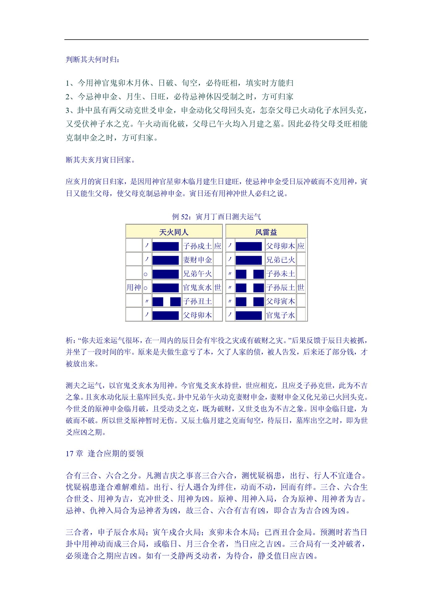

> ⚠ 本页含方块占位字符（██ 等）：原书卦图/爻位无法由文字层还原，**本页卦例不作为默认规则**；请对照上方原页图人工辨认。

<!-- ¶1387 07f1d7c6166c -->
判断其夫何时归：

<!-- ¶1388 8b06190d2d43 -->
、今用神官鬼卯木月休、日破、旬空，必待旺相，填实时方能归

<!-- ¶1389 bd1120ceac10 -->
、今忌神申金、月生、日旺，必待忌神休囚受制之时，方可归家

<!-- ¶1390 93e5b7923e87 -->
、卦中虽有两父动克世爻申金，申金动化父母回头克，怎奈父母已火动化子水回头克，

<!-- ¶1391 7c351209b1b4 -->
又受伏神子水之克。午火动而化破，父母已午火均入月建之墓。因此必待父母爻旺相能

<!-- ¶1392 5e0c2586b3a7 -->
克制申金之时，方可归家。

<!-- ¶1393 7fc5bd6a1768 -->
断其夫亥月寅日回家。

<!-- ¶1394 b6100acf2ecc -->
应亥月的寅日归家，是因用神官星卯木临月建生日建旺，使忌神申金受日辰冲破而不克用神，寅

<!-- ¶1395 3860b11a1d59 -->
日又能生父母，使父母克制忌

<!-- ¶1396 646d0c263fd4 -->
神申金。寅日还有用神冲世人必归之说。

<!-- ¶1397 f340a072f490 -->
：寅月丁酉日测夫运气

<!-- ¶1398 e718fbdade1d -->
天火同人

<!-- ¶1399 be8e8053dadb -->
█████

<!-- ¶1400 cbcde14b80f2 -->
子孙戍土

<!-- ¶1401 a98c1681bd8f -->
█████

<!-- ¶1402 a75e4d1d9ea5 -->
妻财申金

<!-- ¶1403 a39587286e48 -->
█████

<!-- ¶1404 de72ce3bbd3b -->
兄弟午火

<!-- ¶1405 76f6b565a85a -->
用神

<!-- ¶1406 9e4ad87eafe9 -->
█████

<!-- ¶1407 e21e146fa456 -->
官鬼亥水

<!-- ¶1408 1573c45602b1 -->
██

<!-- ¶1409 fbad1721717c -->
██

<!-- ¶1410 ed94a9270cd9 -->
子孙丑土

<!-- ¶1411 f750e205c313 -->
█████

<!-- ¶1412 8790fd9867ed -->
父母卯木

<!-- ¶1413 a5322544cd79 -->
风雷益

<!-- ¶1414 41b82b355fec -->
█████

<!-- ¶1415 185622629129 -->
父母卯木

<!-- ¶1416 7bf0dbd314cd -->
█████

<!-- ¶1417 d4e7de9c5cd5 -->
兄弟已火

<!-- ¶1418 256eb848fe9c -->
██

<!-- ¶1419 f0344ea12b14 -->
██

<!-- ¶1420 f870848fcdb4 -->
子孙未土

<!-- ¶1421 362f8fc0d7b7 -->
██

<!-- ¶1422 a9b9641e9013 -->
██

<!-- ¶1423 21d38b5506ef -->
子孙辰土

<!-- ¶1424 eda32c43cf0a -->
██

<!-- ¶1425 4a4efeeb43ca -->
██

<!-- ¶1426 1de6cc5b7011 -->
父母寅木

<!-- ¶1427 a9ad0af50b98 -->
█████

<!-- ¶1428 350ec5306378 -->
官鬼子水

<!-- ¶1429 9bb94baf8b3e -->
析：

<!-- ¶1430 704a0c3011aa -->
你夫近来运气很坏，在一周内的辰日会有牢役之灾或有破财之灾。

<!-- ¶1431 0276ee1be38c -->
后果反馈于辰日夫被抓，

<!-- ¶1432 4fd77e38a0db -->
并坐了一段时间的牢。原来是夫做生意亏了本，欠了人家的债，被人告发，后来还了部分钱，才

<!-- ¶1433 b84f44f4a949 -->
被放出来。

<!-- ¶1434 6e44bc42b1cb -->
测夫之运气，以官鬼爻亥水为用神。今官鬼爻亥水持世，世应相克，且应爻子孙克世，此为不吉

<!-- ¶1435 2a3c130b730a -->
之象。且亥水动化辰土墓库回头克。卦中兄弟午火动克妻财申金，妻财申金又化兄弟已火回头克。

<!-- ¶1436 c5b300008543 -->
今世爻的原神申金临月破，且受动爻之克，既为破财，又世爻也为不吉之象。因申金临日建，为

<!-- ¶1437 b7bb7b190d1e -->
破而不破。所以世爻原神暂时无伤。又辰土临月建之克而旬空，待辰日，

<!-- ¶1438 38e21816d2ec -->
墓库出空之时，即为世

<!-- ¶1439 54c8b50e84e0 -->
爻应凶之期。

<!-- ¶1440 a2ad42327dad -->
17

<!-- ¶1441 58c8105c0a5f -->
逢合应期的要领

<!-- ¶1442 df59ca1f5202 -->
合有三合、六合之分。凡测吉庆之事喜三合六合，测忧疑祸患，出行、行人不宜逢合。

<!-- ¶1443 c9a0f0bc055c -->
忧疑祸患逢合难解难结。出行、行人遇合为绊住，动而不动，回而有绊。三合、六合生

<!-- ¶1444 c2a08f610a77 -->
合世爻、用神为吉，克冲世爻、用神为凶。原神、用神入局，合为原神、用神者为吉。

<!-- ¶1445 26dd4207d983 -->
忌神、仇神入局合为忌神者为凶，故三合、六合有吉有凶，即合吉为吉合凶为凶。

<!-- ¶1446 1d8219de6b5a -->
三合者，申子辰合水局；寅午戍合火局；亥卯未合木局；已酉丑合金局。预测时若当日

<!-- ¶1447 200b9f2441c3 -->
卦中用神动而成三合局，或临日、月三合全者，当日应之吉凶。三合局有一爻冲破者

<!-- ¶1448 b0b432dbcd3d -->
必须逢合之期应吉凶。如有一爻静两爻动者，为待合，静爻值日应吉凶。

## 第 20 页（PDF 实际页码）

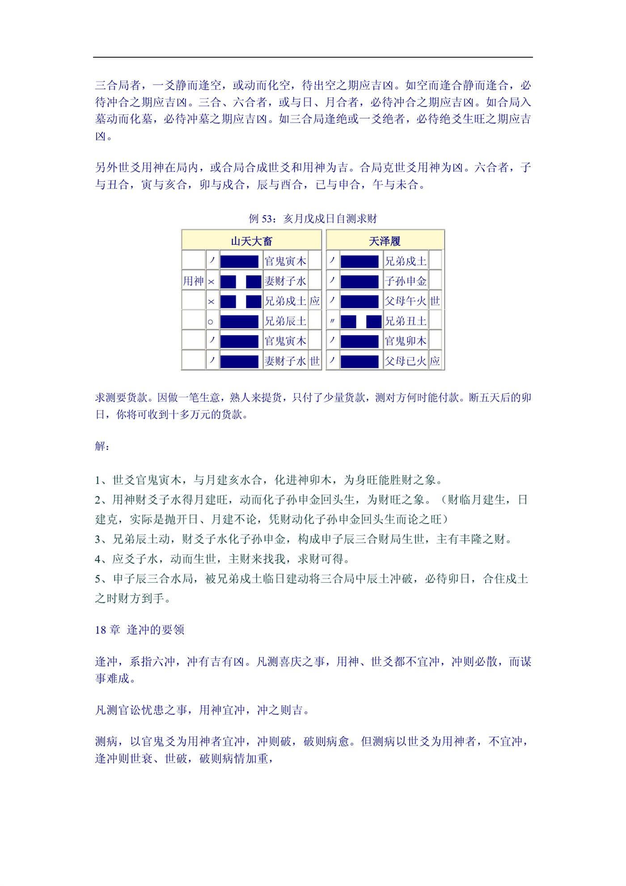

> 卦盘结构化转写（人工目视原页图核对）：[第 20 页转写](../figures/src-e6fc8612e955/page-020.md)

> ⚠ 本页含方块占位字符（██ 等）：原书卦图/爻位无法由文字层还原，**本页卦例不作为默认规则**；请对照上方原页图人工辨认。

<!-- ¶1449 1e3e3c9f00a0 -->
三合局者，一爻静而逢空，或动而化空，待出空之期应吉凶。如空而逢合静而逢合，必

<!-- ¶1450 02eb59e1537e -->
待冲合之期应吉凶。三合、六合者，或与日、月合者，必待冲合之期应吉凶。如合局入

<!-- ¶1451 cc6870e516bc -->
墓动而化墓，必待冲墓之期应吉凶。如三合局逢绝或一爻绝者，必待绝爻生旺之期应吉

<!-- ¶1452 a0bf3abdf548 -->
凶。

<!-- ¶1453 371e9ef91b0c -->
另外世爻用神在局内，或合局合成世爻和用神为吉。合局克世爻用神为凶。六合者，子

<!-- ¶1454 65004080a7c7 -->
与丑合，寅与亥合，卯与戍合，辰与酉合，已与申合，午与未合。

<!-- ¶1455 e0e1de555bef -->
53

<!-- ¶1456 acdcf4a7b972 -->
：亥月戊戍日自测求财

<!-- ¶1457 3a22d3dbe728 -->
山天大畜

<!-- ¶1458 9e84ad7a65d8 -->
█████

<!-- ¶1459 7efc635e7387 -->
官鬼寅

<!-- ¶1460 578a4cf8e40c -->
用神

<!-- ¶1461 8b562e58e2e5 -->
██

<!-- ¶1462 02e79e9a84ee -->
██

<!-- ¶1463 04e50cba8f06 -->
妻财子水

<!-- ¶1464 9e3e1e32b56b -->
██

<!-- ¶1465 99e748ead5fa -->
██

<!-- ¶1466 b404ef89b4c6 -->
兄弟戍土

<!-- ¶1467 b54aad9ba97e -->
█████

<!-- ¶1468 0c363a6cac6e -->
兄弟辰土

<!-- ¶1469 ef89df5526a3 -->
█████

<!-- ¶1470 4cf7f5ada59e -->
官鬼寅木

<!-- ¶1471 ecaa1ede2b1e -->
█████

<!-- ¶1472 a4f8893ccbbc -->
妻财子水

<!-- ¶1473 a5583e955ec1 -->
天泽履

<!-- ¶1474 f7038a447ec9 -->
█████

<!-- ¶1475 5a6959b62c3b -->
兄弟戍土

<!-- ¶1476 a4bc4f1eabaf -->
█████

<!-- ¶1477 b090c57f4cda -->
子孙申金

<!-- ¶1478 faf6b7a49818 -->
█████

<!-- ¶1479 962770fadab7 -->
父母午火

<!-- ¶1480 5fa19382092f -->
██

<!-- ¶1481 dcdfdb4b95c1 -->
██

<!-- ¶1482 166383485bb8 -->
兄弟丑土

<!-- ¶1483 d2fa10e34a01 -->
█████

<!-- ¶1484 e284a4b53bb3 -->
官鬼卯木

<!-- ¶1485 d44fec7e536e -->
█████

<!-- ¶1486 41bfc6beaf9b -->
父母已火

<!-- ¶1487 ddcd4add7aa5 -->
求测要货款。因做一笔生意，熟人来提货，只付了少量货款，测对方何时能付款。断五天后的卯

<!-- ¶1488 4026e024b98f -->
日，你将可收到十

<!-- ¶1489 0d4d85071a3f -->
多万元的货款。

<!-- ¶1490 c5e768cde236 -->
解：

<!-- ¶1491 b64f763a686f -->
、世爻官鬼寅木，与月建亥水合，化进神卯木，为身旺能胜财之象。

<!-- ¶1492 584ba87b958e -->
、用神财爻子水得月建旺，动而化子孙申金回头生，为财旺之象。（财临月建生，日

<!-- ¶1493 78ae60dcae51 -->
建克，实际是抛开日、月建不论，凭财动化子孙申金回头生而论之旺）

<!-- ¶1494 d87c8fefc7e4 -->
、兄弟辰土动，财爻子水化子孙申金，构成申子辰三合财局生世，主有丰隆之财。

<!-- ¶1495 0ac8113b37d8 -->
、应爻子水，动而生世，主财来找我，求财可得。

<!-- ¶1496 d3f16960fd86 -->
、申子辰三合水局，被兄弟戍土临日建动将三合局中辰土冲破，必待卯日，合住戍土

<!-- ¶1497 8987424ff378 -->
之时财方到手。

<!-- ¶1498 aa462f91a703 -->
18

<!-- ¶1499 142d3ddd96ee -->
逢冲的要领

<!-- ¶1500 f8446a2f1510 -->
逢冲，系指六冲，冲有吉有凶。凡测喜庆之

<!-- ¶1501 ab9d44cfb35b -->
事，用神、世爻都不宜冲，冲则必散，而谋

<!-- ¶1502 fa79330c401a -->
事难成。

<!-- ¶1503 350877126236 -->
凡测官讼忧患之事，用神宜冲，冲之则吉。

<!-- ¶1504 25c868cc6f3c -->
测病，以官鬼爻为用神者宜冲，冲则破，破则病愈。但测病以世爻为用神者，不宜冲，

<!-- ¶1505 652d949740c8 -->
逢冲则世衰、世破，破则病情加重，

## 第 21 页（PDF 实际页码）

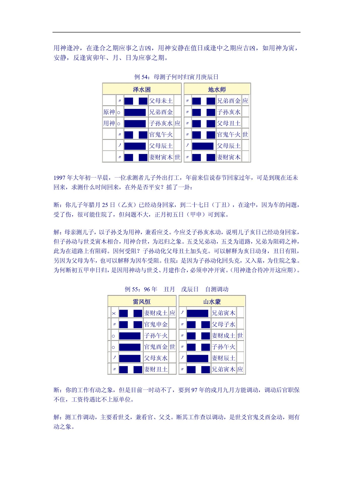

> ⚠ 本页含方块占位字符（██ 等）：原书卦图/爻位无法由文字层还原，**本页卦例不作为默认规则**；请对照上方原页图人工辨认。

<!-- ¶1506 55593ba82073 -->
用神逢冲，在逢合之期应事之吉凶，用神安静在值日或逢中之期应吉凶，如用神为寅，

<!-- ¶1507 161722f1a930 -->
安静，反逢寅卯年、月、日为应事之期。

<!-- ¶1508 f86d56f6f377 -->
54

<!-- ¶1509 02df259ac1cb -->
：母测子何时归寅月庚辰日

<!-- ¶1510 802e21f3a51c -->
泽水困

<!-- ¶1511 1916100f06e7 -->
██

<!-- ¶1512 0c58fbbe25e2 -->
██

<!-- ¶1513 c365557cf3cb -->
父母未土

<!-- ¶1514 16428e3a62ff -->
原神

<!-- ¶1515 0393a341fb34 -->
█████

<!-- ¶1516 ca749f6fe4bc -->
兄弟酉金

<!-- ¶1517 0dcecb18fd08 -->
用神

<!-- ¶1518 e624c7798785 -->
█████

<!-- ¶1519 a11c12456771 -->
子孙亥水

<!-- ¶1520 15b9c9c022aa -->
██

<!-- ¶1521 5234952bfe04 -->
██

<!-- ¶1522 a6b935da464f -->
官鬼午火

<!-- ¶1523 6a04ba5db4c2 -->
█████

<!-- ¶1524 5d0e554a007a -->
父母辰土

<!-- ¶1525 72146201d102 -->
██

<!-- ¶1526 3aa70bc9ce79 -->
██

<!-- ¶1527 935d8638994d -->
妻财寅木

<!-- ¶1528 10f8fde1bc73 -->
地水师

<!-- ¶1529 bb9a0c342714 -->
██

<!-- ¶1530 a22d7e9fd256 -->
██

<!-- ¶1531 e9f607b38d92 -->
兄弟酉金

<!-- ¶1532 677acee8d04a -->
██

<!-- ¶1533 afa89c45e872 -->
██

<!-- ¶1534 6ce79420e56b -->
子孙亥水

<!-- ¶1535 8afb3c5d2d67 -->
██

<!-- ¶1536 77d04e1ba365 -->
██

<!-- ¶1537 6256e5aa0a92 -->
父母丑土

<!-- ¶1538 51a1ecafd1b3 -->
██

<!-- ¶1539 b0502c1084e6 -->
██

<!-- ¶1540 acfcdda44587 -->
官鬼午火

<!-- ¶1541 e26af1bd4e2e -->
█████

<!-- ¶1542 4a8aa417f187 -->
父母辰土

<!-- ¶1543 0c1baa67c564 -->
██

<!-- ¶1544 b51aa87eb229 -->
██

<!-- ¶1545 fdabb8bb8d3c -->
妻财寅木

<!-- ¶1546 c7ea37525359 -->
1997

<!-- ¶1547 1fb73f675f3a -->
年大年初一早晨，一位求测者儿子外出打工，年前来信说春节回家过年，可是到现在还未

<!-- ¶1548 ce347d8f4392 -->
回来，求测什么时间回来，在外是否平安？摇了一卦：

<!-- ¶1549 1c3e2bbc74ae -->
断：你儿子年腊月

<!-- ¶1550 7b0aacd1e343 -->
25

<!-- ¶1551 90b4659e7ecd -->
日（乙亥）已经动身回家，到二十七日（丁丑），在途中，因为车的问题

<!-- ¶1552 64d5613a978b -->
受了伤，很可能住院了，但问题不大，正月初五日（甲申）可到家。

<!-- ¶1553 1070473ae855 -->
解：母亲测儿子，以子孙爻为用神，兼看应爻。今应爻子孙亥水动，说明儿子亥日己经动身回家，

<!-- ¶1554 87af6d279bf3 -->
但子孙动与世爻寅木相合，用神合世，为迟归之象。五爻兄弟动，五爻为道路，兄弟为阻碍之神，

<!-- ¶1555 6d1e8566e3fd -->
此为在道路上有阻碍。因何受阻？子孙动化父母丑土加头克。可以解释为亥日动身，丑日有阻，

<!-- ¶1556 b39c506f739f -->
另因为父母为车，也可以解释为因车受阻。住院：是因为子孙动化回头克，又入墓，为住院之象。

<!-- ¶1557 93070f53c251 -->
为何断初五甲申日归，是因用神动与世爻、月建作合，必须申冲开寅。（用神逢合待冲开这应期）。

<!-- ¶1558 e94a0e80b4f6 -->
丑月

<!-- ¶1559 2d80cb6a1835 -->
戊辰日

<!-- ¶1560 0fd829fa4b48 -->
自测调动

<!-- ¶1561 db8bd72a793e -->
雷风恒

<!-- ¶1562 06ec128f9829 -->
██

<!-- ¶1563 0fb970d7e2b0 -->
██

<!-- ¶1564 59274d16603c -->
妻财戍土

<!-- ¶1565 6a25c4a04f44 -->
██

<!-- ¶1566 b66cc953364c -->
██

<!-- ¶1567 f770d830f02c -->
官鬼申金

<!-- ¶1568 fbd8b35de39c -->
█████

<!-- ¶1569 ee9bc34630a1 -->
子孙午火

<!-- ¶1570 25691a244180 -->
█████

<!-- ¶1571 d34d81d93428 -->
官鬼酉金

<!-- ¶1572 353d09b8e9b3 -->
█████

<!-- ¶1573 492429aec869 -->
父母亥水

<!-- ¶1574 ff061ee31121 -->
██

<!-- ¶1575 937d32bcee77 -->
██

<!-- ¶1576 13fa09cd1d16 -->
妻财丑土

<!-- ¶1577 1c10ef565e1e -->
山水蒙

<!-- ¶1578 3ed6c6a1391d -->
█████

<!-- ¶1579 7f7fd1f18b1e -->
兄弟寅木

<!-- ¶1580 f30291b7205d -->
██

<!-- ¶1581 70ef45482196 -->
██

<!-- ¶1582 f5dd6852b8cf -->
父母子水

<!-- ¶1583 cb3907e06889 -->
██

<!-- ¶1584 5ba3a138e9d1 -->
██

<!-- ¶1585 cac5164d2985 -->
妻财戍土

<!-- ¶1586 56f89b0bc112 -->
██

<!-- ¶1587 c717e7b63a2e -->
██

<!-- ¶1588 5a68d417adf4 -->
子孙午火

<!-- ¶1589 7fc117c54368 -->
█████

<!-- ¶1590 c89e800dcba5 -->
妻财辰土

<!-- ¶1591 9b4f573fd833 -->
██

<!-- ¶1592 65b260d67c91 -->
██

<!-- ¶1593 ad3af29ae6e0 -->
兄弟寅木

<!-- ¶1594 796a0f5a476e -->
断：你的工作有动之象，但是目前一时动

<!-- ¶1595 51147b535196 -->
不了，要到

<!-- ¶1596 1586edebeabc -->
97

<!-- ¶1597 d49b570b5202 -->
年的戍月九月方能调动，调动后官职保

<!-- ¶1598 e28b41aab951 -->
不住，工资待遇比不上原单位。

<!-- ¶1599 d6f2086edf3d -->
解：测工作调动，主要看世爻，兼看官、父爻。断其工作查以调动，是世爻官鬼爻酉金动，则有

<!-- ¶1600 3a122c5ab1f6 -->
动之象。

## 第 22 页（PDF 实际页码）

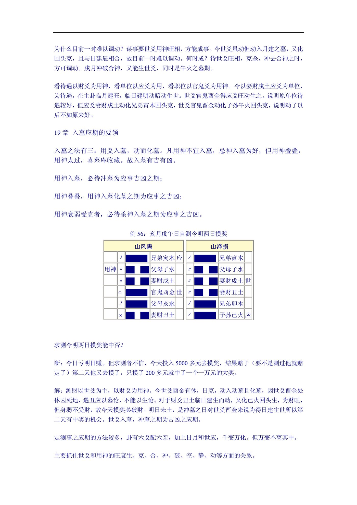

> ⚠ 本页含方块占位字符（██ 等）：原书卦图/爻位无法由文字层还原，**本页卦例不作为默认规则**；请对照上方原页图人工辨认。

<!-- ¶1601 9ada258dba3f -->
为什么目前一时难以调动？谋事要世爻用神旺相，方能成事。今世爻虽动但动入月建之墓，又化

<!-- ¶1602 eab85f0e0681 -->
回头克，且与日建辰相合，故目前一时难以调动。何时成？待世爻旺相，克杀，冲去合神之时，

<!-- ¶1603 1029aa6a3bee -->
方可调动。戍月冲破合神，又能生世爻，同时是午火之墓期。

<!-- ¶1604 b94e242b226b -->
看待遇以财爻为用神，看单位以应爻为用，看职位以官鬼爻为用神。今以妻财戍土应爻为单位，

<!-- ¶1605 ea4c4b4e31ce -->
为待遇，在主卦临月建旺，临

<!-- ¶1606 f30b02cb3eb0 -->
日建明动暗动生世。世爻官鬼酉金得应爻旺动生之。说明原单位待

<!-- ¶1607 79076b0beebb -->
遇较好，但应爻妻财戍土动化兄弟寅木回头克，世爻官鬼酉金动化子孙午火回头克，说明动了以

<!-- ¶1608 e164300ef70f -->
后不如原来好。

<!-- ¶1609 20c237ce6c55 -->
19

<!-- ¶1610 f0076c3a40eb -->
入墓应期的要领

<!-- ¶1611 729c9d44ce80 -->
入墓之法有三：用爻入墓，动而化墓。凡用神不宜入墓，忌神入墓为好，但用神叠叠，

<!-- ¶1612 726f5d03b842 -->
用神太过，喜墓库收藏。故入墓有吉有凶。

<!-- ¶1613 e1d44994a71f -->
用神入墓，必待冲墓为应事吉凶之期；

<!-- ¶1614 818290d2cbc4 -->
用神叠叠，用神入墓化墓之期为应事之吉凶；

<!-- ¶1615 4cb1ecdba1f0 -->
用神衰弱受克者，必待杀神入墓之期为应事之吉凶。

<!-- ¶1616 e4e0e9fc45fa -->
56

<!-- ¶1617 5248642ea02b -->
：亥月戊午日自测今明两日摸奖

<!-- ¶1618 e5dc358fa967 -->
山风蛊

<!-- ¶1619 a7c65ff6c0bd -->
█████

<!-- ¶1620 ddaf88057b42 -->
兄弟寅木

<!-- ¶1621 6d3646ac6a5e -->
用神

<!-- ¶1622 9f1e9fb034ac -->
██

<!-- ¶1623 190e421b172d -->
██

<!-- ¶1624 53b923764609 -->
父母子水

<!-- ¶1625 bff9408e55af -->
██

<!-- ¶1626 a4ffde9e66db -->
██

<!-- ¶1627 7c764138df99 -->
妻财戍土

<!-- ¶1628 5be034cc543a -->
█████

<!-- ¶1629 63086089e057 -->
官鬼酉金

<!-- ¶1630 d156e0c40860 -->
█████

<!-- ¶1631 891627a70f85 -->
父母亥水

<!-- ¶1632 5c1e4e6ae503 -->
██

<!-- ¶1633 09dbf586688c -->
██

<!-- ¶1634 b0cf6c57ecb0 -->
妻财丑土

<!-- ¶1635 948950d94c37 -->
山泽损

<!-- ¶1636 708420eb181f -->
█████

<!-- ¶1637 96386e4d82d3 -->
兄弟寅木

<!-- ¶1638 23f6a4cd58c6 -->
██

<!-- ¶1639 8d14bb29da98 -->
██

<!-- ¶1640 14ad7c4c76cf -->
父母子水

<!-- ¶1641 66cee7412a1f -->
██

<!-- ¶1642 fe8739c45d10 -->
██

<!-- ¶1643 e0f6526177d7 -->
妻财戍土

<!-- ¶1644 a522b8202fd0 -->
██

<!-- ¶1645 8b73f3d62123 -->
██

<!-- ¶1646 dfbb0b5b1372 -->
妻财丑土

<!-- ¶1647 0388d3092aac -->
█████

<!-- ¶1648 068a3ad24fc0 -->
兄弟卯木

<!-- ¶1649 d4930aa4a714 -->
█████

<!-- ¶1650 6f1d0e504fa7 -->
子孙已火

<!-- ¶1651 f827e24fb09d -->
求测今明两日摸奖能中否？

<!-- ¶1652 67523885976e -->
断：今日亏明日赚。但求测者不信，今天投入

<!-- ¶1653 f433c20a8678 -->
5000

<!-- ¶1654 9653f88f0b4f -->
多元去摸奖，结果赔了（要不是

<!-- ¶1655 2534da39ad99 -->
测过他就赔

<!-- ¶1656 af75586f7b19 -->
定了）第二天他又去摸了，只摸了

<!-- ¶1657 367e25b7497b -->
200

<!-- ¶1658 3cdc03b5c915 -->
多元就中了一个一万元的大奖。

<!-- ¶1659 daadc04179c6 -->
解：测财以世爻为主，以财爻为用神。今世爻酉金有休，日克，动入动墓且化墓，因世爻酉金处

<!-- ¶1660 9ae3751acfc4 -->
休囚死地，遇丑应以墓论，不能以生论。对于财爻丑土临日建生而动，又化已火回头生，为财旺，

<!-- ¶1661 910519e1342b -->
但身弱不受财，故今天摸奖必破财。明日未土，是冲墓之日对世爻酉金来说为得日建生世所以第

<!-- ¶1662 93bfca85c358 -->
二天有中奖的机会。世爻入墓，冲墓之期为吉凶之应期。

<!-- ¶1663 13ef5e7b95cc -->
定测事之应期的方法较多，卦有六爻配六亲，加上日月和世应，千变万化。但万变不离其中。

<!-- ¶1664 c2b8bce9c7a3 -->
主要抓住世爻和用神的旺衰生、克、合、冲、

<!-- ¶1665 2bcfcb93d9ad -->
破、空、静、动等方面的关系。

## 第 23 页（PDF 实际页码）

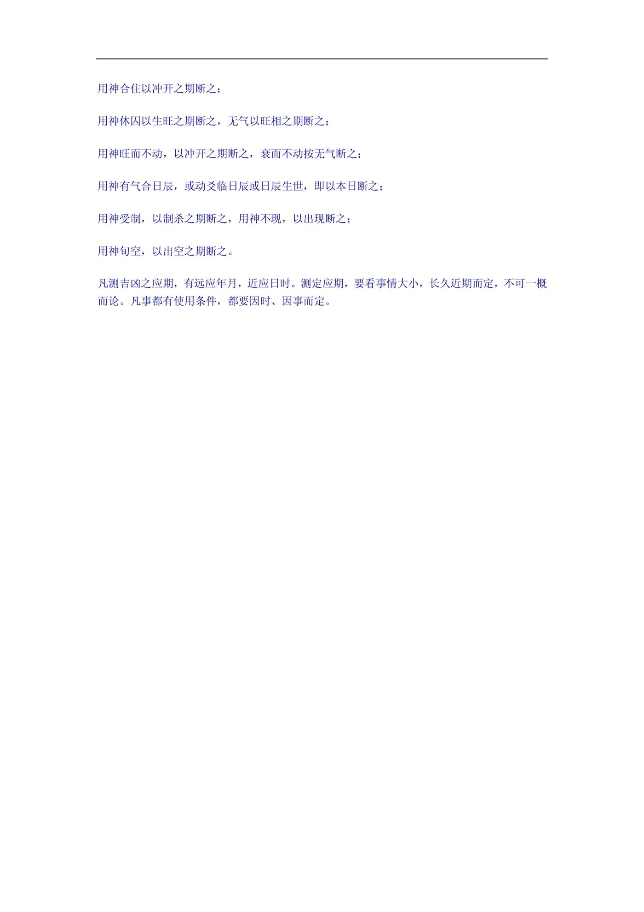

<!-- ¶1666 a9b7f409dcd9 -->
用神合住以冲开之期断之；

<!-- ¶1667 a23cd9efb9c2 -->
用神休囚以生旺之期断之，无气以旺相之期断之；

<!-- ¶1668 02bdbb5257ab -->
用神旺而不动，以冲开之期断之，衰而不动按无气断之；

<!-- ¶1669 f37c98579ea2 -->
用神有气合日辰，或动爻临日辰或日辰生世，即以本日断之；

<!-- ¶1670 974eb3932c59 -->
用神受制，以制杀之期断之，用神不现，以出现断之；

<!-- ¶1671 17cbae5d0517 -->
用神旬空，以出空之期断之。

<!-- ¶1672 86d935d8d9e6 -->
凡测吉凶之应期，有远应年月，近应日时。测定应期，要看事情大小，长久近期而定，不可一概

<!-- ¶1673 216bd68844ab -->
而论。凡事都有使用条件，都要因时、因事而定。

