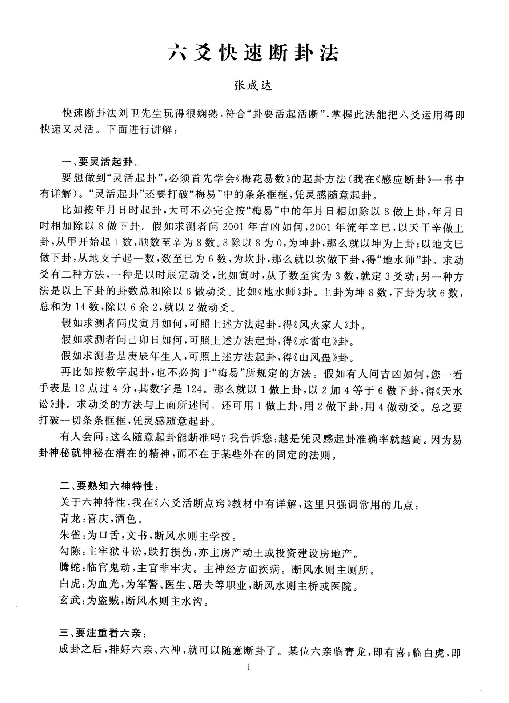
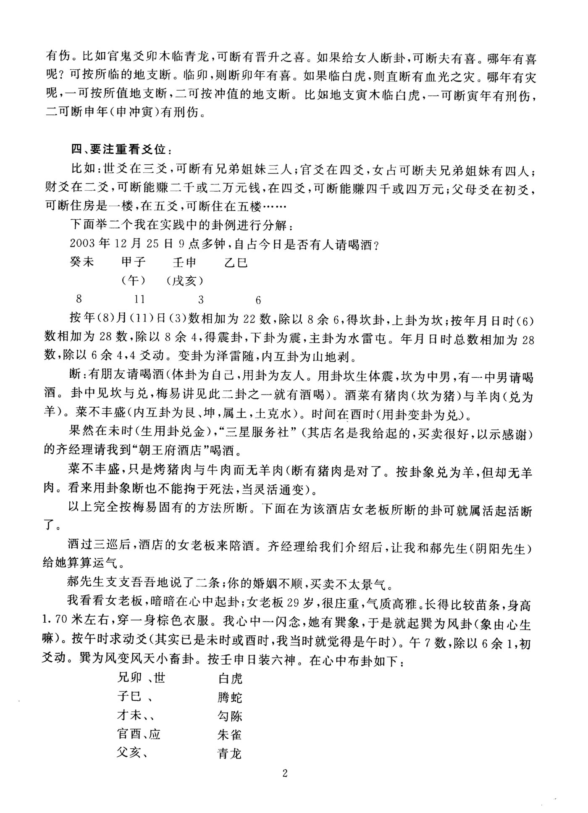
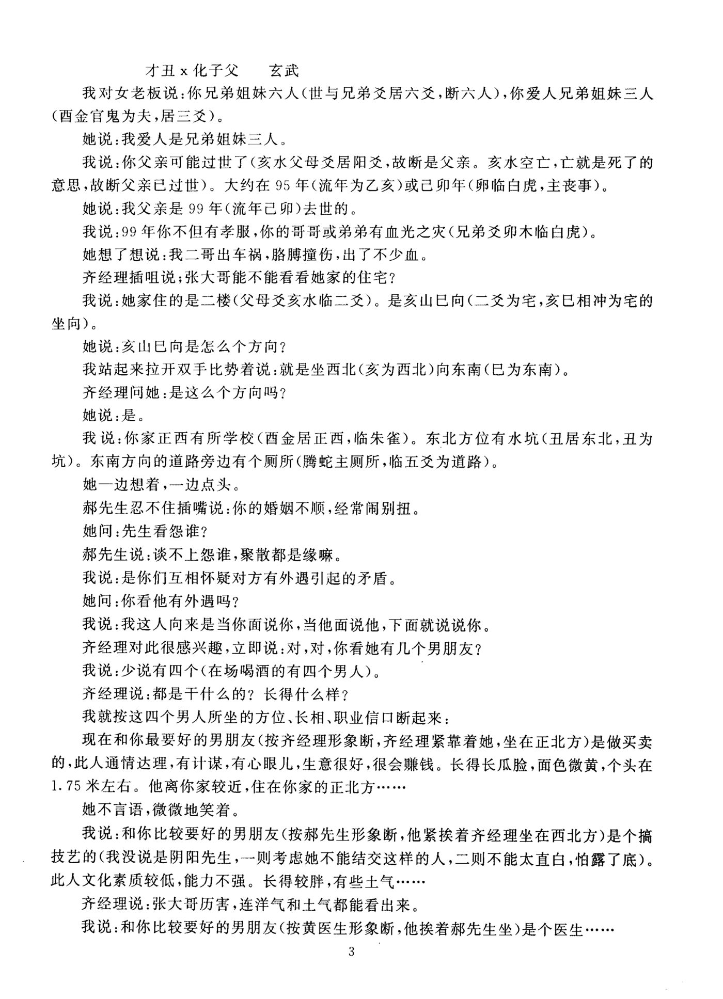
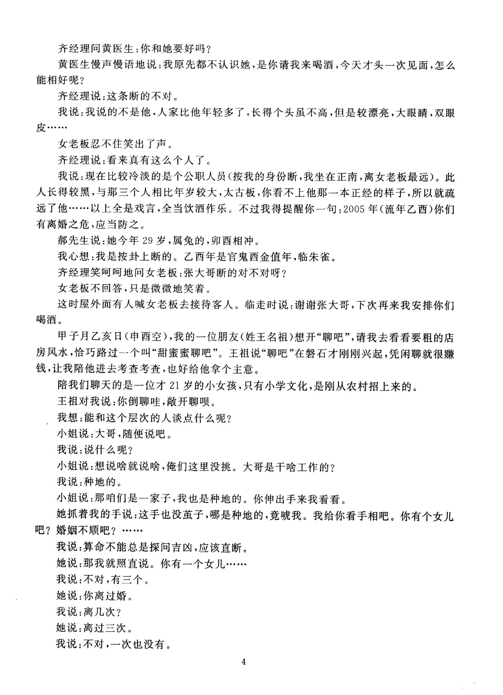
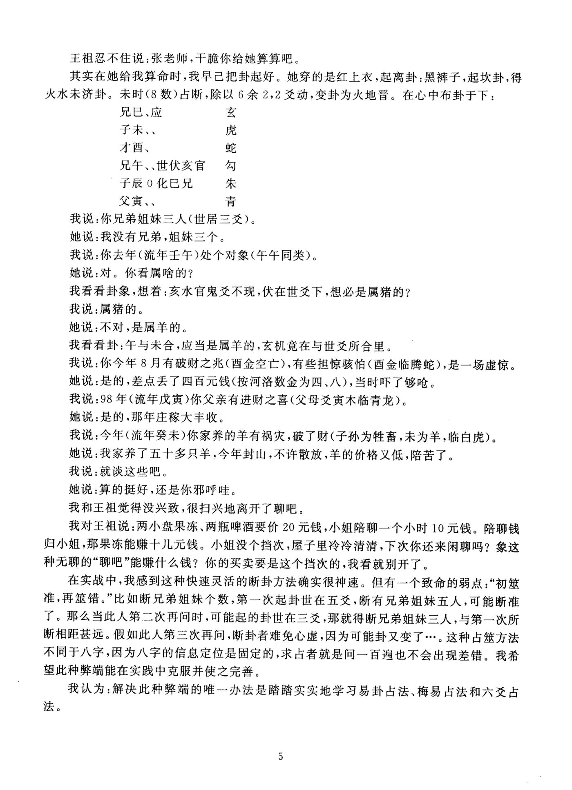

# 11、张成达-六爻快速断卦法

> - 来源：[`src-f3f838d501b1`](../../wiki/sources/src-f3f838d501b1.md)
> - 包内原件：`corpus/originals/张成达八字六爻风水31册/11、张成达-六爻快速断卦法.pdf`
> - 忠实提取文本：`corpus/extracted/src-f3f838d501b1.txt`
> - 覆盖范围：第 1, 2, 3, 4, 5 页
> - 质量状态：`needs_review`
> - 提取器：tools/offline/pdf-render.ps1 + tools/offline/ocr-image.ps1（Windows.Media.Ocr (zh-Hans-CN)）
> - 本文件由机器清洗生成：只做编码、换行、段落与标题层级处理；**未经人工校对的文字不代表已确认**。
> - 段落锚点格式：`<!-- ¶NNNN -->`，供 Wiki 定位引用。

## 第 1 页（PDF 实际页码）

<!-- ¶0001 81f60b334960 -->
六爻快速断卦法

<!-- ¶0002 cabbc694a37d -->
张成达

<!-- ¶0003 721ad4f88fbe -->
快速断卦法刘卫先生玩得很娴熟、符合 “ 卦要活起活断 " ，掌握此法能把六爻运用得即

<!-- ¶0004 dfd3184ca67e -->
快速又灵活。下面进行讲解：

<!-- ¶0005 bfb9cc9d0eb2 -->
、要灵活起卦。

<!-- ¶0006 fca8b2865797 -->
要想做到 “ 灵活起卦 " ，必须首先学会《梅花易数》的起卦方法（我在《感应断卦》一书中

<!-- ¶0007 0acc70f1d85b -->
有详解）。 “ 灵活起卦 " 还要打破 “ 梅易 " 中的条条框框，凭灵感随意起卦。

<!-- ¶0008 c786bc76558e -->
比如按年月日时起卦，大可不必完全按 “ 梅易 " 中的年月日相加除以 8 做上卦，年月日

<!-- ¶0009 7c77bbae94a1 -->
时相加除以 8 做下卦。假如求测者问 2001 年吉凶如何， 2001 年流年辛巳，以天干辛做上

<!-- ¶0010 885a0eba0433 -->
卦，从甲开始起 1 数，顺数至辛为 8 数。 8 除以 8 为 0 ，为坤卦，那么就以坤为上卦；以地支巳

<!-- ¶0011 3c3b50b428c8 -->
做下卦，从地支子起一数，数至巳为 6 数，为坎卦，那么就以坎做下卦，得 “ 地水师 " 卦。求动

<!-- ¶0012 6c8c50c1d939 -->
爻有二种方法，一种是以时辰定动爻，比如寅时，从子数至寅为 3 数，就定 3 爻动；另一种方

<!-- ¶0013 306cfa90c585 -->
法是以上下卦的卦数总和除以 6 做动爻。比如《地水师》卦。上卦为坤 8 数，下卦为坎 6 数，

<!-- ¶0014 913a770636a3 -->
总和为 14 数，除以 6 余 2 ，就以 2 做动爻。

<!-- ¶0015 10fa148723a7 -->
假如求测者问戊寅月如何，可照上述方法起卦，得《风火家人》卦。

<!-- ¶0016 571298c32068 -->
假如求测者问己卯日如何，可照上述方法起卦，得《水雷屯》卦。

<!-- ¶0017 555ede0a6df7 -->
假如求测者是庚辰年生人，可照上述方法起卦，得《山风蛊》卦。

<!-- ¶0018 8091e148ff9f -->
再比如按数字起卦，也不必拘于 “ 梅易 " 所规定的方法。假如有人问吉凶如何，您一看

<!-- ¶0019 c3b06fd2f9d7 -->
手表是 12 点过 4 分，其数字是 124 。那么就以 1 做上卦，以 2 加 4 等于 6 做下卦，得《天水

<!-- ¶0020 2d89cfb8b6c3 -->
讼》卦。求动爻的方法与上面所述同。还可用 1 做上卦，用 2 做下卦，用 4 做动爻。总之要

<!-- ¶0021 3a07d8c48f63 -->
打破一切条条框框，凭灵感随意起卦。

<!-- ¶0022 c7ab0520f706 -->
有人会问：这么随意起卦能断准吗？我告诉您：越是凭灵感起卦准确率就越高。因为易

<!-- ¶0023 fab088d9130f -->
卦神秘就神秘在潜在的精神，而不在于某些外在的固定的法则。

<!-- ¶0024 8cd1a7236b04 -->
、要熟知六神特性：

<!-- ¶0025 42ea26956800 -->
关于六神特性，我在《六爻活断点窍》教材中有详解，这里只强调常用的几点：

<!-- ¶0026 c108674ea809 -->
青龙：喜庆，酒色。

<!-- ¶0027 aa05a7f7e0f7 -->
朱雀：为口舌，文书，断风水则主学校。

<!-- ¶0028 68aaba800702 -->
勾陈：主牢狱斗讼，跌打损伤，亦主房产动土或投资建设房地产。

<!-- ¶0029 613e6447271c -->
腾蛇：临官鬼动，主官非牢灾。主神经方面疾病。断风水则主厕所。

<!-- ¶0030 0bd414ac4372 -->
白虎：为血光，为军警、医生、屠夫等职业，断风水则主桥或医院。

<!-- ¶0031 0911f0a220d0 -->
玄武：为盗贼，断风水则主水沟。

<!-- ¶0032 5e9af57c7cb8 -->
、要注重看六亲：

<!-- ¶0033 e691558464b5 -->
成卦之后，排好六亲、六神，就可以随意断卦了。某位六亲临青龙，即有喜；临白虎，即

## 第 2 页（PDF 实际页码）

<!-- ¶0034 1ac9a4917b54 -->
有伤。比如官鬼爻卯木临青龙，可断有晋升之喜。如果给女人断卦，可断夫有喜。哪年有喜

<!-- ¶0035 d7fc8cfdc884 -->
呢？可按所临的地支断。临卯，则断卯年有喜。如果临白虎，则直断有血光之灾。哪年有灾

<!-- ¶0036 3f09c796431e -->
呢，一可按所值地支断，二可按冲值的地支断。比如地支寅木临白虎，一可断寅年有刑伤，

<!-- ¶0037 9a973f656a81 -->
二可断申年（申冲寅）有刑伤。

<!-- ¶0038 f12465592400 -->
四、要注重看爻位：

<!-- ¶0039 6120a87a2f56 -->
比如：世爻在三爻，可断有兄弟姐妹三人；官爻在四爻，女占可断夫兄弟姐妹有四人；

<!-- ¶0040 1adb986ac451 -->
财爻在二爻，可断能赚二千或二万元钱，在四爻，可断能赚四千或四万元；父母爻在初爻，

<!-- ¶0041 a8365539102a -->
可断住房是一楼，在五爻，可断住在五楼

<!-- ¶0042 d073826e63e8 -->
下面举二个我在实践中的卦例进行分解：

<!-- ¶0043 07f6224842fb -->
2003 年 12 月 25 日 9 点多钟，自占今日是否有人请喝酒？

<!-- ¶0044 48c1634311f4 -->
癸未甲子壬申乙巳

<!-- ¶0045 661587106a39 -->
（午）（戌亥）

<!-- ¶0046 1f29c4ccd795 -->
按年（ 8 ）月（ 1 1 ）日（ 3 ）数相加为 22 数，除以 8 余 6 ，得坎卦，上卦为坎；按年月日时（ 6 ）

<!-- ¶0047 f45921f34e51 -->
数相加为 28 数，除以 8 余 4 ，得震卦，下卦为震，主卦为水雷屯。年月日时总数相加为 28

<!-- ¶0048 71d46c897014 -->
数，除以 6 余 4 ， 4 爻动。变卦为泽雷随，内互卦为山地剥。

<!-- ¶0049 835db8ac08ec -->
断：有朋友请喝酒（体卦为自己，用卦为友人。用卦坎生体震，坎为中男，有一中男请喝

<!-- ¶0050 2b70a288ca16 -->
酒。卦中见坎与兑，梅易讲见此二卦之一就有酒喝）。酒菜有猪肉（坎为猪）与羊肉（兑为

<!-- ¶0051 8b3e1362ff8d -->
羊）。菜不丰盛（内互卦为艮、坤，属土，土克水）。刊间在酉时（用卦变卦为兑）。

<!-- ¶0052 b77785583e50 -->
果然在未时（生用卦兑金）， “ 三星服务社 ” （其店名是我给起的，买卖很好，以示感谢）

<!-- ¶0053 dd2267446015 -->
的齐经理请我到 “ 朝王府酒店 " 喝酒。

<!-- ¶0054 130f7f75efff -->
菜不丰盛，只是烤猪肉与牛肉而无羊肉（断有猪肉是对了。按卦象兑为羊，但却无羊

<!-- ¶0055 360b1582ad02 -->
肉。看来用卦象断也不能拘于死法，当灵活通变）。

<!-- ¶0056 268f2951fd4c -->
以上完全按梅易固有的方法所断。下面在为该酒店女老板所断的卦可就属活起活断

<!-- ¶0057 06c027040af9 -->
了。

<!-- ¶0058 ab48c2e14d2a -->
酒过三巡后，酒店的女老板来陪酒。齐经理给我们介绍后，让我和郝先生（阴阳先生）

<!-- ¶0059 91253309f510 -->
给她算算运气。

<!-- ¶0060 7585edf0d808 -->
郝先生支支吾吾地说了二条；你的婚姻不顺，买卖不太景气。

<!-- ¶0061 9dc86afe2846 -->
我看看女老板，暗暗在心中起卦；女老板 29 岁，很庄重，气质高雅。长得比较苗条，身高

<!-- ¶0062 db4adcb81754 -->
1.70 米左右，穿一身棕色衣服。我心中一闪念，她有巽象，于是就起巽为风卦（象由心生

<!-- ¶0063 8e4c59d44baf -->
嘛）。按午时求动爻（其实已是未时或酉时，我当时就觉得是午时）。午 7 数，除以 6 余 1 ，初

<!-- ¶0064 3fbf261a49e9 -->
爻动。巽为风变风天小畜卦。按壬申日装六神。在心中布卦如下：

<!-- ¶0065 af996b976cc9 -->
兄卯、世

<!-- ¶0066 9249a2e31e21 -->
子巳、

<!-- ¶0067 c69f06c37fc8 -->
才未、、

<!-- ¶0068 72fab4cd4a72 -->
官酉、应

<!-- ¶0069 2a670b0a2050 -->
父亥、

<!-- ¶0070 de64ea723e7d -->
白虎

<!-- ¶0071 7f3fd58267b9 -->
腾蛇

## 第 3 页（PDF 实际页码）

<!-- ¶0072 212521914c68 -->
才丑 x 化子父玄武

<!-- ¶0073 87bc0c55219a -->
我对女老板说：你兄弟姐妹六人（世与兄弟爻居六爻，断六人），你爱人兄弟姐妹三人

<!-- ¶0074 4487bfb73817 -->
（酉金官鬼为夫，居三爻）。

<!-- ¶0075 3a6061a622ce -->
她说：我爱人是兄弟姐妹三人。

<!-- ¶0076 20e2df19781f -->
我说：你父亲可能过世了（亥水父母爻居阳爻，故断是父亲。亥水空亡，亡就是死了的

<!-- ¶0077 3dadc12ecb4b -->
意思，故断父亲已过世）。大约在 9 5 年（流年为乙亥）或己卯年（卵临白虎，主丧事）。

<!-- ¶0078 582dc75847c8 -->
她说：我父亲是 9 9 年（流年己卯）去世的。

<!-- ¶0079 8389b431af34 -->
我说： 99 年你不但有孝服，你的哥哥或弟弟有血光之灾（兄弟爻卯木临白虎）。

<!-- ¶0080 c06b4407418e -->
她想了想说：我二哥出车祸，胳膊撞伤，出了不少血。

<!-- ¶0081 d46187a75b86 -->
齐经理插咀说；张大哥能不能看看她家的住宅？

<!-- ¶0082 181071ea3170 -->
我说：她家住的是二楼（父母爻亥水临二爻）。是亥山巳向（二爻为宅，亥巳相冲为宅的

<!-- ¶0083 fe0722de49df -->
坐向）。

<!-- ¶0084 f98655699b3a -->
她说：亥山巳向是怎么个方向？

<!-- ¶0085 dd596c253538 -->
我站起来拉开双手比势着说：就是坐西北（亥为西北）向东南（巳为东南）。

<!-- ¶0086 fc84b4cb2477 -->
齐经理问她：是这么个方向吗？

<!-- ¶0087 b9ed07b35aea -->
她说：是。

<!-- ¶0088 13de17c7143c -->
我说：你家正西有所学校（酉金居正西，临朱雀）。东北方位有水坑（丑居东北，丑为

<!-- ¶0089 748a51dd4edd -->
坑）。东南方向的道路旁边有个厕所（腾蛇主厕所，临五爻为道路）。

<!-- ¶0090 c847c969a29c -->
她一边想着，一边点头。

<!-- ¶0091 76a95813685e -->
郝先生忍不住插嘴说：你的婚姻不顺，经常闹别扭。

<!-- ¶0092 d42e8008638b -->
她问：先生看怨谁？

<!-- ¶0093 071a238a1760 -->
郝先生说：谈不上怨谁，聚散都是缘嘛。

<!-- ¶0094 75c754072582 -->
我说：是你们互相怀疑对方有外遇引起的矛盾。

<!-- ¶0095 2f2192ebfc7f -->
她问：你看他有外遇吗？

<!-- ¶0096 e68060dad717 -->
我说：我这人向来是当你面说你，当他面说他，下面就说说你。

<!-- ¶0097 2176cbfe3bd8 -->
齐经理对此很感兴趣，立即说：对，对，你看她有几个男朋友？

<!-- ¶0098 f929a3a623f9 -->
我说：少说有四个（在场喝酒的有四个男人）。

<!-- ¶0099 a9d357a19ea4 -->
齐经理说：都是干什么的？长得什么样？

<!-- ¶0100 4e33f5d5b38b -->
我就按这四个男人所坐的方位、长相、职业信口断起来：

<!-- ¶0101 a07bc5b75037 -->
现在和你最要好的男朋友（按齐经理形象断，齐经理紧靠着她，坐在正北方）是做买卖

<!-- ¶0102 c0f38eaf4ac8 -->
的，此人通情达理，有计谋，有心眼儿，生意很好，很会赚钱。长得长瓜脸，面色微黄，个头在

<!-- ¶0103 7fd16883139e -->
1.75 米左右。他离你家较近，住在你家的正北方

<!-- ¶0104 16a31fae3758 -->
她不言语，微微地笑着。

<!-- ¶0105 4a36ae65b241 -->
我说：和你比较要好的男朋友（按郝先生形象断，他紧挨着齐经理坐在西北方）是个搞

<!-- ¶0106 e7fcd0602e31 -->
技艺的（我没说是阴阳先生，一则考虑她不能结交这样的人，二则不能太直白，怕露了底）。

<!-- ¶0107 621b26b5f94d -->
此人文化素质较低，能力不强。长得较胖，有些土气

<!-- ¶0108 8531d90288e6 -->
齐经理说：张大哥历害，连洋气和土气都能看出来。

<!-- ¶0109 35e3c076d0fc -->
我说：和你比较要好的男朋友（按黄医生形象断，他挨着郝先生坐）是个医生

## 第 4 页（PDF 实际页码）

<!-- ¶0110 58088e4c11b1 -->
齐经理问黄医生：你和她要好吗？

<!-- ¶0111 5f6beb053547 -->
黄医生慢声慢语地说：我原先都不认识她，是你请我来喝酒，今天才头一次见面，怎么

<!-- ¶0112 fe11f46fb3f2 -->
能相好呢？

<!-- ¶0113 3fce98f6cc77 -->
齐经理说：这条断的不对。

<!-- ¶0114 bfcb88480365 -->
我说：我说的不是他，人家比他年轻多了，长得个头虽不高，但是较漂亮，大眼睛，双眼

<!-- ¶0115 ee80aca88ec3 -->
女老板忍不住笑出了声。

<!-- ¶0116 7510830bcdb2 -->
齐经理说：看来真有这么个人了。

<!-- ¶0117 d55de97065d2 -->
我说：现在比较冷淡的是个公职人员（按我的身份断，我坐在正南，离女老板最远）。此

<!-- ¶0118 2c6e1436d8e7 -->
人长得较黑，与那三个人相比年岁较大，太古板，你看不上他那一本正经的样子，所以就疏

<!-- ¶0119 7ba299f4f2de -->
远了他 “ · “ · 以上全是戏言，全当饮酒作乐。不过我得提醒你一句： 2005 年（流年乙酉）你们

<!-- ¶0120 580c8df773cb -->
有离婚之危，应当防之。

<!-- ¶0121 afbf18252698 -->
郝先生说：她今年 2 9 岁，属兔的，卯酉相冲。

<!-- ¶0122 1259ba96580d -->
我心想：我是按卦上断的。乙酉年是官鬼酉金值年，临朱雀。

<!-- ¶0123 27e475159bda -->
齐经理笑呵呵地问女老板：张大哥断的对不对呀？

<!-- ¶0124 86415afff4de -->
女老板不回答，只是微微地笑着。

<!-- ¶0125 0e31980bb8ef -->
这时屋外面有人喊女老板去接待客人。临走时说：谢谢张大哥，下次再来我安排你们

<!-- ¶0126 2e8185c7c858 -->
喝酒。

<!-- ¶0127 c7b3f90798b0 -->
甲子月乙亥日（申酉空），我的一位朋友（姓王名祖）想开 “ 聊吧 " ，请我去看看要租的店

<!-- ¶0128 ba974d28e8de -->
房风水，恰巧路过一个叫 “ 甜蜜蜜聊吧 ” 。王祖说 “ 聊吧 " 在磐石才刚刚兴起，凭闲聊就很赚

<!-- ¶0129 f0ea23decd88 -->
钱，让我陪他进去考查考查，也好给他拿个主意。

<!-- ¶0130 3713cd82367b -->
陪我们聊天的是一位才 21 岁的小女孩，只有小学文化，是刚从农村招上来的。

<!-- ¶0131 8020341aed29 -->
王祖对我说：你倒聊哇，敞开聊呗。

<!-- ¶0132 b0e9ba9d1910 -->
我想：能和这个层次的人谈点什么呢？

<!-- ¶0133 c7e1ad90141e -->
小姐说：大哥，随便说吧。

<!-- ¶0134 449bb28eaddd -->
我说：说什么呢？

<!-- ¶0135 d0c9314b5715 -->
小姐说：想说啥就说啥，俺们这里没挑。大哥是干啥工作的？

<!-- ¶0136 22696e0b0ce9 -->
我说：种地的。

<!-- ¶0137 bef484769c0f -->
小姐说：那咱们是一家子，我也是种地的。你伸出手来我看看。

<!-- ¶0138 1afd8250efe5 -->
她抓着我的手说：这手也没茧子，哪是种地的，竟唬我。我给你看手相吧。你有个女儿

<!-- ¶0139 e84948ad1333 -->
吧？婚姻不顺吧？

<!-- ¶0140 1e127fdaf533 -->
我说：算命不能总是探问吉凶，应该直断。

<!-- ¶0141 c6b1068a56f5 -->
她说：那我就照直说。你有一个女儿

<!-- ¶0142 2d0b145fd0ed -->
我说：不对，有三个。

<!-- ¶0143 21c44bc3f0af -->
她说：你离过婚。

<!-- ¶0144 10a7adf32bce -->
我说：离几次？

<!-- ¶0145 fd55a208deae -->
她说：离过三次。

<!-- ¶0146 269feeb45409 -->
我说：不对，一次也没有。

## 第 5 页（PDF 实际页码）

<!-- ¶0147 bbff7288dc52 -->
王祖忍不住说：张老师，干脆你给她算算吧。

<!-- ¶0148 0b3986f851e9 -->
其实在她给我算命时，我早己把卦起好。她穿的是红上衣，起离卦：黑裤子，起坎卦，得

<!-- ¶0149 16ba60beb8f8 -->
火水未济卦。未刊（ 8 数）占断，除以 6 余 2 ， 2 爻动，变卦为火地晋。在心中布卦于下：

<!-- ¶0150 09bb12914751 -->
兄巳、应

<!-- ¶0151 0816a0ba6518 -->
子未、、

<!-- ¶0152 282af514a910 -->
才酉、

<!-- ¶0153 b6580b8ace32 -->
兄午、、世伏亥官勾

<!-- ¶0154 cb2bb626cdd9 -->
子辰 0 化巳兄

<!-- ¶0155 de7f23432cd5 -->
父寅、

<!-- ¶0156 a2050dfcd816 -->
我说：你兄弟姐妹三人（世居三爻）。

<!-- ¶0157 a9bc9ed97eef -->
她说：我没有兄弟，姐妹三个。

<!-- ¶0158 8c214a943eee -->
我说：你去年（流年壬午）处个对象（午午同类）。

<!-- ¶0159 9fafa56eb286 -->
她说：对。你看属啥的？

<!-- ¶0160 a5f4a04ec997 -->
我看看卦象，想着：亥水官鬼爻不现，伏在世爻下，想必是属猪的？

<!-- ¶0161 a4f99969e79d -->
我说：属猪的。

<!-- ¶0162 4c0da02c38b5 -->
她说：不对，是属羊的。

<!-- ¶0163 1eaf37e5eda3 -->
我看看卦：午与未合，应当是属羊的，玄机竟在与世爻所合里。

<!-- ¶0164 3a5bcd37c725 -->
我说：你今年 8 月有破财之兆（酉金空亡），有些担惊骇怕（酉金临腾蛇），是一场虚惊。

<!-- ¶0165 0cf6d5e79224 -->
她说：是的，差点丢了四百元钱（按河洛数金为四、八），当时吓了够呛。

<!-- ¶0166 286b10774695 -->
我说： 98 年（流年戊寅）你父亲有进财之喜（父母爻寅木临青龙）。

<!-- ¶0167 31439134f136 -->
她说：是的，那年庄稼大丰收。

<!-- ¶0168 b799ac2058f7 -->
我说：今年（流年癸未）你家养的羊有祸灾，破了财（子孙为牲畜，未为羊，临白虎）。

<!-- ¶0169 1a8ac498fdf9 -->
她说：我家养了五十多只羊，今年封山，不许散放，羊的价格又低，陪苦了。

<!-- ¶0170 e2ec2bc71254 -->
我说：就谈这些吧。

<!-- ¶0171 046ff26f13f3 -->
她说：算的挺好，还是你邪呼哇。

<!-- ¶0172 a4d573c8a779 -->
我和王祖觉得没兴致，很扫兴地离开了聊吧。

<!-- ¶0173 3889ef4f0ebc -->
我对王祖说：两小盘果冻、两瓶啤酒要价 20 元钱，小姐陪聊一个小时 10 元钱。陪聊钱

<!-- ¶0174 2034f2236f53 -->
归小姐，那果冻能赚十几元钱。小姐没个挡次，屋子里冷冷清清，下次你还来闲聊吗？象这

<!-- ¶0175 cae42ef2d19f -->
种无聊的 “ 聊吧 " 能赚什么钱？你的买卖要是这个挡次的，我看就别开了。

<!-- ¶0176 1a1a15fee702 -->
在实战中，我感到这种快速灵活的断卦方法确实很神速。但有一个致命的弱点： “ 初筮

<!-- ¶0177 ab51b5f1d651 -->
准，再筮错。 " 比如断兄弟姐妹个数，第一次起卦世在五爻，断有兄弟姐妹五人，可能断准

<!-- ¶0178 2b27b8b00244 -->
了。那么当此人第二次再问时，可能起的卦世在三爻，那就得断兄弟姐妹三人，与第一次所

<!-- ¶0179 48926dd330fb -->
断相距甚远。假如此人第三次再问，断卦者难免心虚，因为可能卦又变了 · · · 。这种占筮方法

<!-- ¶0180 6336954fd73a -->
不同于八字，因为八字的信息定位是固定的，求占者就是问一百遍也不会出现差错。我希

<!-- ¶0181 bdac5412fee6 -->
望此种弊端能在实践中克服并使之完善。

<!-- ¶0182 f5a763ccada0 -->
我认为：解决此种弊端的唯一办法是踏踏实实地学习易卦占法、梅易占法和六爻占

<!-- ¶0183 c9a0adafe895 -->
法。

